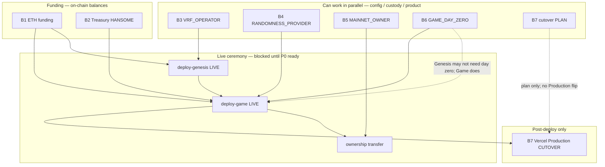

# HANSOME — Mainnet Launch Dependency Graph

| Field | Value |
|------|------|
| File | `docs/MAINNET_LAUNCH_DEPENDENCY_GRAPH.md` |
| Purpose | Map dependencies among launch blockers B1–B7 |
| Baseline | [`MAINNET_LAUNCH_PROGRESS_TRACKER.md`](./MAINNET_LAUNCH_PROGRESS_TRACKER.md) · [`MAINNET_BLOCKER_CLOSURE_PLAN.md`](./MAINNET_BLOCKER_CLOSURE_PLAN.md) · [`MAINNET_PRE_LAUNCH_ENV_AUDIT.md`](./MAINNET_PRE_LAUNCH_ENV_AUDIT.md) |
| Mode | **Docs only** — no deployment, no transactions, no secrets |
| Date | 2026-07-21 |

**Hard rules:** Do not paste private keys. Prefer redacted address prefixes in notes. Do not run live deploy from this document alone — see [`MAINNET_GO_LIVE_APPROVAL.md`](./MAINNET_GO_LIVE_APPROVAL.md).

---

## 1. Blocker definitions (B1–B7)

| ID | Name | What “done” means |
|----|------|-------------------|
| **B1** | ETH funding | Deployer (ceremony signer) holds enough **ETH on chainId 4663** for gas (tracker target ≥ **0.05 ETH**) |
| **B2** | Treasury funding | Funder holds approved `$HANSOME` for **GameTreasury** (recommended **300,000,000**; not RewardDistributor) |
| **B3** | `VRF_OPERATOR` | Real operator address (not placeholder); custody + Genesis reveal runbook |
| **B4** | `RANDOMNESS_PROVIDER` | Day-seed fulfiller role confirmed; address + game randomness runbook |
| **B5** | `MAINNET_OWNER` | Multisig / timelock chosen; signers + threshold documented; env set for ownership transfer plan |
| **B6** | `GAME_DAY_ZERO` | Env equals approved unix **`1784894400`** (2026-07-24 12:00 UTC) |
| **B7** | Vercel cutover | Production cutover **plan** ready before ceremony; Production env **applied** only after live `robinhood-*.json` + verify |

---

## 2. Dependency graph

### Legend

| Edge | Meaning |
|------|---------|
| **A → B** | A should be resolved (or at least READY) before B can be safely completed / executed |
| **∥** | Can proceed in parallel (no hard dependency) |
| **blocks deploy** | Live ceremony (`deploy-genesis` / `deploy-game` with real txs) must not start |

### Mermaid



### Edge notes

| From | To | Why |
|------|----|-----|
| B1 | Live Genesis / Game deploy | No gas → txs fail mid-ceremony |
| B2 | Live Game deploy (fund step) | GameTreasury must be fundable at ceremony (or explicit funded-skip path already satisfied on-chain) |
| B3 | Live Genesis deploy | `VRFRevealAdapter` constructor / operator must not be placeholder |
| B4 | Live Game deploy | Day-seed / randomness wiring must match confirmed provider |
| B5 | Post-deploy ownership transfer | Multisig must exist before `transfer-mainnet-ownership` |
| B6 | Live Game deploy | `GAME_DAY_ZERO` is immutable at deploy; wrong unix = permanent wrong Day 0 |
| Genesis live | Game live | Preferred order: Genesis suite JSON first, then Game suite (addresses + verify) |
| Game live + verifies | B7 Production cutover | UI must not point at Mainnet until `robinhood-genesis.json` + `robinhood-game.json` exist and verify scripts pass |
| B7 **plan** | (none hard) | Checklist / env draft can be prepared anytime; **flip** waits on deploy artifacts |

**B3 ≠ B4:** Genesis NFT reveal operator (`VRF_OPERATOR`) is not the same role as game day-seed `RANDOMNESS_PROVIDER`. Confirm both; do not reuse blindly without a written role decision.

---

## 3. What can be completed independently

These have **no hard dependency on each other** and do **not** require waiting for funding txs to land first (except where noted):

| Workstream | IDs | Independent actions |
|------------|-----|---------------------|
| **Config / product** | **B6** | Set `GAME_DAY_ZERO=1784894400` in ceremony env; re-run dry-run `day_zero` check |
| **Custody / roles** | **B3**, **B4**, **B5** | Choose addresses, document signers/runbooks, put non-secret addresses into env; dry-run plan checks |
| **Cutover prep** | **B7 (plan only)** | Draft Vercel Production variable list from [`MAINNET_VERCEL_CUTOVER.md`](./MAINNET_VERCEL_CUTOVER.md); agree rollback window — **do not** switch Production to Mainnet yet |
| **Funding (parallel)** | **B1**, **B2** | Can proceed in parallel with each other and with B3–B6; B1 is ETH to deployer, B2 is HANSOME to funder (often same or related ops wallets — coordinate, but logically independent) |

**Dry-runs** (`DRY_RUN=1`) can and should be re-run as each of B1–B6 moves to READY, without sending live txs.

---

## 4. What blocks deployment

### Hard blockers for **any live** Mainnet ceremony

| Blocker | Blocks |
|---------|--------|
| **B1** OPEN | Live Genesis **and** live Game (gas) |
| **B2** OPEN | Live Game fund / launch path (Treasury not fundable at approved amount) |
| **B3** OPEN | Live Genesis |
| **B4** OPEN | Live Game |
| **B5** OPEN | Safe ownership end-state (do not leave Ownable on hot deployer without plan) |
| **B6** OPEN / wrong value | Live Game (immutable Day 0) |
| Go-live approval not READY | Live flags / ceremony per [`MAINNET_GO_LIVE_APPROVAL.md`](./MAINNET_GO_LIVE_APPROVAL.md) |

### Soft / sequencing blockers

| Item | Blocks |
|------|--------|
| Missing live `robinhood-genesis.json` / `robinhood-game.json` | B7 **Production cutover** |
| Verify scripts not green on Mainnet | B7 Production cutover; player traffic |
| B7 plan not READY | Ops confidence only — does **not** block writing contracts, but blocks responsible cutover |

### Explicitly does **not** block writing config / dry-runs

- B7 Production flip  
- Live ownership transfer (comes **after** deploy)  
- Player traffic  

---

## 5. Recommended execution order

### Phase A — Parallel prep (raise readiness without live deploy)

1. **B6** — Fix `GAME_DAY_ZERO` to **`1784894400`** (fastest config win).  
2. **B3** + **B4** + **B5** — Confirm addresses/roles/multisig docs in parallel.  
3. **B7 plan** — Cutover checklist + rollback window agreed (still no Production Mainnet).  
4. **B1** + **B2** — Fund deployer ETH and Treasury HANSOME in parallel (ops wallets).  

Re-run Genesis + Game **dry-runs** until B1–B6 verification methods pass → status **VERIFIED**.

### Phase B — Live ceremony (only after Phase A P0 VERIFIED + go-live READY)

1. Live **Genesis** deploy (needs **B1**, **B3**; env clean).  
2. Live **Game** suite deploy + Treasury fund (needs **B1**, **B2**, **B4**, **B6**).  
3. **Ownership transfer** to **B5** target.  
4. Mainnet verify scripts green.

### Phase C — Frontend

1. **B7 cutover** — Apply Production env from live JSON; smoke; keep rollback ready.

```text
B6 ∥ B3 ∥ B4 ∥ B5 ∥ B7plan ∥ (B1 ∥ B2)
        ↓
   dry-runs green (B1–B6 VERIFIED)
        ↓
   Genesis LIVE → Game LIVE → ownership
        ↓
   B7 Production cutover
```

---

## 6. Critical path

Longest chain that determines “time to GO” (assuming funding is the slowest physical constraint):

```text
B2 (assemble ~300M HANSOME on funder)
  → Game LIVE fund step
  → verifies
  → B7 Production cutover
  → players on Mainnet
```

Alternate critical path if ETH is scarcer than HANSOME:

```text
B1 (deployer ≥ 0.05 ETH on 4663)
  → Genesis LIVE → Game LIVE → …
```

**Config critical path** (can finish in minutes if decisions exist):

```text
B6 → B3/B4/B5 env confirmation → dry-run VERIFIED
```

**True launch critical path (combined):**

```text
max(B1, B2, B3, B4, B5, B6)  →  live Genesis+Game  →  B7 cutover
```

Until **all P0 (B1–B6)** are VERIFIED, readiness stays below ceremony GO. B7 VERIFIED is required for Production traffic on Mainnet.

---

## 7. Independence matrix (quick view)

|  | B1 | B2 | B3 | B4 | B5 | B6 | B7 plan | B7 cutover |
|--|----|----|----|----|----|----|---------|------------|
| **B1** | — | ∥ | ∥ | ∥ | ∥ | ∥ | ∥ | needs live deploy first |
| **B2** | ∥ | — | ∥ | ∥ | ∥ | ∥ | ∥ | needs live deploy first |
| **B3** | ∥ | ∥ | — | ∥ (≠ role) | ∥ | ∥ | ∥ | — |
| **B4** | ∥ | ∥ | ∥ (≠ role) | — | ∥ | ∥ | ∥ | — |
| **B5** | ∥ | ∥ | ∥ | ∥ | — | ∥ | ∥ | after deploy + transfer |
| **B6** | ∥ | ∥ | ∥ | ∥ | ∥ | — | ∥ | — |
| **B7 plan** | ∥ | ∥ | ∥ | ∥ | ∥ | ∥ | — | plan precedes flip |
| **B7 cutover** | after deploy | after deploy | — | — | after owner plan | — | plan ready | — |

---

## 8. First action to move readiness from 0%

**Do this first (no deployment, no secrets in chat):**

1. Set ceremony env **`GAME_DAY_ZERO=1784894400`** (close **B6**).  
2. Re-run Game-launch dry-run and confirm `day_zero` shows **2026-07-24 12:00 UTC**.  
3. Mark **B6 → READY**, then **VERIFIED** on [`MAINNET_LAUNCH_PROGRESS_TRACKER.md`](./MAINNET_LAUNCH_PROGRESS_TRACKER.md).

That is the fastest single change that moves launch readiness from **0%** to **1/7 ≈ 14%** without waiting on ETH, HANSOME assembly, or multisig logistics.

**Immediate parallel next (same day):** replace placeholder **B3** `VRF_OPERATOR` and set **B5** `MAINNET_OWNER` documentation — both are decision/config work that unblocks dry-run VERIFIED counts while **B1/B2** funding proceeds.
