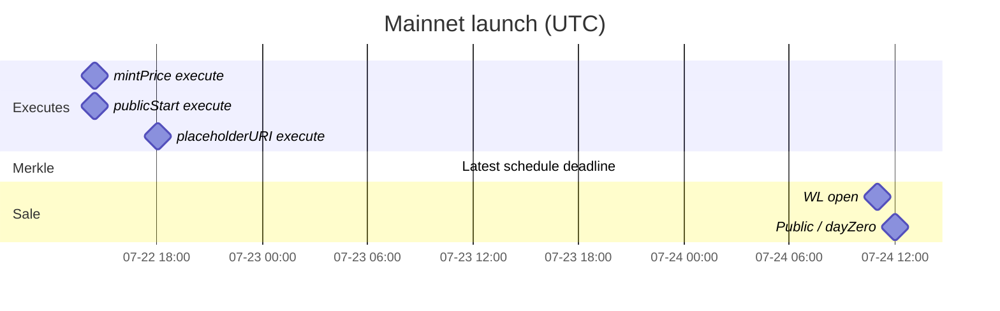

# HANSOME — Mainnet Launch Runbook

| Field | Value |
|------|------|
| File | `docs/MAINNET_LAUNCH_RUNBOOK.md` |
| Purpose | Chronological ops checklist from **now** through Public Mint |
| Mode | **Ops runbook** — this file alone does **not** authorize transactions |
| Chain | Robinhood Mainnet **4663** (never **46630**) |
| RPC | `https://rpc.mainnet.chain.robinhood.com` |
| Explorer | `https://robinhoodchain.blockscout.com` |
| Assumed “now” | ~**2026-07-22 morning Asia/Taipei** — **before** 14:27 UTC executes |
| Status | Pending timelock executes + Merkle + FE ship + WL/Public open |

**Related docs**

- Worker: [`settlement-worker/docs/RUNBOOK_MAINNET.md`](../settlement-worker/docs/RUNBOOK_MAINNET.md)
- Mint ops: [`MAINNET_GENESIS_MINT_OPS.md`](./MAINNET_GENESIS_MINT_OPS.md)
- Vercel: [`MAINNET_VERCEL_CUTOVER.md`](./MAINNET_VERCEL_CUTOVER.md)
- Ceremony: [`MAINNET_B7_LAUNCH_CEREMONY_CHECKLIST.md`](./MAINNET_B7_LAUNCH_CEREMONY_CHECKLIST.md)
- Roles: [`MAINNET_ROLES_AND_RUNBOOK.md`](./MAINNET_ROLES_AND_RUNBOOK.md)
- Schedule artifact: `contracts/deployments/robinhood-mint-sale-schedule.json`
- Handoff: [`CURSOR_AGENT_HANDOFF.md`](./CURSOR_AGENT_HANDOFF.md)

---

## 0. Locked addresses & constants

| Role / item | Value |
|-------------|--------|
| Owner / deployer (ceremony EOA) | `0xcE152894dF356741e7cfdFdD9d0B4D1fDf4a069A` |
| Genesis NFT | `0x6eBb78FDB40CF6f6b8B33a235eF321AD15107cb0` |
| HansomeGame | `0xb8dad421881171f4485523d109C94dc650ecB7Eb` |
| GameRandomness | `0x134f3CE4006a04C2C5DaD0E654d1C4228dd15791` |
| `$HANSOME` | `0x2C38Df5F59b04C3F3BB8c9E6C445E211eB1b0875` |
| `ADMIN_TIMELOCK` | **86400** s (24h) |
| Target mint price | **0.015 ETH** = `15000000000000000` wei |
| `publicStart` / Day Zero | **1784894400** = 2026-07-24T12:00:00Z = **2026-07-24 20:00:00 Asia/Taipei** |
| WL open (`publicStart − 1h`) | **1784890800** = 2026-07-24T11:00:00Z = **2026-07-24 19:00:00 Asia/Taipei** |
| Formal placeholder URI | `ipfs://bafybeiaq6n2kpjqsr5tb22gmxek6w3u2ot2ys7fkxzkxtzhzbfcyhnc26u/placeholder.json` |
| Formal baseURI (already set) | `ipfs://bafybeihs7d6nzeq2s6woads3bsbpwa5g4fgspz7fmtxr4wd6xh2idd224e/` |

### Pending timelock ops (already scheduled — execute only)

| Op | Arg | opId | Earliest execute (UTC) | Asia/Taipei (UTC+8) | Unix ETA |
|----|-----|------|------------------------|---------------------|----------|
| `mintPrice` 0.015 ETH | `15000000000000000` | `0x4d81dd70ae93aa94aebfbaf0e850fbb073aaba98ab10d71397b93b62df797850` | **2026-07-22T14:27:11Z** | **2026-07-22 22:27:11** | `1784730431` |
| `publicStart` | `1784894400` | `0xe05d2c1e3c8c5e7b9cf09d48eb24f59c6b19837e8679bcaea189def1213e330a` | **2026-07-22T14:27:16Z** | **2026-07-22 22:27:16** | `1784730436` |
| `placeholderURI` | formal IPFS (above) | `0xaa5e6c76dac070bc7b4c5ff93f8a0e938139f11aa0bf978e5f120f3ca12d42c1` | **2026-07-22T18:03:41Z** | **2026-07-23 02:03:41** | `1784743421` |
| Merkle root | *(not scheduled)* | — | Schedule ≥24h before WL | See §5 | — |

Schedule txs (reference):

| Op | Schedule tx |
|----|-------------|
| `scheduleMintPrice` | `0x98560d75d58c64034d3ee0a3f4092fda3aa4b003542d43bf58954c4b86caf63c` |
| `schedulePublicStart` | `0x426359a19c2786e3a41ceab9c8912ca9598c156298c31ff822347cf8b486082f` |
| `schedulePlaceholderURI` | `0x6d0b5fbebc867a2786acb8c963329dc1d8d9246b5f193bbfd4c808ccdac9950c` |

---

## 1. What NOT to do

| Do not | Why |
|--------|-----|
| Re-run `schedule-mainnet-mint-sale.ts` for price/publicStart | `_schedule` **overwrites** `pendingAdminOps` ETA → resets the 24h clock |
| Set `EXECUTE_AFTER_WAIT=1` on already-scheduled ops | Script schedules again, then waits a **new** full timelock |
| Run `set-genesis-placeholder-uri.ts` on Mainnet for the pending URI | Schedules again + long wait; no Mainnet live gates |
| Use `finish-genesis-bootstrap.ts` on Mainnet | Testnet recovery path; no Mainnet guards |
| Set `MAINNET_LIVE_ACK` / `DRY_RUN=0` on settlement-worker | Keep dry-run through mint; separate settlement GO later |
| Print / paste private keys into chat, git, or this doc | Custody rule |
| Point Production at Testnet suite (`46630`) | Fail-closed + user damage |
| Reuse Testnet Merkle proofs / roots | Wrong sale |
| Change Railway / Redis / Production deploy from this runbook alone | Explicit GO required per step |
| Cancel a correct pending op unless aborting launch | `cancelAdminOp` clears ETA; must re-schedule (+24h) |

**Live write flags** (only for scripts that use `assertMainnetDeployAllowed`; clear between phases):

```text
ALLOW_MAINNET_DEPLOY=1
CONFIRM_MAINNET_DEPLOY=I_UNDERSTAND
LIVE_MAINNET_SEND=1
```

(`CONFIRM_MAINNET_DEPLOY=YES` is also accepted by the shared guard; `schedule-mainnet-mint-sale.ts` itself prefers `I_UNDERSTAND` or it forces `DRY_RUN`.)

---

## 2. Timeline overview (Asia/Taipei + UTC)

| When (Taipei) | When (UTC) | Phase |
|---------------|------------|-------|
| **Now** → 22:27 Jul 22 | Now → 14:27 Jul 22 | Pre-flight; Merkle list prep; FE readiness |
| **22:27:11 Jul 22** | **14:27:11 Jul 22** | Execute `mintPrice` |
| **22:27:16 Jul 22** | **14:27:16 Jul 22** | Execute `publicStart` |
| **02:03:41 Jul 23** | **18:03:41 Jul 22** | Execute `placeholderURI` |
| ASAP after price/start OK; **latest schedule ≤ 19:00 Jul 23** | **≤ 11:00 Jul 23** | Schedule Merkle (24h before WL) |
| ≥24h after Merkle schedule | eta + 86400 | Execute Merkle; ship proofs JSON; FE redeploy |
| **19:00 Jul 24** | **11:00 Jul 24** | Whitelist mint opens |
| **20:00 Jul 24** | **12:00 Jul 24** | Public mint + Day Zero |
| After mint / first settle GO | — | Worker live cutover (separate) |



---

## 3. Pre-flight (before first execute)

**Window:** before **2026-07-22T14:27:11Z** / **2026-07-22 22:27:11 Asia/Taipei**

### 3.1 Read-only chain checks (no txs)

PowerShell (from repo root or `contracts/`):

```powershell
cd C:\hansomealpacas\contracts

# Prefer hardhat console read-only — example eth_call pattern via cast (if installed):
# cast call 0x6eBb78FDB40CF6f6b8B33a235eF321AD15107cb0 "mintPrice()(uint256)" --rpc-url https://rpc.mainnet.chain.robinhood.com
# cast call 0x6eBb78FDB40CF6f6b8B33a235eF321AD15107cb0 "publicStart()(uint256)" --rpc-url https://rpc.mainnet.chain.robinhood.com
# cast call 0x6eBb78FDB40CF6f6b8B33a235eF321AD15107cb0 "pendingAdminOps(bytes32)(uint256)" 0x4d81dd70ae93aa94aebfbaf0e850fbb073aaba98ab10d71397b93b62df797850 --rpc-url https://rpc.mainnet.chain.robinhood.com
# cast call 0xb8dad421881171f4485523d109C94dc650ecB7Eb "dayZero()(uint256)" --rpc-url https://rpc.mainnet.chain.robinhood.com
# cast chain-id --rpc-url https://rpc.mainnet.chain.robinhood.com
```

Hardhat console (read-only; do not send txs):

```powershell
cd C:\hansomealpacas\contracts
npx hardhat console --network mainnet
```

```js
const g = "0x6eBb78FDB40CF6f6b8B33a235eF321AD15107cb0";
const nft = await ethers.getContractAt("HansomeGenesisNFT", g);
const game = await ethers.getContractAt("HansomeGame", "0xb8dad421881171f4485523d109C94dc650ecB7Eb");
(await ethers.provider.getNetwork()).chainId; // 4663n
await nft.owner();                 // 0xcE15…069A
await nft.ADMIN_TIMELOCK();        // 86400
await nft.mintPrice();             // 0 (until execute)
await nft.publicStart();           // 0 (until execute)
await nft.whitelistMerkleRoot();   // 0x0 until Merkle execute
await nft.tokenURI(1n);            // ipfs://hansome-genesis/placeholder.json until placeholder execute
await nft.pendingAdminOps("0x4d81dd70ae93aa94aebfbaf0e850fbb073aaba98ab10d71397b93b62df797850"); // 1784730431
await nft.pendingAdminOps("0xe05d2c1e3c8c5e7b9cf09d48eb24f59c6b19837e8679bcaea189def1213e330a"); // 1784730436
await nft.pendingAdminOps("0xaa5e6c76dac070bc7b4c5ff93f8a0e938139f11aa0bf978e5f120f3ca12d42c1"); // 1784743421
await game.dayZero();              // 1784894400
```

| Check | Expected | OK |
|-------|----------|-----|
| chainId | `4663` | [ ] |
| Genesis owner | `0xcE152894dF356741e7cfdFdD9d0B4D1fDf4a069A` | [ ] |
| `ADMIN_TIMELOCK` | `86400` | [ ] |
| Pending mintPrice ETA | `1784730431` | [ ] |
| Pending publicStart ETA | `1784730436` | [ ] |
| Pending placeholder ETA | `1784743421` | [ ] |
| Game `dayZero` | `1784894400` | [ ] |
| Owner ETH for gas | Comfortable (≥ ~0.01 ETH for 3–5 admin txs) | [ ] |
| Worker | `DRY_RUN=1` / healthz `dryRun:true` | [ ] |
| WL address list | Owner list in `data/mainnet/whitelist-addresses.txt` final (or schedule deferred with deadline understood) | [ ] |

### 3.2 Scripts inventory (execute path)

| Goal | Repo script | Notes |
|------|-------------|-------|
| Schedule price/start/merkle | `scripts/schedule-mainnet-mint-sale.ts` · `npm run genesis:schedule-sale:mainnet` | **Already done** for price+start (`SKIP_MERKLE_ROOT=1`). Do **not** re-run for those. |
| Generate Merkle | `scripts/generate-mainnet-whitelist-merkle.ts` · `npm run genesis:merkle:mainnet` | Offline; no txs |
| Schedule placeholder only | `scripts/ops-mainnet-set-uris-schedule-only.ts` | **Already done** |
| Execute mintPrice / publicStart / placeholder | **No dedicated Mainnet execute script** | Use Hardhat console (§4) with exact calldata args — **do not invent new unsafe flags** |
| Execute Merkle | Console `executeWhitelistMerkleRoot(root)` after schedule+timelock | Same |
| Worker dry-run | `settlement-worker` · `npm run start:mainnet` | Keep `DRY_RUN=1` |

---

## 4. Execute window A — mintPrice + publicStart

### 4.1 `executeMintPrice(0.015 ETH)`

| | |
|--|--|
| Earliest | **2026-07-22T14:27:11Z** = **2026-07-22 22:27:11 Asia/Taipei** |
| Function | `executeMintPrice(uint256 priceWei)` |
| Arg | `15000000000000000` (`ethers.parseEther("0.015")`) |
| Signer | Owner `0xcE15…069A` |
| Expected after | `mintPrice() == 15000000000000000` · pending opId ETA → `0` |

**Command (Hardhat console — live send; operator must wait until ETA):**

```powershell
cd C:\hansomealpacas\contracts
# Ensure deployer key in contracts/.env is the owner EOA (never print the key)
npx hardhat console --network mainnet
```

```js
const nft = await ethers.getContractAt(
  "HansomeGenesisNFT",
  "0x6eBb78FDB40CF6f6b8B33a235eF321AD15107cb0",
);
const price = ethers.parseEther("0.015");
// Gate: block.timestamp >= 1784730431
const eta = await nft.pendingAdminOps("0x4d81dd70ae93aa94aebfbaf0e850fbb073aaba98ab10d71397b93b62df797850");
const now = (await ethers.provider.getBlock("latest")).timestamp;
if (now < Number(eta)) throw new Error(`Timelock not ready: now=${now} eta=${eta}`);
const tx = await nft.executeMintPrice(price);
console.log("executeMintPrice", tx.hash);
await tx.wait();
console.log("mintPrice", (await nft.mintPrice()).toString()); // 15000000000000000
```

**Verify (no send):**

```text
cast call 0x6eBb78FDB40CF6f6b8B33a235eF321AD15107cb0 "mintPrice()(uint256)" --rpc-url https://rpc.mainnet.chain.robinhood.com
# expect 15000000000000000
```

| Gate | Pass | OK |
|------|------|-----|
| Tx success on explorer | status=1 | [ ] |
| `mintPrice()` | `15000000000000000` | [ ] |
| Pending mintPrice opId | `0` | [ ] |

**If fail:** see §9 — do **not** execute `publicStart` until mintPrice is active (or explicitly abort).

### 4.2 `executePublicStart(1784894400)`

| | |
|--|--|
| Earliest | **2026-07-22T14:27:16Z** = **2026-07-22 22:27:16 Asia/Taipei** |
| Function | `executePublicStart(uint256 timestamp)` |
| Arg | `1784894400` |
| Expected after | `publicStart() == 1784894400` · `whitelistStart() == 1784890800` · commitment remains locked |

```js
const start = 1784894400;
const eta2 = await nft.pendingAdminOps("0xe05d2c1e3c8c5e7b9cf09d48eb24f59c6b19837e8679bcaea189def1213e330a");
const now2 = (await ethers.provider.getBlock("latest")).timestamp;
if (now2 < Number(eta2)) throw new Error(`Timelock not ready: now=${now2} eta=${eta2}`);
const tx2 = await nft.executePublicStart(start);
console.log("executePublicStart", tx2.hash);
await tx2.wait();
console.log("publicStart", (await nft.publicStart()).toString());       // 1784894400
console.log("whitelistStart", (await nft.whitelistStart()).toString()); // 1784890800
console.log("commitmentLocked", await nft.saleIdentityCommitmentLocked()); // true
```

**Verify:**

```text
cast call … "publicStart()(uint256)"     # 1784894400
cast call … "whitelistStart()(uint256)"  # 1784890800
```

| Gate | Pass | OK |
|------|------|-----|
| `publicStart()` | `1784894400` | [ ] |
| `whitelistStart()` | `1784890800` | [ ] |
| `saleIdentityCommitmentLocked` | `true` | [ ] |
| Pending publicStart opId | `0` | [ ] |

**Between-executes gate:** both price and start active before any marketing “sale configured” claim. Frontend MintPanel will then read live `0.015 ETH`.

---

## 5. Whitelist Merkle process

Merkle was **skipped** in the original schedule (`skipMerkleRoot: true`). Must complete before WL open.

### 5.1 Deadlines

| Event | UTC | Asia/Taipei | Unix |
|-------|-----|-------------|------|
| **Latest safe `scheduleWhitelistMerkleRoot`** | **2026-07-23T11:00:00Z** | **2026-07-23 19:00:00** | `1784804400` (= WL − 86400) |
| Earliest execute (if scheduled at deadline) | 2026-07-24T11:00:00Z | 2026-07-24 19:00:00 | `1784890800` |
| WL open | 2026-07-24T11:00:00Z | 2026-07-24 19:00:00 | `1784890800` |

**Prefer:** schedule Merkle **as soon as the address list is final** (ideally 2026-07-22 after price/start executes, or earlier the same day) so execute lands well before WL.

### 5.2 Generate (offline — no txs)

**Owner source of truth（可持續編輯直到定稿）：** [`data/mainnet/whitelist-addresses.txt`](../data/mainnet/whitelist-addresses.txt)  
維護說明（中文）：[`data/mainnet/README.md`](../data/mainnet/README.md)

```powershell
cd C:\hansomealpacas\contracts

# 1) Edit owner list (one address per line; # comments ok)
#    ..\data\mainnet\whitelist-addresses.txt
#    Legacy fallback: deployments\mainnet-whitelist-addresses.txt
#    Never use .example for production

# 2) Generate root + proofs (also writes frontend JSON when not using .example)
#    OFFLINE — does NOT schedule/execute on chain
npm run genesis:merkle:mainnet
# = npx hardhat run scripts/generate-mainnet-whitelist-merkle.ts --network hardhat
```

**Outputs**

| File | Role |
|------|------|
| `contracts/deployments/robinhood-genesis-whitelist.mainnet.json` | Root + proofs (ops) |
| `lib/game/mainnet/whitelistProofs.MAINNET.json` | Frontend proofs (auto-written when using real addresses file) |

Record `merkleRoot` from the JSON. Confirm `addressCount` ≤ product intent (on-chain WL mint cap remains **100**).

Workflow reminder: **edit list → generate → review root → later** `scheduleWhitelistMerkleRoot` **before deadline 2026-07-23 11:00 UTC** (see §5.1).

### 5.3 Schedule Merkle (live)

```powershell
cd C:\hansomealpacas\contracts
$env:DRY_RUN = "1"
$env:GENESIS_NFT_ADDRESS = "0x6eBb78FDB40CF6f6b8B33a235eF321AD15107cb0"
$env:GENESIS_MINT_PRICE_ETH = "0.015"
$env:GENESIS_PUBLIC_START = "1784894400"
# Loads root from robinhood-genesis-whitelist.mainnet.json unless GENESIS_MERKLE_ROOT set
# WARNING: Do NOT use this to re-schedule price/publicStart if those are already active.
# Prefer console-only scheduleWhitelistMerkleRoot if price/start already executed:
npx hardhat console --network mainnet
```

**Preferred (console — schedule Merkle only):**

```js
const nft = await ethers.getContractAt("HansomeGenesisNFT", "0x6eBb78FDB40CF6f6b8B33a235eF321AD15107cb0");
const root = "0x…"; // from robinhood-genesis-whitelist.mainnet.json
const tx = await nft.scheduleWhitelistMerkleRoot(root);
console.log(tx.hash);
await tx.wait();
// Record pendingAdminOps(opId) ETA = now + 86400
```

If using `schedule-mainnet-mint-sale.ts` **after** price/start are already **executed** (active on-chain), the script will attempt to **schedule again** and reset ETAs for price/start — **avoid**. Use console for Merkle-only.

**Live flags** (only if using the guarded schedule script for a fresh combined schedule):

```powershell
Remove-Item Env:DRY_RUN -ErrorAction SilentlyContinue
$env:ALLOW_MAINNET_DEPLOY = "1"
$env:CONFIRM_MAINNET_DEPLOY = "I_UNDERSTAND"
$env:LIVE_MAINNET_SEND = "1"
# Do not set EXECUTE_AFTER_WAIT=1 unless intentionally waiting a full new timelock in-process
```

### 5.4 Execute Merkle (after ETA)

```js
const root = "0x…"; // exact same root as scheduled
const tx = await nft.executeWhitelistMerkleRoot(root);
await tx.wait();
console.log(await nft.whitelistMerkleRoot()); // must equal root
```

| Gate | Pass | OK |
|------|------|-----|
| `whitelistMerkleRoot()` | nonzero · equals generated root | [ ] |
| Frontend JSON root | matches on-chain | [ ] |
| Proofs committed / deployed | see §7 | [ ] |

---

## 6. Execute window B — placeholderURI

| | |
|--|--|
| Earliest | **2026-07-22T18:03:41Z** = **2026-07-23 02:03:41 Asia/Taipei** |
| Function | `executePlaceholderURI(string uri)` |
| Arg (exact) | `ipfs://bafybeiaq6n2kpjqsr5tb22gmxek6w3u2ot2ys7fkxzkxtzhzbfcyhnc26u/placeholder.json` |
| Expected after | `tokenURI(1)` returns that URI (pre-reveal) |

```js
const uri =
  "ipfs://bafybeiaq6n2kpjqsr5tb22gmxek6w3u2ot2ys7fkxzkxtzhzbfcyhnc26u/placeholder.json";
const eta3 = await nft.pendingAdminOps("0xaa5e6c76dac070bc7b4c5ff93f8a0e938139f11aa0bf978e5f120f3ca12d42c1");
const now3 = (await ethers.provider.getBlock("latest")).timestamp;
if (now3 < Number(eta3)) throw new Error(`Timelock not ready: now=${now3} eta=${eta3}`);
const tx3 = await nft.executePlaceholderURI(uri);
console.log("executePlaceholderURI", tx3.hash);
await tx3.wait();
console.log("tokenURI(1)", await nft.tokenURI(1n));
```

| Gate | Pass | OK |
|------|------|-----|
| `tokenURI(1)` | formal `ipfs://bafybeiaq6n2…/placeholder.json` | [ ] |
| Not | `ipfs://hansome-genesis/placeholder.json` | [ ] |
| Pending placeholder opId | `0` | [ ] |

---

## 7. Frontend deployment order (Vercel)

Follow [`MAINNET_VERCEL_CUTOVER.md`](./MAINNET_VERCEL_CUTOVER.md). Production `NEXT_PUBLIC_*` should already target Mainnet suite; **redeploy** when env or proofs change.

| Order | Relative to chain | Action |
|------:|-------------------|--------|
| 1 | After §4 (price + publicStart active) | Confirm Mint UI reads **0.015 ETH** and sale window derives from on-chain `publicStart` / `whitelistStart`. Redeploy if marketing copy/countdown must match `1784894400`. |
| 2 | After §5.2 generate | Commit `lib/game/mainnet/whitelistProofs.MAINNET.json` (real proofs; root ≠ `0x0`). |
| 3 | After §5.4 Merkle **execute** | Redeploy Production so WL wallets load proofs matching **on-chain** root. **Must be live before WL open** (2026-07-24 19:00 Taipei). |
| 4 | After §6 placeholder execute | Optional redeploy if any static metadata links; NFT `tokenURI` is on-chain. |
| 5 | Before Public | Smoke: wallet on `4663`, Mint page, My NFTs, no Testnet RPC. |

**Vercel Production public vars (expected):**

| Variable | Value |
|----------|--------|
| `NEXT_PUBLIC_GAME_CHAIN_ID` | `4663` |
| `NEXT_PUBLIC_GAME_REQUIRE_MAINNET` | `1` |
| `NEXT_PUBLIC_GAME_RPC_URL` | `https://rpc.mainnet.chain.robinhood.com` |
| `NEXT_PUBLIC_GAME_EXPLORER` | `https://robinhoodchain.blockscout.com` |
| `NEXT_PUBLIC_HANSOME_GAME_ADDRESS` | `0xb8dad421881171f4485523d109C94dc650ecB7Eb` |
| `NEXT_PUBLIC_GENESIS_NFT_ADDRESS` (or `NEXT_PUBLIC_HANSOME_GENESIS_ADDRESS`) | `0x6eBb78FDB40CF6f6b8B33a235eF321AD15107cb0` |
| Timings | GDS `72000` / `14400` / `86400` — no `120/120/240` |

Changing `NEXT_PUBLIC_*` requires a **new Production deployment**.

---

## 8. Sale day — WL then Public

| Phase | UTC | Asia/Taipei | On-chain expectation |
|-------|-----|-------------|----------------------|
| WL open | 2026-07-24T11:00:00Z | 2026-07-24 19:00:00 | `isWhitelistOpen() == true` (until public) |
| Public / Day Zero | 2026-07-24T12:00:00Z | 2026-07-24 20:00:00 | `isPublicOpen() == true` · Game day 0 begins |

**Ops during sale**

- Watch explorer mint txs; confirm price = 0.015 ETH.
- WL: proofs must match root; failed proof = FE/root mismatch.
- Keep settlement-worker on **`DRY_RUN=1`** through the mint window unless a separate settlement GO is signed.

---

## 9. Emergency rollback (execute failures)

Contracts are not undeployable. Contain + cancel + re-schedule + FE message.

| Failure | Action |
|---------|--------|
| `executeMintPrice` reverts (timelock / wrong arg) | Confirm ETA + exact `15000000000000000`. Do not change price without new schedule (+24h). Pause marketing. |
| `executeMintPrice` OK, `executePublicStart` fails | Price is live; sale still closed (`publicStart==0`). Fix and retry execute with **exact** `1784894400`. Do **not** re-schedule publicStart unless cancelling first. |
| Wrong arg scheduled | Owner `cancelAdminOp(opId)` → schedule correct arg → wait full **86400** again. May miss WL/public wall-clock — communicate delay. |
| Merkle wrong / Testnet root | Cancel pending Merkle op if any; regenerate; re-schedule; **delay WL** if needed. Never ship mismatched FE proofs. |
| Placeholder execute fails | Sale can still proceed; metadata stays temporary URI until fixed (+24h if re-schedule). |
| FE wrong after redeploy | Vercel rollback per [`MAINNET_VERCEL_CUTOVER.md`](./MAINNET_VERCEL_CUTOVER.md) §E — restore previous Production deployment/env. |
| Exploit / incident during sale | Pause messaging; owner pause paths if available; do not open worker live; escalate. |

**Cancel (owner only — last resort):**

```js
await (await nft.cancelAdminOp("0x…opId…")).wait();
```

---

## 10. Worker activation checklist

Source of truth: [`settlement-worker/docs/RUNBOOK_MAINNET.md`](../settlement-worker/docs/RUNBOOK_MAINNET.md).

### Through mint (required)

| Step | Action | OK |
|------|--------|-----|
| W1 | Profile `mainnet`, chainId `4663`, Game + Randomness addresses match suite | [ ] |
| W2 | `DRY_RUN=1` in `.env.mainnet` / Railway | [ ] |
| W3 | **Do not** set `MAINNET_LIVE_ACK` | [ ] |
| W4 | Health: `dryRun: true` on healthz/readyz | [ ] |
| W5 | Logs show `dry_run_tx` only — **no** broadcast settles | [ ] |

```bash
cd settlement-worker
# cp .env.mainnet.example .env.mainnet  # fill keys offline; never print
# Keep DRY_RUN=1
npm run build
npm run start:mainnet
```

### Settlement live GO (separate — after mint / proven settle path)

| Step | Action | OK |
|------|--------|-----|
| S1 | Explicit ops GO for settlement live | [ ] |
| S2 | Settler + seed wallets funded on Mainnet | [ ] |
| S3 | Confirm on-chain `randomnessProvider` matches seed key | [ ] |
| S4 | Set `DRY_RUN=0` + `MAINNET_LIVE_ACK=I_UNDERSTAND_MAINNET_SETTLEMENT` | [ ] |
| S5 | Watch first day settle after reveal close | [ ] |
| S6 | Alerts webhook on | [ ] |

**Rollback worker:** set `DRY_RUN=1` or stop service. Settlement remains permissionless for manual `finalizeDay` / `creditBatch` if needed; seed still needs provider key.

---

## 11. Final launch verification checklist (10 acceptance items)

All must be **PASS** before declaring launch ready (re-check after executes + FE ship).

| # | Criterion | Required | How to verify |
|---|-----------|----------|---------------|
| 1 | `mintPrice` active | `15000000000000000` (0.015 ETH) | `eth_call` / cast `mintPrice()` — not merely scheduled |
| 2 | `publicStart` active | `1784894400` | `eth_call` `publicStart()` |
| 3 | `GAME_DAY_ZERO` / `dayZero` | `1784894400` | `eth_call` HansomeGame `dayZero()` |
| 4 | Whitelist root | ≠ `0x0` · matches generated root | `eth_call` `whitelistMerkleRoot()` |
| 5 | Placeholder URI | Formal `ipfs://bafybeiaq6n2…/placeholder.json` | `eth_call` `tokenURI(1)` |
| 6 | Frontend countdown / open time | Aligns with `publicStart` `1784894400` (Jul 24 12:00 UTC / 20:00 Taipei) | Production UI + code |
| 7 | Frontend mint price | Matches live chain `0.015 ETH` after execute | MintPanel / i18n + `mintPrice()` |
| 8 | Mainnet addresses | Genesis / Game / distributor / randomness match suite | Vercel `NEXT_PUBLIC_*` + deploy JSON |
| 9 | No Testnet / accel in Production | No `46630`, no testnet RPC, no `120/120/240` | Production env + network tab |
| 10 | Worker dry-run | `DRY_RUN=1` / healthz `dryRun:true` | Railway/local healthz — **until settlement GO** |

---

## 12. Final GO / NO-GO checklist

### GO for §4 executes (mintPrice + publicStart) — 2026-07-22 ~22:27 Taipei

| # | Gate | OK |
|---|------|-----|
| G1 | Pending ETAs still match table in §0 | [ ] |
| G2 | Owner key available; gas funded | [ ] |
| G3 | Will **not** re-schedule price/start | [ ] |
| G4 | Worker remains `DRY_RUN=1` | [ ] |
| G5 | Ops lead: **GO execute price + publicStart** | [ ] |

### GO for §6 placeholder — 2026-07-23 ~02:03 Taipei

| # | Gate | OK |
|---|------|-----|
| P1 | Placeholder ETA ready; URI string exact | [ ] |
| P2 | Ops lead: **GO execute placeholderURI** | [ ] |

### GO for Merkle schedule / execute / FE

| # | Gate | OK |
|---|------|-----|
| M1 | Final address list approved | [ ] |
| M2 | Schedule ≥24h before WL (`≤ 2026-07-23T11:00:00Z`) | [ ] |
| M3 | Execute root == FE JSON root | [ ] |
| M4 | Production redeployed with proofs **before** WL | [ ] |

### GO for public mint marketing / open

| # | Gate | OK |
|---|------|-----|
| L1 | All 10 acceptance items PASS (§11) | [ ] |
| L2 | WL proofs live on Production | [ ] |
| L3 | Incident / rollback contacts ready | [ ] |
| L4 | **NO** settlement `MAINNET_LIVE_ACK` unless separate GO | [ ] |

| Role | Name | Date | GO / NO-GO | Signature |
|------|------|------|------------|-----------|
| Product | | | | |
| Ops / Deployer | | | | |
| Treasury / Founder | | | | |

---

## 13. Quick command cheat sheet

```powershell
cd C:\hansomealpacas\contracts

# Offline Merkle
npm run genesis:merkle:mainnet

# Dry-run sale schedule helper (DO NOT use to re-schedule already-pending price/start)
$env:DRY_RUN = "1"
$env:GENESIS_NFT_ADDRESS = "0x6eBb78FDB40CF6f6b8B33a235eF321AD15107cb0"
$env:GENESIS_MINT_PRICE_ETH = "0.015"
$env:GENESIS_PUBLIC_START = "1784894400"
$env:SKIP_MERKLE_ROOT = "1"
npx hardhat run scripts/schedule-mainnet-mint-sale.ts --network mainnet

# Live executes — Hardhat console (after each ETA); no separate execute*.ts in repo
npx hardhat console --network mainnet
```

```bash
# Worker — keep dry-run through mint
cd settlement-worker
npm run build && npm run start:mainnet
# Live later only: DRY_RUN=0 + MAINNET_LIVE_ACK=I_UNDERSTAND_MAINNET_SETTLEMENT
```

---

## 14. Document history

| Date | Note |
|------|------|
| 2026-07-22 | Initial Mainnet launch runbook from pending timelock audit + schedule JSON + worker/Vercel docs |
