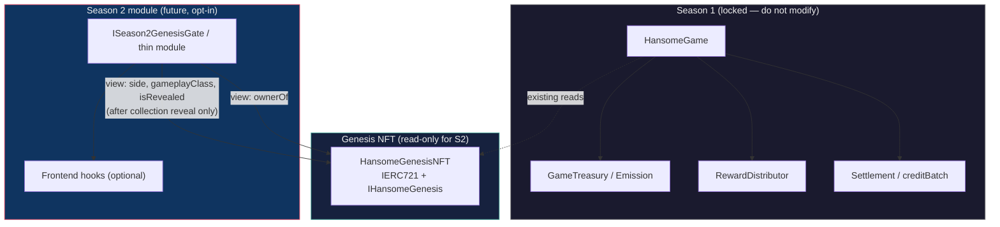

# HANSOME — Season 2 Module Minimal Interface (Design Note)

| Field | Value |
|---|---|
| Document type | Architecture / interface sketch (NOT production Solidity) |
| Status | **DRAFT — design only** |
| Scope | Read-only Genesis NFT ownership gate for a future opt-in Season 2 module |
| Does **not** define | Season 1 gameplay, 80/10/10 pools, settlement, mint/reveal, GDS v1.1 numbers |
| Companion docs | `docs/CURSOR_AGENT_HANDOFF.md`, `docs/HANSOME_Contract_Architecture_v1.0.md`, `contracts/contracts/genesis/IHansomeGenesis.sol`, `docs/GAME_RUNTIME_ADDRESSES.md` |

> **Explicit:** This document is **not** approved for implementation this week unless the owner explicitly requests it. No deploy scripts, no Mainnet transactions, and no changes to Season 1 contracts are implied.

---

## 1. Goal / non-goals

### Goals

- Define a **minimal, read-only boundary** for a future **Season 2** module that:
  - Treats the existing **HANSOME Genesis NFT** collection as the sole identity source.
  - Performs **ownership checks only** (`ownerOf`) — no staking, no escrow, no custody transfers.
  - May optionally read **on-chain side / gameplay class** after reveal for Season 2 UX or eligibility rules (defined later; not in this sketch).
  - Is **opt-in**: Season 1 (`HansomeGame`, settlement, emission, Genesis mint/reveal) continues unchanged.
- Give frontend and future Solidity authors a **shared vocabulary** (interface names, trust model, forbidden touchpoints).

### Non-goals

| Non-goal | Rationale |
|---|---|
| Modify `HansomeGenesisNFT`, `HansomeGame`, treasury, emission, or settlement | Season 1 feature freeze; GDS v1.1 locked |
| Change 80 / 10 / 10 pool split or daily \(R_d\) formulas | Economic model is Season 1 authority |
| Stake, lock, or custodian Genesis NFTs inside Season 2 | User requirement: ownership check only |
| Rewrite Season 1 claim balances or `pendingRewardOf` semantics | Claims stay on existing game suite |
| Deploy contracts or submit Mainnet txs | Design note only |
| Define Season 2 gameplay rules or rewards | Requires separate GDS / season spec upgrade |

---

## 2. Architecture

Season 2 module sits **beside** Season 1 — it **reads** Genesis state; it does **not** write to Genesis or the game settlement graph.



**Integration rule:** Season 2 module address is **not** wired into `HansomeGame` in this design. Players (or a future router) interact with Season 2 only if they choose to. Season 1 day loop is unaffected.

---

## 3. Minimal Solidity interface + thin module sketch

Interfaces below are **interface-focused** — illustrative, not audited production code.

### 3.1 Shared types (reuse Genesis enums)

Season 2 should import `HansomeTypes` from the existing Genesis package rather than redefine side/class labels:

```solidity
// SPDX-License-Identifier: MIT
pragma solidity ^0.8.24;

import {HansomeTypes} from "../genesis/HansomeTypes.sol";
```

### 3.2 Read surface on Genesis (already deployed)

Season 2 depends on **two** read APIs on the same contract:

| API | Source | Purpose |
|---|---|---|
| `ownerOf(uint256)` | `IERC721` | Ownership gate |
| `side`, `gameplayClass`, `isRevealed`, `isCollectionRevealed` | `IHansomeGenesis` | Identity after reveal |

```solidity
import {IERC721} from "@openzeppelin/contracts/token/ERC721/IERC721.sol";
import {IHansomeGenesis} from "../genesis/IHansomeGenesis.sol";
```

### 3.3 `IGenesisOwnershipReader` — minimal read adapter

```solidity
// SPDX-License-Identifier: MIT
pragma solidity ^0.8.24;

import {HansomeTypes} from "../genesis/HansomeTypes.sol";

/**
 * @notice Read-only Genesis identity + ownership. No transfers, no approvals.
 */
interface IGenesisOwnershipReader {
    function genesisNft() external view returns (address);

    function ownerOfGenesis(uint256 tokenId) external view returns (address owner);

    function isGenesisOwner(address account, uint256 tokenId) external view returns (bool);

    /// @dev Reverts or returns sentinel if token unrevealed — see §5.
    function genesisSide(uint256 tokenId) external view returns (HansomeTypes.Side);

    function genesisClass(uint256 tokenId) external view returns (HansomeTypes.GameplayClass);

    function isGenesisRevealed(uint256 tokenId) external view returns (bool);
}
```

### 3.4 `ISeason2GenesisGate` — module-facing gate (ownership-first)

```solidity
// SPDX-License-Identifier: MIT
pragma solidity ^0.8.24;

/**
 * @notice Season 2 entry surface: prove Genesis ownership without custody.
 * @dev Season 2 gameplay hooks (if any) sit behind this gate in a later spec.
 */
interface ISeason2GenesisGate {
    /// @notice Immutable module version string for frontend / indexers.
    function season2ModuleVersion() external pure returns (string memory);

    /// @notice Genesis collection this module trusts (immutable at deploy).
    function genesisNft() external view returns (address);

    /// @notice True iff `msg.sender == ownerOf(tokenId)` on Genesis.
    function verifyOwnership(uint256 tokenId) external view returns (bool);

    /// @notice Same check for arbitrary `account` (UI / meta-tx planners).
    function verifyOwnershipOf(address account, uint256 tokenId) external view returns (bool);

    /// @notice Optional: require revealed token before Season 2 actions (policy TBD).
    function verifyEligibleParticipant(address account, uint256 tokenId)
        external
        view
        returns (bool eligible, bytes32 reasonCode);
}
```

`reasonCode` is a compact machine-readable hint (e.g. `keccak256("NOT_OWNER")`, `keccak256("NOT_REVEALED")`) — exact enum left to a future Season 2 spec.

### 3.5 Thin module sketch (not production)

```solidity
// SPDX-License-Identifier: MIT
pragma solidity ^0.8.24;

import {IERC721} from "@openzeppelin/contracts/token/ERC721/IERC721.sol";
import {IHansomeGenesis} from "../genesis/IHansomeGenesis.sol";
import {HansomeTypes} from "../genesis/HansomeTypes.sol";
import {IGenesisOwnershipReader} from "./IGenesisOwnershipReader.sol";
import {ISeason2GenesisGate} from "./ISeason2GenesisGate.sol";

/**
 * @title HansomeSeason2GenesisGate_v0
 * @notice READ-ONLY adapter. Does not hold NFTs, does not call HansomeGame.
 */
contract HansomeSeason2GenesisGate_v0 is IGenesisOwnershipReader, ISeason2GenesisGate {
    IERC721 public immutable genesisErc721;
    IHansomeGenesis public immutable genesisIdentity;

    error InvalidGenesisAddress();
    error InvalidTokenId();

    constructor(address genesisNft_) {
        if (genesisNft_ == address(0)) revert InvalidGenesisAddress();
        genesisErc721 = IERC721(genesisNft_);
        genesisIdentity = IHansomeGenesis(genesisNft_);
    }

    function season2ModuleVersion() external pure returns (string memory) {
        return "season2-genesis-gate-v0.0.0-sketch";
    }

    function genesisNft() external view returns (address) {
        return address(genesisErc721);
    }

    function ownerOfGenesis(uint256 tokenId) public view returns (address owner) {
        _requireValidTokenId(tokenId);
        return genesisErc721.ownerOf(tokenId);
    }

    function isGenesisOwner(address account, uint256 tokenId) public view returns (bool) {
        if (account == address(0)) return false;
        _requireValidTokenId(tokenId);
        try genesisErc721.ownerOf(tokenId) returns (address owner) {
            return owner == account;
        } catch {
            return false;
        }
    }

    function verifyOwnership(uint256 tokenId) external view returns (bool) {
        return isGenesisOwner(msg.sender, tokenId);
    }

    function verifyOwnershipOf(address account, uint256 tokenId) external view returns (bool) {
        return isGenesisOwner(account, tokenId);
    }

    function verifyEligibleParticipant(address account, uint256 tokenId)
        external
        view
        returns (bool eligible, bytes32 reasonCode)
    {
        if (!isGenesisOwner(account, tokenId)) {
            return (false, keccak256("NOT_OWNER"));
        }
        if (!genesisIdentity.isRevealed(tokenId)) {
            return (false, keccak256("NOT_REVEALED"));
        }
        return (true, bytes32(0));
    }

    function genesisSide(uint256 tokenId) external view returns (HansomeTypes.Side) {
        _requireValidTokenId(tokenId);
        return genesisIdentity.side(tokenId);
    }

    function genesisClass(uint256 tokenId) external view returns (HansomeTypes.GameplayClass) {
        _requireValidTokenId(tokenId);
        return genesisIdentity.gameplayClass(tokenId);
    }

    function isGenesisRevealed(uint256 tokenId) external view returns (bool) {
        _requireValidTokenId(tokenId);
        return genesisIdentity.isRevealed(tokenId);
    }

    function _requireValidTokenId(uint256 tokenId) internal pure {
        if (tokenId == 0 || tokenId > HansomeTypes.LAST_TOKEN_ID) revert InvalidTokenId();
    }
}
```

**Deliberately absent:** `transferFrom`, `safeTransferFrom`, `setApprovalForAll`, pointers to `HansomeGame`, treasury pulls, emission updates, or any state that mirrors Season 1 day/commit/reveal/settlement.

---

## 4. Reading `ownerOf` on Genesis (Mainnet example)

### Canonical addresses

| Network | Chain ID | Genesis NFT |
|---|---|---|
| Robinhood **Mainnet** (example) | `4663` | `0x6eBb78FDB40CF6f6b8B33a235eF321AD15107cb0` |
| Robinhood **Testnet** (QA only) | (see deploy json) | `0x43c1d6aF194A796EC612F2bAC04085a409A1347C` |

Source of truth for runtime env: `docs/GAME_RUNTIME_ADDRESSES.md`.

### On-chain read path

1. Season 2 module stores **`genesisNft`** immutable = Mainnet address above (or Testnet in Preview).
2. For gate check: `IERC721(genesisNft).ownerOf(tokenId)` compared to `account`.
3. Token ID domain: **`1 … 550`** (`HansomeTypes.LAST_TOKEN_ID`). Invalid IDs must not reach game logic.
4. **No custody:** module never receives `transferFrom`; ownership remains in the player's wallet.

### Off-chain mirror (already in repo)

Forum posting uses the same pattern — direct `ownerOf` via viem, no staking:

```36:42:lib/game/forum/ownership.ts
    const owner = (await client.readContract({
      address: GENESIS_NFT_ADDRESS as Address,
      abi: hansomeGenesisInventoryAbi,
      functionName: "ownerOf",
      args: [BigInt(tokenId)],
    })) as Address;
    return getAddress(owner).toLowerCase() === getAddress(wallet).toLowerCase();
```

Season 2 frontend may reuse `hansomeGenesisInventoryAbi` and `GENESIS_NFT_ADDRESS` from `lib/game/genesis.ts` for consistency.

---

## 5. Permitted reads vs forbidden writes

### May read (view-only)

| Data | When | Notes |
|---|---|---|
| `ownerOf(tokenId)` | Always (if token exists) | Primary Season 2 gate |
| `balanceOf(owner)` | Always | Inventory listing |
| `isRevealed(tokenId)` | Always | Gate unrevealed tokens if policy requires |
| `isCollectionRevealed()` | Always | Global reveal flag |
| `side(tokenId)` | After token revealed | Alpaca vs Cougar — on-chain authority |
| `gameplayClass(tokenId)` | After token revealed | Alpaca classes only; Cougar stays `None` per GDS |
| `tokenURI` / metadata | After reveal | UX only; **game logic must not trust metadata over chain** |

### Must not read for Season 2 authority (Season 1 internal)

| Data | Reason |
|---|---|
| `HansomeGame` commit/reveal location state | Season 1 day loop — separate system |
| `pendingRewardOf`, claim bitmaps, day snapshots | Season 1 rewards — do not fork accounting |
| Mint counters, merkle roots, reveal pipeline admin | Genesis ops — out of scope |
| Treasury balance, emission schedule, pool splits | Locked GDS v1.1 economics |

### Must not change (hard boundary)

- Genesis NFT: no mint, burn, reveal, metadata, royalty, or identity mutation from Season 2.
- `HansomeGame` / `RewardDistributor` / settlement workers: no new hooks unless a **future, explicitly approved** game upgrade says otherwise.
- Season 1 scoring module (`lib/game/scoring`, `scoringVersion = "v0.1.1"`): unchanged; Season 2 may introduce a **new** season id and version string, not retroactive edits.

---

## 6. Frontend hook points (optional, short)

Reuse existing Genesis inventory plumbing where possible:

| Hook / module | Reuse for Season 2 |
|---|---|
| `hooks/game/useOwnedGenesisNfts.ts` | Wallet-scoped token list + identity reads |
| `lib/game/genesis.ts` | `GENESIS_NFT_ADDRESS`, chain id, supply caps |
| `lib/game/abis/hansomeGenesisInventory.ts` | `ownerOf`, `side`, `gameplayClass`, `isRevealed` |
| `lib/game/forum/ownership.ts` | Server-side ownership verify pattern |
| `lib/game/genesisIdentity.ts` | Map enums → UI labels |

**Suggested (future) additions — not implemented:**

- `hooks/game/useSeason2Eligibility.ts` — wraps `verifyOwnership` / off-chain `ownerOf` + `isRevealed`.
- Env: `NEXT_PUBLIC_SEASON2_GATE_ADDRESS` (optional; module unset = Season 2 UI hidden).
- Route namespace: `/game/season-2/*` behind feature flag; Season 1 routes untouched.

---

## 7. Trust / versioning

| Topic | Policy |
|---|---|
| **Opt-in** | Season 2 is a separate module + optional UI. Default player path remains Season 1. |
| **Genesis trust anchor** | Single immutable `genesisNft` address per deployment; must match `GAME_RUNTIME_ADDRESSES` for the target chain. |
| **Version string** | `season2ModuleVersion()` exposed on-chain; frontend displays it in Season 2 footer / debug. |
| **No Season 1 rewrite** | Season 1 contracts, formulas, and leaderboard season id remain authoritative for daily play. |
| **Spec upgrade path** | Season 2 gameplay/rewards require a **new** spec (e.g. GDS addendum or `HANSOME_Season2_*`) — not silent edits to GDS v1.1. |
| **Upgradeability** | Prefer **new gate contract + new version string** over mutating Season 1. If proxy pattern is ever used, document it in a security appendix first. |

---

## 8. Implementation status

| Item | Status |
|---|---|
| This design note | **Draft** |
| Solidity in repo | **Not added** (sketch lives in this doc only) |
| Deploy / Mainnet txs | **Explicitly out of scope** |
| Season 1 code changes | **None** |

**Do not implement this week unless the owner explicitly asks.**

---

## 9. Next steps (if we build it)

1. **Approve Season 2 product spec** — define what eligibility gates beyond `ownerOf` / `isRevealed` are required (side filters, class filters, snapshot date, etc.) in a versioned doc separate from GDS v1.1.
2. **Freeze interface + version** — promote §3 interfaces to `contracts/contracts/season2/` with tests that mock `IHansomeGenesis` + `IERC721` (no Mainnet fork required for unit tests).
3. **Deploy gate to Testnet only** — point at Testnet Genesis `0x43c1…347C`; wire `NEXT_PUBLIC_SEASON2_GATE_ADDRESS` on Preview; keep Production unset until sign-off.
4. **Frontend feature flag** — add `useSeason2Eligibility` and `/game/season-2` shell that reads gate or mirrors `ownerOf` off-chain for UX-only previews.
5. **Security review boundary checklist** — confirm module bytecode has no `transferFrom`, no `delegatecall` to game suite, no token custody, and no mutable Genesis pointer.

---

## Change log

| Date | Version | Notes |
|---|---|---|
| 2026-07-23 | 0.1.0 | Initial minimal interface design note |

---

**End — design only; Season 1 remains locked.**
