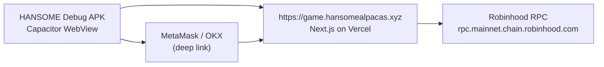

# HANSOME Mainland China Android TEST APK — Internal QA Report

| Field | Value |
|---|---|
| Date | 2026-07-23 |
| Mode | **TEST APK / internal QA only** — not Play Store, not CN store distribution |
| Wrapper path | `mobile/hansome-game/` |
| Production URL | `https://game.hansomealpacas.xyz` |
| Package ID | `xyz.hansomealpacas.game` |
| App name | **HANSOME** |
| Capacitor | 7.x (`@capacitor/core` 7.4.2) |
| Min SDK | 23 · Target/Compile SDK 35 |
| Signing | **Debug keystore** (Gradle default) — no production key committed |

---

## Verdicts

| Check | Result |
|---|---|
| **APK BUILD** | **PASS** |
| **SAFE FOR INTERNAL TESTING** | **YES** |
| **MAINLAND CHINA PRODUCTION READY** | **NO** — pending real CN device/network testing |

---

## APK artifact

| Property | Value |
|---|---|
| Primary path | `mobile/hansome-game/android/app/build/outputs/apk/debug/app-debug.apk` |
| Copy (gitignored) | `artifacts/hansome-game-debug.apk` |
| Size | **4,403,900 bytes** (~4.20 MiB) |
| SHA-256 | `a33495adeb371840b232d1f2f85ee9c3e8981d65bc96b56eefc50743c506db52` |
| Published | **No** — sideload / internal QA only |

### Install (internal QA)

```powershell
adb install -r artifacts\hansome-game-debug.apk
```

Or sideload the APK file directly on a test device (enable “Install unknown apps” for the file manager).

---

## Architecture



- **Website = source of truth** — APK loads the live production URL via `server.url`; no duplicate game business logic bundled.
- **System WebView** — no Google Play Services, Firebase, Maps, TWA, or Chrome Custom Tabs requirement.
- **HTTPS only** — `cleartext: false`, `usesCleartextTraffic="false"`, `network_security_config` blocks cleartext.
- **Portrait lock** — `android:screenOrientation="portrait"` on main activity.
- **Trusted origin** — `game.hansomealpacas.xyz` (+ related HANSOME hosts in `allowNavigation`).

### Capacitor config (committed)

File: `mobile/hansome-game/capacitor.config.ts`

- `server.url`: `https://game.hansomealpacas.xyz`
- `server.cleartext`: `false`
- `server.androidScheme`: `https`
- `allowNavigation`: game host, MetaMask/OKX link domains, Blockscout, Pinata gateway, Robinhood RPC host
- WebView debugging enabled for QA (`webContentsDebuggingEnabled: true`)

Placeholder `www/index.html` ships in APK assets but is **not** used at runtime when remote URL is set.

---

## Build verification

| Step | Command | Result |
|---|---|---|
| Web typecheck | `npm run typecheck` (repo root) | **PASS** |
| Web lint | `npm run lint` (repo root) | **PASS** (pre-existing warnings only) |
| Web build | `npm run build` (repo root) | **PASS** |
| Android debug APK | `mobile/hansome-game/android/gradlew.bat assembleDebug` | **PASS** (JDK 21 required) |

**Rebuild prerequisites:** JDK 21+, Android SDK (platform 35, build-tools 35.0.0), `ANDROID_HOME` / `local.properties` pointing at SDK. `local.properties` is gitignored.

---

## Secret scan (APK + wrapper assets)

Script: `mobile/hansome-game/scripts/secret-scan.mjs`

Scanned: debug APK binary, `android/app/src/main/assets/`, `www/`, `capacitor.config.ts`

| Pattern class | Hits |
|---|---|
| Private keys / mnemonics | **0** |
| KV / Pinata JWT / relayer env names | **0** |
| Vercel / AWS tokens | **0** |

**Verdict: PASS** — APK contains Capacitor shell + minimal placeholder HTML/config only; no server secrets, no `.env`, no relayer/vault keys, no reveal seed or unrevealed metadata.

Public `NEXT_PUBLIC_*` values are **not** in the APK bundle (loaded at runtime from the remote website JS).

---

## Wallet deep-link behavior (documented — no web changes)

Existing web logic (`lib/game/walletConnect.ts`, `WalletHelpModal`) — **unchanged**.

WebView has **no injected** `window.ethereum`. Connect flow uses the in-app help modal → external wallet apps.

### Allowlisted navigation (Capacitor)

| Target | Purpose |
|---|---|
| `https://metamask.app.link/dapp/...` | MetaMask mobile dapp open |
| `https://link.metamask.io/...` | MetaMask alternate link host |
| `https://www.okx.com/download?deeplink=...` | OKX Wallet dapp open |
| `metamask://`, `okx://` (system handler) | Custom scheme handoff when wallet app intercepts |

Non-allowlisted HTTPS (e.g. Blockscout explorer, marketing site) opens in the **system browser** per Capacitor external-link rules.

### Expected QA behaviors

| Scenario | Expected behavior |
|---|---|
| **MetaMask installed** | User taps Connect → help modal → MetaMask link → MetaMask in-app browser opens dapp → user connects/signs → user returns to HANSOME APK (task switcher or recent apps). Connection state depends on MetaMask session; WebView may still show “not connected” until user completes flow in wallet browser. |
| **MetaMask not installed** | MetaMask link may open Play Store / landing page; web shows “No compatible wallet detected…” (`NO_WALLET_CONNECT_MESSAGE`). |
| **OKX installed** | OKX deeplink page → OKX app opens dapp URL → same return-via-recents pattern as MetaMask. |
| **OKX not installed** | OKX download landing; same error UX if no provider. |
| **Wrong chain (not 4663)** | Web shows switch-network UX (Robinhood Mainnet); user must switch in wallet app. No WalletConnect QR (not shipped). |
| **Return to APK** | `launchMode="singleTask"` — reopening icon resumes same WebView task; remote URL reloads from Capacitor server config. |
| **Android back button** | Capacitor `BridgeActivity` navigates WebView history when `canGoBack`; otherwise moves task to background. |

**Limitation:** Deep-link connect does not inject a provider back into the APK WebView. Full in-WebView signing requires opening inside MetaMask/OKX in-app browser (same as mobile Chrome without extension). This matches current product design per `docs/WALLET_MOBILE_CONNECT.md`.

---

## WebView `localStorage` — Commit/Reveal note

Mainnet commit salts are stored client-side only:

- Key: `hansome-commit-secrets-v2` (`lib/game/commitSecret.ts`)
- Scope: per wallet address; survives normal app background/foreground **within the same WebView profile**

### Will break Reveal

| Event | Effect |
|---|---|
| APK uninstall / clear app data | **Salts lost** — cannot Reveal committed moves |
| WebView storage wipe (Settings → Apps → HANSOME → Clear storage) | **Salts lost** |
| Different device | **No salts** — must Commit on that device |
| Cross-wallet switch | Secrets scoped per wallet — expected |

### Persists (typical)

| Event | Effect |
|---|---|
| Background → foreground | Storage retained |
| Process kill by OS | Usually retained (same app UID) |
| Web deploy updates | Unaffected — storage is local to WebView |

**No redesign in this task** — documented for CN QA testers. Mainnet has **no** server-side commit vault (testnet gasless vault is off on chain 4663).

---

## Icons & splash

Source: `public/icons/pwa/icon-512.png`

Applied via `mobile/hansome-game/scripts/apply-icons.mjs` to Android `mipmap-*` launcher icons and `drawable/splash.png`. Splash background `#0a0a0f` (Capacitor SplashScreen plugin).

---

## Scope compliance (untouched)

| Area | Status |
|---|---|
| `contracts/**` | **Untouched** |
| Genesis mint / Blind Box / Reveal metadata / genesisIdentity | **Untouched** |
| Mainnet env / Whitelist / sale times | **Untouched** |
| Settlement worker | **Untouched** |
| Game economics / forum persistence | **Untouched** |
| PWA production config | **Untouched** |
| WalletConnect / wallet business logic in web app | **Untouched** |
| Production signing keys | **Not created or committed** |
| Mainnet transactions | **None sent** |
| Website changes | **Zero** — wrapper-only |

---

## Mainland China — explicit non-claims

This APK **does not** validate:

- Vercel / `game.hansomealpacas.xyz` reachability from mainland networks
- Robinhood RPC latency or blocking from CN
- Pinata IPFS gateway for NFT images
- MetaMask/OKX deep-link round-trip on CN Android ROMs

See prior audit: `reports/MAINLAND_CHINA_ANDROID_READINESS_AUDIT.md`

### Required CN device test matrix (post-sideload)

1. Cold open APK — time-to-interactive, TLS, blank screen
2. `eth_chainId` via wallet to Robinhood RPC
3. MetaMask deep link round-trip from APK
4. OKX deep link round-trip
5. No wallet apps installed — error UX
6. Switch to chain **4663**, Commit one NFT
7. Same-device Reveal after Commit — **localStorage persistence**
8. Claim after settlement window
9. My NFTs — Pinata metadata/image load
10. Forum read + signed post
11. BGM/SFX from same-origin `/audio/*`
12. Background → foreground session behavior
13. Flaky network / airplane mode error messages

---

## Repository layout (new)

```
mobile/hansome-game/
  capacitor.config.ts      # remote URL + allowNavigation
  package.json             # Capacitor deps + build scripts
  www/index.html           # placeholder (unused at runtime)
  scripts/
    apply-icons.mjs        # icon/splash from PWA assets
    copy-debug-apk.mjs     # copy to artifacts/
    secret-scan.mjs        # APK/asset secret scan
  android/                 # Capacitor Android project (committed)
artifacts/
  hansome-game-debug.apk   # gitignored copy for QA handoff
```

---

## References

- Readiness audit: `reports/MAINLAND_CHINA_ANDROID_READINESS_AUDIT.md`
- Wallet mobile connect: `docs/WALLET_MOBILE_CONNECT.md`
- Commit secrets: `lib/game/commitSecret.ts`
- Deep links: `lib/game/walletConnect.ts`

---

*End of report — TEST APK only; do not publish to stores or claim CN production readiness.*
