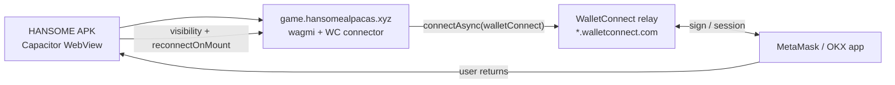

# Android Wallet Connection Fix — Capacitor APK + WalletConnect v2

| Field | Value |
|---|---|
| Date | 2026-07-23 |
| Mode | Internal QA debug APK only — **not published** |
| Target chain | Robinhood Mainnet **4663** |
| APK package | `xyz.hansomealpacas.game` |
| Remote web URL | `https://game.hansomealpacas.xyz` |

---

## Verdicts

| Check | Result |
|---|---|
| **ANDROID WALLET CONNECT** | **NEEDS REAL DEVICE TEST** — code + APK built; requires Vercel deploy with `NEXT_PUBLIC_WALLETCONNECT_PROJECT_ID` |
| **METAMASK** | **NEEDS REAL DEVICE TEST** |
| **OKX** | **NEEDS REAL DEVICE TEST** |
| **SAFE FOR INTERNAL QA** | **YES** |

---

## Root cause

### Why WebView → deep link → return failed

The Capacitor APK loads the live game in a **system WebView** (`server.url` → `https://game.hansomealpacas.xyz`). That WebView has **no injected `window.ethereum`** provider.

The previous connect path when no provider was detected:

1. User taps **Connect Wallet** → preflight fails → **WalletHelpModal**
2. User taps **Open in MetaMask** → `metamask.app.link/dapp/game.hansomealpacas.xyz/...`
3. MetaMask opens the dapp in **MetaMask’s in-app browser** (a separate WebView with its own injected provider)
4. User approves connect **inside MetaMask’s browser**
5. User switches back to the HANSOME APK → original Capacitor WebView resumes

**Failure:** The EIP-1193 provider and wagmi session exist only inside MetaMask’s browser context. The HANSOME APK WebView never received a provider, never ran `connectAsync` successfully, and has **no account state**. Deep links alone cannot bridge two isolated WebViews.

The same pattern applies to OKX dapp deep links (`okx.com/download?deeplink=...`).

### Why MetaMask may open Google Play Store

| Scenario | Behavior |
|---|---|
| MetaMask **not installed** | `metamask.app.link` / universal link handlers fall through to **Play Store** install page |
| MetaMask installed but link handler fails | OS may still offer Play Store as fallback |
| User expects in-app browser | Link opens MetaMask app, not Play Store — Play Store usually means **missing wallet app** |

This is expected Android behavior, not a HANSOME bug. WalletConnect v2 avoids relying on dapp deep links by pairing through the **WalletConnect relay** instead.

---

## Architecture (after fix)



### Connect path selection

| Surface | Provider | Connector used |
|---|---|---|
| Desktop + MetaMask extension | `window.ethereum` | `injected()` (unchanged) |
| Mobile browser + in-wallet browser | injected | `injected()` |
| Mobile browser, no injection | none | `walletConnect` (if project id set) |
| **Capacitor APK WebView** | **none** | **`walletConnect` always preferred** |

### Session restore

- wagmi `reconnectOnMount` (existing in `Web3Provider`)
- `CapacitorWalletBridge` listens for `visibilitychange` / `focus` / `pageshow` and calls `useReconnect()` when the shell returns from a wallet app

---

## Files changed

### Web app (wallet logic)

| File | Change |
|---|---|
| `lib/wagmi.ts` | Add `walletConnect` via `wagmi/connectors/walletConnect` when `NEXT_PUBLIC_WALLETCONNECT_PROJECT_ID` is set; keep `injected()` |
| `lib/game/walletConnect.ts` | Capacitor-aware connector pick; block injected on Capacitor; new helper messages |
| `lib/game/capacitorEnv.ts` | **New** — `isCapacitorNative()`, `shouldPreferWalletConnect()` |
| `hooks/game/useOpenWalletConnect.ts` | Use Capacitor-aware preflight messages |
| `hooks/game/useCapacitorWalletResume.ts` | **New** — reconnect on app resume |
| `components/game/CapacitorWalletBridge.tsx` | **New** — mounts resume hook |
| `context/WalletConnectContext.tsx` | Bridge + help modal retry; hide broken deep links when WC configured |
| `components/game/WalletHelpModal.tsx` | Hide MetaMask/OKX dapp links on Capacitor; retry CTA for WC |
| `lib/game/__tests__/walletConnect.test.ts` | Mock Capacitor env for existing tests |
| `.env.example` | Document `NEXT_PUBLIC_WALLETCONNECT_PROJECT_ID` |
| `package.json` | Add `@wagmi/connectors`, `@wagmi/core`, `@walletconnect/ethereum-provider` |

### Capacitor / Android shell

| File | Change |
|---|---|
| `mobile/hansome-game/capacitor.config.ts` | Allow WalletConnect / Reown relay hosts in navigation |
| `mobile/hansome-game/android/app/src/main/AndroidManifest.xml` | Intent filters: `xyz.hansomealpacas.game://` + `https://game.hansomealpacas.xyz` for wallet return / resume |

### Not changed (launch lock respected)

- Smart contracts, Genesis mint / blind box / reveal flows
- Mainnet env addresses / game economics
- `app/game/mint/`, `app/game/reveal/`, `app/game/launch-end/`, contract scripts

---

## Dependencies added

```json
"@wagmi/connectors": "^8.0.22",
"@wagmi/core": "^3.6.1",
"@walletconnect/ethereum-provider": "^2.23.10"
```

Import uses **`wagmi/connectors/walletConnect`** (direct subpath, not `wagmi/connectors` barrel) to avoid Next.js production build failures from optional connector peers.

---

## Required deploy step (critical)

The APK loads **remote production JS**. Code changes do **not** take effect until:

1. **Merge & deploy** this web app to Vercel (`game.hansomealpacas.xyz`)
2. Set **`NEXT_PUBLIC_WALLETCONNECT_PROJECT_ID`** in Vercel (public Reown project id from [dashboard.reown.com](https://dashboard.reown.com))
3. Sideload the new debug APK below

Without the env var, wagmi falls back to **injected-only** and Capacitor behavior matches the old broken path.

---

## Security

| Topic | Status |
|---|---|
| Private keys / mnemonics / vault secrets in APK or web bundle | **None added** |
| WalletConnect project id | Public client id only (documented in `.env.example`) |
| Signature verification / forum auth | **Unchanged** — no weakening |
| Custody / private-key import | **Not implemented** |
| Mainnet txs from this task | **None sent** |

---

## Desktop / mobile browser regression

| Scenario | Expected |
|---|---|
| Desktop Chrome + MetaMask extension | Still uses `injected()` — **unchanged** |
| Desktop without extension | WalletConnect QR modal when project id set |
| Mobile Safari / Chrome in-wallet | Injected path when provider present — **unchanged** |
| Mobile without wallet browser | WalletConnect mobile wallet list / deep link when project id set |

Build verification:

| Step | Result |
|---|---|
| `npm run typecheck` | **PASS** |
| `npm run lint` | **PASS** (pre-existing warnings only) |
| `npm run build` | **PASS** |
| `vitest` walletConnect tests | **PASS** (12/12) |
| `gradlew assembleDebug` | **PASS** (JDK 21) |

---

## Debug APK artifact

| Property | Value |
|---|---|
| Primary path | `mobile/hansome-game/android/app/build/outputs/apk/debug/app-debug.apk` |
| Copy | `artifacts/hansome-game-debug.apk` |
| Size | **4,426,622 bytes** (~4.22 MiB) |
| SHA-256 | `41743b01c873f0388e0c96cadf26eb5a7ce65242759d96d221c85ef85b7e8c9b` |

### Install (internal QA)

```powershell
adb install -r artifacts\hansome-game-debug.apk
```

---

## QA checklist (Taiwan Android device)

After Vercel deploy + project id:

1. Open APK → Connect Wallet → MetaMask opens → approve → return → **address shown**, chain **4663**
2. Repeat with OKX Wallet
3. Sign a forum nonce or commit tx — signature succeeds
4. Kill app, reopen — session **restores** via WalletConnect storage + reconnect
5. Desktop Chrome + MetaMask extension — connect still works via injection

---

## Related docs

- Prior APK report: `reports/ANDROID_MAINLAND_CHINA_TEST_APK.md`
- Mobile connect doc (pre-fix): `docs/WALLET_MOBILE_CONNECT.md` — update after deploy
