# HANSOME — Cold Perf V2 Phase 9 Critical Path Profiler

| Field | Value |
|-------|--------|
| **Date** | 2026-07-29T16:13:37.471Z |
| **Live tip before** | `dpl_5xqS15tNvmkgyAXp1KhLzPNEjup7` |
| **Live tip after** | `dpl_5xqS15tNvmkgyAXp1KhLzPNEjup7` |
| **Candidate deploy** | `dpl_Bcb7DXZU7wVgn8ueM7syuCTrGjqq` (instrumentation-only, not promoted) |
| **Alias www/game promoted?** | **NO** |
| **Test alias** | restored → Phase 8 tip |
| **PonsLaunchLocker** | **Excluded** |
| **Phase 7.1 Smart LP** | **Inactive** |
| **Profiler flag** | `HANSOME_CRITICAL_PATH_PROFILE=1` (candidate only) |
| **Verdict** | **PASS_NOT_DEPLOYED** |

Phase 9 is **instrumentation and profiling only**. No optimizations shipped. No Production promotion.

Machine-readable: `reports/data/phase9_aggregate.json`

---

### 1. Method

| Layer | Mechanism |
|-------|-----------|
| Opt-in server profiler | `lib/hansome-score/critical-path-profiler.ts` via `HANSOME_CRITICAL_PATH_PROFILE=1` |
| Hierarchical spans | Extends Phase 8 `deep-profile` + KF LP substages |
| RPC timing | Blockscout / Gecko / ETH-USD / Robinhood RPC wrappers |
| Client reconstruction | Dense status poll → DAG / Chrome Trace / Mermaid / flamegraph |
| Clean HANSOME n=3 | Phase 8.1B proven KF cleans (40 797 / 37 510 / 35 727) |
| Live instrumented | Candidate `dpl_Bcb7…` one clean KF **31 497 ms** with server RPC dump |

### 2. Measurements

| Sample | n | Wall (ms) | Notes |
|--------|--:|-----------|-------|
| HANSOME clean KF | 3 | 40797, 37510, 35727 | median **37510** |
| HANSOME live instrumented | 1 | 31497 | serverProfile=true; KF price-only |
| PRIMARY refresh | 2 | 594, 56787 | real: 56787 |
| Core7 status | 8 | — | terminal 7/8 |
| Top100 sample | 25 | — | terminal 4/25 |

### 3. Total wall + critical path (HANSOME median)

- **Total wall:** **37510 ms**
- **Critical path total:** **37510 ms**
- **Critical path:** `DeepScan → Cache/WarmPrelude → ParallelWave → Liquidity → lp_known_evidence_load → Score`
- **Parallel utilization %:** 75.7
- **Idle %:** 35.9
- **Blocked %:** 12.5
- **Source:** phase81b_clean_kf_median+live_server_rpc

Live instrumented critical path (server spans):
`scan.deep.parallel_wave → scan.deep.relationships → scan.deep.liquidity → scan.deep.creatorBurn → scan.deep.liquidity.known_first → scan.deep.liquidity.lp_market_refresh`

### 4. Every stage duration (HANSOME median client DAG)

| Stage | ms |
|-------|---:|
| DeepScan | 37510 |
| Liquidity | 25037 |
| Creator | — |
| Burn | — |
| CreatorBurn | 11664 |
| Holder | — |
| Relationships | 12723 |
| Market | 5699 |
| Presentation | — |
| Security | — |
| Score | 3540 |
| Discovery | 0 |
| TransferIndex | 1088 |
| Cache | 1080 |
| BackgroundExhaustive | 50 |
| Publish | — |
| FinalValidation | 2174 |
| ParallelWave | 29690 |

Live server stage overlay (instrumented run):

| Stage | ms |
|-------|---:|
| DeepScan | 0 |
| Liquidity | 25783 |
| CreatorBurn | 20643 |
| Relationships | 18805 |
| Market | 5699 |
| Score | 3 |
| FinalValidation | 1010 |
| ParallelWave | 25788 |

### 5. RPC duration summary (live instrumented server)

| Provider | count | median | P95 | P99 | slowest | timeouts | retries |
|----------|------:|-------:|----:|----:|--------:|---------:|--------:|
| robinhood_rpc | 0 | — | — | — | — | 0 | 0 |
| blockscout | 20 | 4715 | 9073 | 21881 | 21881 | 0 | 0 |
| gecko | 1 | 1834 | 1834 | 1834 | 1834 | 0 | 0 |
| eth_usd | 1 | 920 | 920 | 920 | 920 | 0 | 0 |
| other_http | 0 | — | — | — | — | 0 | 0 |

### 6. Top bottlenecks

| Rank | Node | Wall ms | On crit path |
|-----:|------|--------:|:------------:|
| 1 | DeepScan | 37510 | Y |
| 2 | ParallelWave | 29690 | Y |
| 3 | Liquidity | 25037 | Y |
| 4 | Relationships | 12723 | N |
| 5 | CreatorBurn | 11664 | N |
| 6 | lp_known_evidence_load | 8109 | Y |
| 7 | creator_burn_recompute | 4558 | N |
| 8 | Score | 3540 | Y |
| 9 | lp_known_first_plan | 3460 | N |
| 10 | lp_lock_reuse | 3294 | N |

Top 10 longest RPCs (live):

| Rank | Provider | Name | ms |
|-----:|----------|------|---:|
| 1 | blockscout | /api/v2/tokens/0x58daec3116aae6D93017bAAea7749052E8a04fA7/transfers | 21881 |
| 2 | gecko | gecko_pool | 1834 |
| 3 | eth_usd | coingecko_simple_price | 920 |

### 7. Critical path table

| Step | Name | Start | Finish | Wall | Contribution |
|-----:|------|------:|-------:|-----:|-------------:|
| 1 | DeepScan | 0 | 37510 | 37510 | 37510 |
| 2 | Cache/WarmPrelude | 3200 | 4280 | 1080 | 1080 |
| 3 | ParallelWave | 4280 | 33970 | 29690 | 29690 |
| 4 | Liquidity | 8933 | 33970 | 25037 | 25037 |
| 5 | lp_known_evidence_load | 12393 | 20502 | 8109 | 8109 |
| 6 | Score | 33970 | 37510 | 3540 | 3540 |

### 8. Mermaid DAG (HANSOME median)

```mermaid
flowchart TD
  DeepScan[["DeepScan\n37510ms"]]
  Cache_WarmPrelude[["Cache/WarmPrelude\n1080ms"]]
  ParallelWave[["ParallelWave\n29690ms"]]
  Relationships["Relationships\n12723ms"]
  Liquidity[["Liquidity\n25037ms"]]
  CreatorBurn["CreatorBurn\n11664ms"]
  Score[["Score\n3540ms"]]
  lp_known_first_plan["lp_known_first_plan\n3460ms"]
  lp_known_evidence_load[["lp_known_evidence_load\n8109ms"]]
  lp_known_evidence_validate["lp_known_evidence_validate\n2303ms"]
  lp_owner_reuse["lp_owner_reuse\n2196ms"]
  lp_lock_reuse["lp_lock_reuse\n3294ms"]
  lp_market_refresh["lp_market_refresh\n2386ms"]
  lp_known_first_early_exit["lp_known_first_early_exit\n1115ms"]
  lp_final_validation["lp_final_validation\n2174ms"]
  lp_background_exhaustive["lp_background_exhaustive\n50ms"]
  head_overlap_refresh["head_overlap_refresh\n1088ms"]
  background_history_resume["background_history_resume\n1151ms"]
  creator_burn_recompute["creator_burn_recompute\n4558ms"]
  funder["funder\n1212ms"]
  early_transfers["early_transfers\n1097ms"]
  warm_snapshot_load["warm_snapshot_load\n1080ms"]
  checkpoint_validate["checkpoint_validate\n1327ms"]
  parallel_wave_start["parallel_wave_start\n1077ms"]
  DeepScan --> Cache_WarmPrelude
  DeepScan --> ParallelWave
  ParallelWave --> Relationships
  ParallelWave --> Liquidity
  ParallelWave --> CreatorBurn
  DeepScan --> Score
  Liquidity --> lp_known_first_plan
  Liquidity --> lp_known_evidence_load
  Liquidity --> lp_known_evidence_validate
  Liquidity --> lp_owner_reuse
  Liquidity --> lp_lock_reuse
  Liquidity --> lp_market_refresh
  Liquidity --> lp_known_first_early_exit
  Liquidity --> lp_final_validation
  Liquidity --> lp_background_exhaustive
  CreatorBurn --> head_overlap_refresh
  CreatorBurn --> background_history_resume
  CreatorBurn --> creator_burn_recompute
  Relationships --> funder
  Relationships --> early_transfers
  Cache_WarmPrelude --> warm_snapshot_load
  Cache_WarmPrelude --> checkpoint_validate
  Cache_WarmPrelude --> parallel_wave_start
```

### 9. Parallelization report (report only — no opts)

- **alreadyParallel:** Relationships ∥ Liquidity ∥ CreatorBurn; Gecko ∥ ETH-USD inside market ensure (server)
- **serialize:** Score after parallel barrier; KF LP steps plan→evidence→owner→lock→market→exit; Warm prelude before parallel wave
- **independent:** Relationships vs Liquidity vs CreatorBurn until Score; lp_background_exhaustive after interactive LP barrier
- **unnecessarilyWait:** Score marked analyzing while parallel still running; KF owner/lock publish before independent market fetch starts
- **couldStartEarlier:** ensureMarket could start at lp_known_first_plan; Score recompute could stream as legs finish (not implemented)
- **blocksWithoutDataDep:** Score waits for Relationships even when LP+CreatorBurn done

### 10. Optimization opportunities (ranked — DO NOT IMPLEMENT)

| Rank | Opportunity | Expected saved ms | Complexity | Risk |
|-----:|-------------|------------------:|------------|------|
| 1 | Non-LP parallel work dominates after Quick skip — reduce Relationships/CreatorBurn or start Score earlier | 12473 | high | medium |
| 2 | KF Liquidity wall still material with Quick skipped — profile publish + market awaits inside LP path | 10000 | medium | low |
| 3 | Tighten score finalize / avoid any residual market refetch | 3540 | low | low |
| 4 | Start Gecko+ETH-USD at KF plan time (overlap with evidence/owner/lock) | 2386 | low | low |

### 11. Artifacts

- **report:** `reports/HANSOME_COLD_PERF_V2_PHASE9_CRITICAL_PATH_PROFILER.md`
- **medianJson:** `reports/data/phase9_hansome_median.json`
- **medianChromeTrace:** `reports/data/phase9_hansome_median.chrome-trace.json`
- **medianFlamegraph:** `reports/data/phase9_hansome_median.flamegraph.json`
- **medianMermaid:** `reports/data/phase9_hansome_median.mermaid.mmd`
- **medianCritTable:** `reports/data/phase9_hansome_median.critical-path-table.json`
- **liveInstrumented:** `reports/data/phase9_hansome_live.json`
- **liveChromeTrace:** `reports/data/phase9_hansome_live.chrome-trace.json`
- **aggregate:** `reports/data/phase9_aggregate.json`

### 12. Forbidden-scope compliance

- No score formula / weight / threshold changes
- No liquidity / creator / burn / holder / relationships / market semantic changes
- Smart LP still off; Pons still excluded
- Cache / retry / watchdog logic unchanged
- Profiling opt-in only (`HANSOME_CRITICAL_PATH_PROFILE=1`)
- **www/game tip unchanged:** `dpl_5xqS15tNvmkgyAXp1KhLzPNEjup7`
- Test alias restored to Phase 8 tip after measures

### 13. Final verdict

**PASS_NOT_DEPLOYED**

Instrumentation shipped to candidate only. Critical-path artifacts produced. No www/game promotion. Remaining ~35–40s wall after Quick skip is dominated by parallel non-Quick work (Liquidity KF residual + Relationships/CreatorBurn barrier), not broad Quick/Titan.
