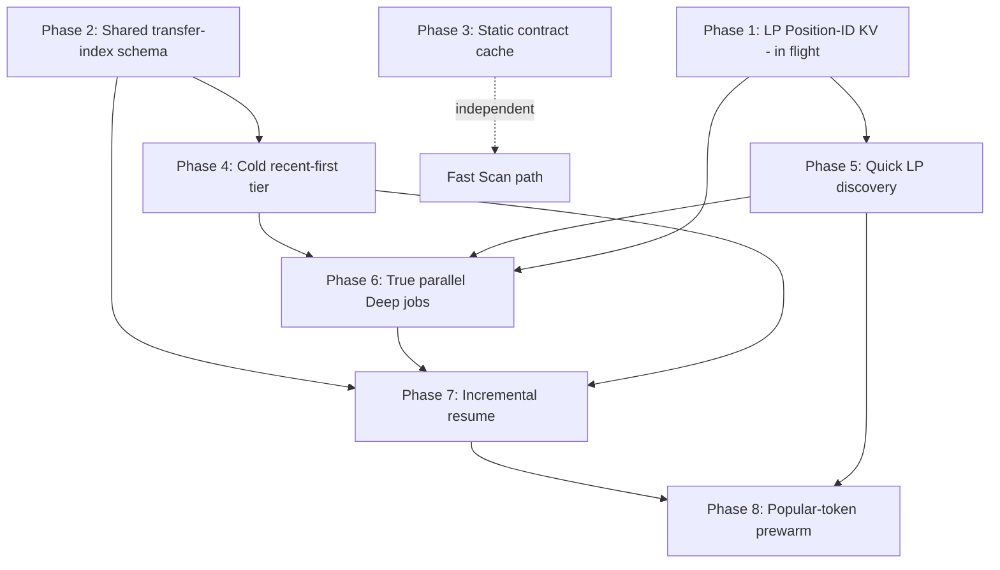

# HANSOME — Cold Scan V2 + Deep Performance V2 Unified Implementation Plan

| Field | Value |
|-------|-------|
| **Date** | 2026-07-28 |
| **Scope** | Implementation planning only |
| **Code changed** | **No** |
| **Deployed** | **No** |
| **Inputs (PASS)** | `reports/HANSOME_COLD_SCAN_V2_DESIGN.md`, `reports/HANSOME_DEEP_SCAN_PERFORMANCE_V2_DESIGN.md` |
| **Phase 1 note** | `reports/HANSOME_DEEP_PERF_V2_PHASE1_LP_CACHE.md` **not present**; workspace already contains Persistent LP Position-ID KV matching Perf V2 §5.2 (`lib/hansome-score/lp/position-cache.ts` → `scan:lp:{chainId}:{token}`). Treat as **Phase 1 already approved / in flight**. **Do not edit Phase 1 code** from this plan. |
| **Analytics MVP** | **Untouched** |
| **Recommendation** | **APPROVE sequence** (see §9) |

---

## 0. Goal, constraints, non-goals

### Goals (latency)

| Path | Target (where upstream permits) |
|------|----------------------------------|
| Cold first useful Deep | **30–60s** (Lock Dist and/or recent Creator/Burn with honest Incomplete) |
| Warm / repeat Deep | **10–30s** when cached / indexed evidence exists |
| Fast Scan | **Remain fast** (do not add Deep work to Fast; static contract cache may shave repeat Fast only) |

**Useful Deep** = progressive publish of Lock Distribution (verified / quick-discovery MIXED-or-locked evidence) **and/or** Creator + Burn over a recent transfer tier — never claimed complete until genesis / exhaustive rules allow.

### Hard constraints (frozen)

- No scoring formula / weight changes  
- No Burn semantics changes  
- No LP / lock semantics changes  
- No risk threshold changes  
- No Unknown → Safe / No conversion  
- No timeout inflation as the solution  
- No token-specific FOX / CASHCAT / PONS **result** hardcoding  
- HANSOME seeds may remain **hints only**  
- Analytics MVP untouched (`lib/scan-analytics.ts` and related surfaces)  
- Existing `deepAttemptId` retry fencing must remain valid  
- Existing Top-100 compatibility must not regress  

### This turn

- **NO IMPLEMENT** · **NO DEPLOY** · **NO CODE MODIFICATION** (plan document only)

---

## 1. Shared vs Cold-only vs Warm-only matrix

| Capability | Shared (implement once) | Cold V2 primary | Warm / Perf V2 primary |
|------------|:-----------------------:|:---------------:|:----------------------:|
| **Transfer-index schema** (`scan:xfer:*` meta, lock, optional chunks, derived digests) | **YES** | Recent-tier write + publish | Incremental resume / backfill |
| **Persistent LP Position-ID KV** (`scan:lp:*`) | **YES** | Revalidate-first on cold isolate | Cross-isolate warm Lock Dist |
| **Static contract-analysis cache** (`scan:contract:*` proposed) | **YES** | Populate on first Fast | Hit on repeat Fast / Deep touch |
| **Single transfer fetcher / coordinator** (one writer per token) | **YES** | Recent 6p ∩ 7d | Head refresh + genesis resume |
| **Deep job / stage state + snapshot fencing** | **YES** | True parallel first useful | Per-stage resume / retry |
| **Score publisher** (existing formulas only, on stage transitions) | **YES** | Progressive after parallel publishes | Same |
| Cold **recent-first** page/time caps | uses Shared | **Cold-only behavior** | — |
| **Quick LP discovery** (Titan / hints / PM 2–3p; exhaustive async) | uses Shared LP KV | **Cold-only behavior** | Exhaustive completion may fill KV for warm |
| **True parallel Deep jobs** | Shared orchestration | **Cold wall-clock win** | Also enables warm stage independence |
| **Repeat-scan incremental resume** | uses Shared xfer meta | — | **Warm-only behavior** |
| **Popular-token prewarming** | uses Shared stores + jobs | — | **Warm-only / last** |
| Burn product store `scan:burn:*` | **Keep existing** (not redesigned) | Recent tier upserts honest Incomplete | Prefer incremental refresh when meta usable |
| In-process `position-cache` memory layer | Keep as L1 over KV | Cold miss → KV | Warm hit |

**Rule:** schemas and KV writers are Shared; Cold and Warm are **consumers** with different budgets and completeness claims. Never fork a second transfer index or second LP ID store.

---

## 2. Recommended phase order (with rationale)

User conceptual order preserved where dependencies allow; reorders justified below.

| # | Phase title | Why this slot |
|---|-------------|---------------|
| **1** | Persistent LP Position-ID KV schema (**in flight — do not edit**) | Already matches Perf V2; prerequisite for Quick LP and warm Lock Dist; land/verify separately if unfinished |
| **2** | Shared transfer-index schema + helpers | Prerequisite for recent-first **and** incremental resume; implement once |
| **3** | Static contract-analysis cache | Independent of Deep path; keeps Fast lean on repeats; no Deep dependency — ship early while small |
| **4** | Cold recent-first transfer tier | Unlocks Creator/Burn first useful ~15–35s without 40-page wall; must land **before** relying on 30–60s cold band |
| **5** | Quick LP discovery | Unlocks FOX-class Lock Dist without 190s exhaustive; consumes Phase 1 KV; exhaustive stays async |
| **6** | True parallel Deep jobs | Collapses sequential sum into max(stage); fencing must be proven; most valuable **after** Phases 4–5 so parallel work is *useful* work |
| **7** | Repeat-scan incremental resume | Warm 10–30s path; needs populated cursors from Phases 2/4 (+ parallel job model from 6) |
| **8** | Popular-token prewarming | Last; amplifies warm hits; must not race Analytics or stampede Blockscout |

### Reorder vs user’s numbered list

| User item | Plan phase | Change |
|-----------|------------|--------|
| 1 Shared transfer-index schema | **2** | After LP KV (in flight) so calendar doesn’t block Phase 1 verification |
| 2 Persistent LP Position-ID KV | **1** | First — already in flight |
| 3 Static contract cache | **3** | Unchanged relative position among greenfield work |
| 4 Cold recent-first | **4** | Unchanged |
| 5 Quick LP discovery | **5** | Unchanged (after LP KV) |
| 6 True parallel Deep jobs | **6** | **After** recent-first + quick LP (Cold V2 §6 / §8): parallel alone with 40-page Creator still fails FOX band |
| 7 Repeat-scan incremental resume | **7** | Unchanged (after schema + cold writers) |
| 8 Popular-token prewarming | **8** | Last — unchanged |

### Why not parallel earlier?

Parallel jobs alone (Cold V2 step 1) can surface HANSOME Lock Dist ~15–40s, but Creator/Burn stays ~100s+ on 40 pages and FOX Lock Dist stays weak. Landing recent-first + quick LP **first** makes the parallel phase’s wall clock land inside 30–60s for both history UI and Lock Dist when evidence exists.

---

## 3. Dependency graph

**Parallelizable calendars (no code coupling):** Phase 3 can proceed in parallel with Phases 2/4/5. Phase 1 verification can finish while Phase 2 is authored — **without** modifying Phase 1 modules from other agents’ workstreams.

---

## 4. Phases (detail)

### Phase 1 — Persistent LP Position-ID KV (**IN FLIGHT — DO NOT EDIT**)

| | |
|--|--|
| **Status** | Treat as approved / in flight. Report file absent; code already defines `LpDiscoveryCache`, `scan:lp:{chainId}:{token}`, load/persist, sanitize (no lock-truth). |
| **Files / modules** | `lib/hansome-score/lp/position-cache.ts`, consumers in `lp/detect.ts`, `lp/multi.ts`, tests in `__tests__/lp-known-first.test.ts` — **read/consume only from later phases** |
| **Migration / KV** | `scan:lp:{chainId}:{token}` → discovery inputs only (`positionIds`, pools, versions, lockerCandidates, `exhaustiveComplete`, timestamps). TTL soft ~24h; always revalidate on-chain |
| **Cold latency** | When IDs already in KV: Lock Dist path toward **~10–20s** instead of rediscovery; first-time FOX still needs Phase 5 |
| **Warm latency** | Primary win: repeat Lock Dist **~10–20s** without 276× `readPosition` |
| **Correctness risks** | Stale closed NFT IDs; accidental persistence of lock classification — mitigations already in sanitize / revalidate-on-use |
| **Regression tests** | Existing LP known-first + sanitize rejects lock-truth fields; no ALL_LOCKED from cache alone |
| **Deploy / no-deploy gate** | **Separate approve** by Phase 1 owner. This unified plan does **not** authorize deploy. Later phases must not regress Top-100 / fencing when Phase 1 ships |

---

### Phase 2 — Shared transfer-index schema + helpers

| | |
|--|--|
| **Intent** | One durable transfer-index contract for Cold recent-tier and Warm resume. **Schema + helpers first**; Deep behavior wiring in Phases 4/7 |
| **Files / modules** | **New:** e.g. `lib/hansome-score/transfer-index/` (`types`, `kv`, `lock`, optional chunk codec). **Touch later (not this phase’s behavior):** `blockscout.ts`, `scan-deep.ts`, `creator.ts`, `supply-burn/*`, `relationship.ts`. **Do not touch:** `lib/scan-analytics.ts` |
| **Migration / KV** | `scan:xfer:{chainId}:{token}` → `TransferIndexMeta` (version, head/tail timestamps+blocks, `nextPageParams`, `paginationComplete`, pages/counts, `indexState`, `generation`); `scan:xfer:lock:{chainId}:{token}` NX lock; optional `scan:xfer:chunk:…`. **Derived-first** (creator digests + existing `scan:burn:*`); optional newest N-page raw window; **never** full ~113k rows in Redis v1 |
| **Cold latency** | Neutral until Phase 4 wires recent-tier (setup only) |
| **Warm latency** | Enables Phase 7; no user-visible warm win alone |
| **Correctness risks** | KV size blowup; opaque cursor invalidation; generation fencing for writers |
| **Regression tests** | Schema round-trip; sanitize; lock NX; reject oversized payloads; generation ignore-stale unit tests |
| **Deploy / no-deploy gate** | **No Production deploy required** if helpers unused; if shipped dark, feature-flag off. Gate: unit tests green; KV size spike on FOX meta+derived sample |

---

### Phase 3 — Static contract-analysis cache

| | |
|--|--|
| **Intent** | Cache ABI / verification / derived capability flags by `chainId + address + bytecodeHash` (or Blockscout verified hash). No risk-threshold changes |
| **Files / modules** | **New:** e.g. `lib/hansome-score/contract-cache.ts`. **Wire:** `scan-fast.ts`, `contract-risk.ts`, burn mechanism helpers that re-fetch smart-contract. Invalidate on bytecode / verification change |
| **Migration / KV** | `scan:contract:{chainId}:{address}:{bytecodeHash}` (or equivalent). TTL long; bust on hash mismatch |
| **Cold latency** | Negligible on Deep first useful; first Fast still populates |
| **Warm latency** | Repeat Fast **~−1–3s**; less Blockscout pressure |
| **Correctness risks** | Stale ABI after upgrade if hash not checked; never convert Unknown→Safe from cache hits |
| **Regression tests** | Hash miss → refetch; capability flags identical with/without cache; Fast path latency smoke; contract-risk fixtures unchanged |
| **Deploy / no-deploy gate** | Optional independent deploy after unit + Fast smoke. **Must not** change Fast request shape enough to slow cold Fast. Top-100 Fast compatibility spot-check |

---

### Phase 4 — Cold recent-first transfer tier

| | |
|--|--|
| **Intent** | Newest-first **min(6 Blockscout pages, 7-day cursor)**; publish Creator + Burn with honest Incomplete; Relationships consume shared head (drop duplicate early-transfers GET) |
| **Files / modules** | `blockscout.ts` (`stopAtOrBeforeTimestampMs` already exists), `scan-deep.ts` creatorBurn path, `creator.ts`, `supply-burn/analyze.ts` / `burn-history.ts` / `burn-cache.ts`, `relationship.ts` (read shared head), Phase 2 transfer-index writers |
| **Migration / KV** | Populate `TransferIndexMeta` every page or every N pages; append-only newest→oldest; burn upsert may run on partial window — windows stay Incomplete/Unknown per existing rules |
| **Cold latency** | Creator/Burn recent **~15–35s** (vs ~106s / soft-fail). Major step toward 30–60s useful Deep |
| **Warm latency** | Partial: leaves cursors for Phase 7; not full warm head-refresh yet |
| **Correctness risks** | Launch-era creator dumps outside window must **not** set `available=true` / clear provisional −8; Burn all-time / P3 Incomplete until genesis; UX must not show “complete” Deep from recent tier alone |
| **Regression tests** | Recent tier asserts `paginationComplete=false`; creator provisional preserved; Burn P2 24h/7d completeness only when window covered; FOX-class fixture with history ≫6 pages; Relationships no second page-1 GET when index has head; Top-20 Deep honesty checks |
| **Deploy / no-deploy gate** | Deploy only after honesty tests + HANSOME/FOX staging smoke. **No** timeout increases. Feature-flag recent-tier if needed |

---

### Phase 5 — Quick LP discovery

| | |
|--|--|
| **Intent** | Generic order: revalidate KV/seeds → Titan → hint NFT inventories → PM recent 2–3 pages → publish Lock Dist with `discoveryComplete=false`; exhaustive **async afterward** |
| **Files / modules** | `lp/detect.ts`, `lp/multi.ts`, `lp/titan.ts`, PM transfer helpers in `blockscout.ts`, `scan-deep.ts` liquidity stage; **consume** Phase 1 KV APIs only (do not rewrite Phase 1 module) |
| **Migration / KV** | Persist newly proven `positionIds` / pools / lockerCandidates via existing `persistLpDiscoveryCache`; never persist lock classification |
| **Cold latency** | HANSOME Lock Dist **~15–30s** stable; FOX Lock Dist **~30–60s** when quick path finds evidence; else history-first useful from Phase 4 while LP stays Incomplete |
| **Warm latency** | Feeds KV for Phase 1 warm path; exhaustive completion improves later repeats |
| **Correctness risks** | Understated locked %; never ALL_LOCKED from quick path alone; no FOX result hardcoding; HANSOME seeds hints only |
| **Regression tests** | Quick path never sets `discoveryComplete=true` / `exhaustiveDiscoveryComplete=true`; MIXED rules unchanged; seed-less token can discover via Titan/hints/PM; Top-20 LP presentation fixtures |
| **Deploy / no-deploy gate** | After Phase 1 KV available in target env (or degrades to memory/seeds). Staging: HANSOME + FOX Lock Dist honesty. Separate approve from Phase 4 |

---

### Phase 6 — True parallel Deep jobs

| | |
|--|--|
| **Intent** | After Fast base: run Liquidity, CreatorBurn (or creator+burn over one xfer job), Relationships as **true concurrent** tasks; Score recomputes on progressive publishes with **existing formulas only** |
| **Files / modules** | `scan-deep.ts` (orchestration), `scan-progress.ts` (fencing / monotonic stage merge), `app/api/scan/*` progress writers, optional `scan:job:{chainId}:{token}:{stage}` helpers per Perf V2 §5.3. Prefer Vercel-friendly model A: one stage slice per invocation / `after()` continuation |
| **Migration / KV** | Optional `scan:job:*` state; snapshot remains UI contract. Align `attemptId` / `generation` with `deepAttemptId` |
| **Cold latency** | Wall clock ≈ **max(quick LP, recent xfer, rel)** → target bundle **~25–60s** useful Deep when Phases 4–5 landed |
| **Warm latency** | Stage independence: stuck burn backfill must not flip liquidity back to analyzing |
| **Correctness risks** | Split-brain snapshot writes; stale generation clobber; double transfer writers — **one xfer coordinator only**; retry-race regressions |
| **Regression tests** | Extend `scan-deep-retry-race.test.ts`, `scan-deep-stage-independence.test.ts`, `scan-progress.test.ts`; concurrent publish merge; stale `deepAttemptId` ignored; Top-20 Deep regression (no lost `done` stages) |
| **Deploy / no-deploy gate** | **Highest-risk Deep deploy.** Require fencing suite green + Production-like smoke (retry / partial rearm) before promote. No timeout inflation |

---

### Phase 7 — Repeat-scan incremental resume

| | |
|--|--|
| **Intent** | On Deep need: if `paginationComplete` + head fresh → ≤5 head pages; else resume `nextPageParams` with budgeted pages; stop cold `maxPages=40` when warm-complete unless Refresh forces reindex. Wire burn incremental helper into Deep path |
| **Files / modules** | Transfer-index consumers, `scan-deep.ts`, `supply-burn/burn-cache.ts` (`refreshBurnHistoryIncremental` / peek helpers), creator digest updates |
| **Migration / KV** | Advance meta + derived stores; keep `scan:burn:*` as burn product store |
| **Cold latency** | Neutral / slight improve on retries within same cold session (no full re-page) |
| **Warm latency** | Creator/Burn / Lock Dist (with LP KV) toward **10–30s** / **10–20s** |
| **Correctness risks** | Cursor invalid → safe full reindex job; never mark all-time complete without genesis; Refresh policy must still allow forced reindex |
| **Regression tests** | Warm complete → ≤5 head pages mocked; retry does not re-fetch 40 pages; Incomplete preserved when genesis open; Refresh reindex path; burn incremental parity with cold upsert |
| **Deploy / no-deploy gate** | After Phase 2+4 (+ ideally 6). Staging warm FOX/HANSOME repeat scan. Separate approve |

---

### Phase 8 — Popular-token prewarming (**last**)

| | |
|--|--|
| **Intent** | Cron / queue advances xfer_index + LP ID cache + head-incremental creator/burn for hot CAs by scan frequency / velocity. **No Explore UI**. Caps concurrency |
| **Files / modules** | New prewarm job module + cron route; `scan:prewarm:queue` / `scan:prewarm:meta:{token}`; uses Phases 1–2–7 job APIs. **No** Analytics MVP changes (selection may later *read* scan frequency if already emitted — do not modify analytics modules) |
| **Migration / KV** | Prewarm queue/meta keys only; must not reset user-visible retry budgets |
| **Cold latency** | Indirect: hot tokens may already be warm on first interactive visit |
| **Warm latency** | Primary amplifier for FOX-class interactive Deep in target bands |
| **Correctness risks** | Rate-limit stampede; prewarm writing snapshots without fencing; priority list must not become score hardcoding |
| **Regression tests** | Concurrency cap; fencing ignore; no retry-budget reset; dry-run queue selection |
| **Deploy / no-deploy gate** | **Last.** Cron optional accelerator — status-poll resume must work without cron. Rate-limit soak on staging |

---

## 5. How fencing / Top-100 / Fast Scan stay safe

### Fencing (`deepAttemptId`)

- Keep `shouldAcceptDeepProgress` / `shouldAcceptDeepSettle` / `rearmPartialForDeepRetry` as authority (`scan-progress.ts`).
- Parallel jobs (Phase 6) write **only their stage fields** + monotonic `mergeMonotonicAnalysisStages`.
- Stale generation publishes are ignored; exhausted terminal partial/failed must not revive into `deep_running` without rearm.
- Transfer-index and LP KV writes use their own `generation` / updatedAt where needed, but **UI truth** remains fenced snapshot merges.
- Regression suite: existing retry-race tests remain mandatory CI for Phases 6–8.

### Top-100 compatibility

- No scoring / LP / Burn semantic changes → compatibility class preserved.
- After each user-facing Deep phase (4, 5, 6, 7): run Top-100 compat smoke + Top-20 Deep regression (no critical FAIL; no lost `done` stages).
- Honesty: more `incomplete`/`partial` early publishes are OK; **false Safe / false complete** is not.

### Fast Scan

- Phases 2/4/5/6/7/8 must not move Deep paging or LP exhaustive into Fast.
- Phase 3 may only **remove** duplicate smart-contract work on warm Fast.
- Gate: cold Fast stays in current ~6–15s band; cached Fast stays sub-second where already cached.
- Progressive Deep continues to assume Fast base exists — do not require Fast to await Deep jobs.

---

## 6. Latency stack (expected, combined)

Assumptions: Production-class Blockscout/RPC; no timeout increases; Fast already returned.

| After phases | HANSOME first useful Deep | FOX first useful Deep | Warm repeat Deep |
|--------------|--------------------------:|----------------------:|-----------------:|
| 1 only (LP KV) | Lock Dist better on multi-instance when IDs known | Still weak without quick path | Lock Dist **~10–20s** if IDs cached |
| +2 schema | — | — | foundation |
| +3 contract cache | — | — | Fast **−1–3s** |
| +4 recent-first | Creator/Burn **~15–25s** (still sequential vs LP) | History UI **~20–35s** | cursors ready |
| +5 quick LP | Lock Dist **~15–30s** | Lock Dist **~30–60s** if hit; else history-first | KV filled |
| +6 parallel | Bundle **~25–45s** | Bundle **~40–60s** history; LP if quick hit | stage-independent |
| +7 incremental | retries cheaper | retries cheap | Creator/Burn **~10–30s** |
| +8 prewarm | often warm on arrival | often warm on arrival | best-case bands |

Upstream caveat: Blockscout RTT ≫3s/page or RPC stalls can slip the band; design still beats multi-minute sequential 40-page + exhaustive LP.

---

## 7. Explicitly NOT in this program

| Out of scope | Reason |
|--------------|--------|
| **Analytics MVP** changes | Locked untouched |
| **Explore UI** / discovery surfaces | Perf V2 non-goal |
| Scoring formula / weights / Overall bands | Frozen |
| Burn / LP lock / risk threshold semantics | Frozen |
| Unknown → Safe/No conversions | Frozen |
| Timeout / `maxDuration` inflation as the fix | Forbidden |
| Token-specific FOX/CASHCAT/PONS result hardcoding | Forbidden |
| Full 113k raw transfer blobs in KV v1 | Size / cost risk |
| External worker fleet (Perf option C) | Later if volume demands |
| Wallet-analysis product expansion | May *read* shared index later; not this program |
| Game / Solidity / Season 1 feature work | Unrelated |
| Editing Phase 1 LP cache implementation from this plan | Other agent / separate approve |

---

## 8. Program-level regression & deploy policy

| Gate | When |
|------|------|
| Unit / vitest for touched modules | Every phase |
| Fencing + stage-independence suites | Required before/after Phase 6 |
| HANSOME + FOX staging smoke (honesty + latency band) | Phases 4, 5, 6, 7 |
| Top-100 compat + Top-20 Deep regression | Before any Production promote of 4–7 |
| Analytics surfaces unchanged (diff check) | Every phase PR |
| **No deploy** from planning; each phase needs **explicit user approve** to implement and **separate approve** to deploy |

Preferred ship shape: **small PRs per phase**, independently testable, feature-flag where behavior changes (recent-tier, quick LP, parallel orchestrator, incremental resume, prewarm cron).

---

## 9. Final recommendation

### **APPROVE sequence**

The unified order is ready for later **per-phase implementation approval**:

1. Persistent LP Position-ID KV (**in flight — do not edit**)  
2. Shared transfer-index schema + helpers  
3. Static contract-analysis cache  
4. Cold recent-first transfer tier  
5. Quick LP discovery  
6. True parallel Deep jobs  
7. Repeat-scan incremental resume  
8. Popular-token prewarming  

### REVISE notes (non-blocking)

1. **Phase 1 report missing** — when Phase 1 agent finishes, add `reports/HANSOME_DEEP_PERF_V2_PHASE1_LP_CACHE.md` for audit trail; sequence already accounts for in-flight KV.  
2. **Job runner choice** (status-driven `after()` vs cron queue) remains an implementation spike inside Phase 6 / 8 — not a design REVISE.  
3. If product later demands creator `available=true` from recent windows or ALL_LOCKED from quick LP — **reject** (violates locked semantics); do not revise this plan to allow it.  
4. Calendar parallelization of Phase 3 with Phase 2 is encouraged; do **not** parallelize two writers onto the same transfer index.

### Confirmations

- [x] Planning only — **no implementation**  
- [x] **No deploy**  
- [x] **No code modification** in this turn  
- [x] Shared infrastructure identified for single implementation  
- [x] Analytics MVP untouched  
- [x] Phase 1 LP KV treated as in flight / do not edit  
- [x] Cold 30–60s / warm 10–30s / Fast-safe optimized order  

---

## 10. Return summary (for parent agent)

**Recommended phase order**

1. Persistent LP Position-ID KV (in flight — do not edit)  
2. Shared transfer-index schema + helpers  
3. Static contract-analysis cache  
4. Cold recent-first transfer tier  
5. Quick LP discovery  
6. True parallel Deep jobs  
7. Repeat-scan incremental resume  
8. Popular-token prewarming  

**Shared infrastructure (implement once)**

- Transfer-index schema + single writer (`scan:xfer:*`)  
- Persistent LP Position-ID KV (`scan:lp:*`)  
- Static contract-analysis cache  
- Deep job/stage fencing aligned with `deepAttemptId`  
- Score publisher on stage transitions (existing formulas only)  
- Existing burn product store `scan:burn:*` (kept, not forked)  

**Report path:** `reports/HANSOME_COLD_PERF_V2_UNIFIED_IMPLEMENTATION_PLAN.md`  

**Confirm:** **NO implement / NO deploy**
