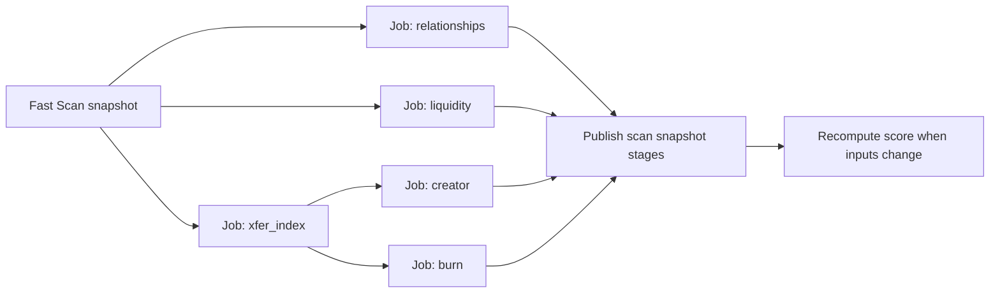

# HANSOME — Deep Scan Performance V2 (Design)

| Field | Value |
|-------|-------|
| **Date** | 2026-07-28 |
| **Scope** | Design + benchmark / estimate only |
| **Code changes** | **None** |
| **Deploy** | **None** |
| **Scoring / Burn / LP / lock / risk formulas** | **Unchanged** (out of scope) |
| **Verdict** | **PASS** — design ready for a later approved implementation phase |

---

## 1. Problem statement

Production Deep on high-activity tokens (FOX class) routinely exceeds UX estimates and soft stage budgets. Observed Collecting windows of **4+ minutes**, often settling as honest `partial` without Lock Dist or complete Creator/Burn P2/P3. Raising timeouts is **not** an acceptable solution: work must be reused, parallelized as independent jobs, and incrementalized.

### Benchmark tokens

| Token | Address | Transfers (Production Fast) | Holders | Notes |
|-------|---------|----------------------------:|--------:|-------|
| **FOX** | `0x2103faA9D1762e27a716C61718b3aCf3Ec1F9bf1` | **~113,751** | ~3,099 | Heavy; no Position NFT seeds |
| **HANSOME** | `0x2C38Df5F59b04C3F3BB8c9E6C445E211eB1b0875` | **~1,091** | (low) | Seeds `#47299` / `#357867` / `#142938` |

Sources: Production `/api/scan/status` (FOX, 2026-07-28), prior latency audit / FOX diagnosis, Blockscout counters on Fast snapshots.

---

## 2. Current architecture (as coded)

Deep enrich (`enrichScanDeep`) runs **inside one serverless attempt** under:

| Constant | Value | Role |
|----------|------:|------|
| `DEEP_SCAN_MAX_EXECUTION_MS` | **270s** | Hard wall per attempt |
| Soft `relationships` | **45s** | Funding graph |
| Soft `liquidity` | **180s** | Multi-version LP / known-first |
| Soft `creatorBurn` | **120s** | Shared transfer paging + Creator + Burn P2/P3 |
| Auto retries | **2** | Re-arm `partial` (fencing exists in code; Production still shows heavy partials) |

**Stage order (sequential in one worker):**  
`relationships` → `liquidity` (known-first preferred) → `creatorBurn` → score finalize.

Stages soft-fail independently (liquidity no longer aborted by creatorBurn timeout in current code), but they still **share one wall clock and one isolate**. A slow stage consumes budget that later stages need.

### Existing cache fragments (important gaps)

| Artifact | Key / location | What it stores | Gap |
|----------|----------------|----------------|-----|
| Scan snapshot | `scan:snapshot:4663:{addr}` | Full `ScanResponse` | 15m fresh / 60m stale; Deep redo still heavy when stages `partial` |
| Burn history | `scan:burn:*` | **Derived burn events** + cursors | Incremental refresh helper exists; Deep path still **re-pages transfers** via `fetchTokenTransfersPaged` then upserts |
| Position IDs | in-process `lp/position-cache.ts` | NFT IDs, 6h TTL | **Not KV** — cold isolate = empty |
| Known seeds | `knownPositionSeeds()` | HANSOME-only hard seeds | FOX / peers get **[]** → no known-first Lock Dist |

Creator + Burn **already share one transfer fetch inside a single attempt** (`fetchTokenTransfersPaged` → `analyzeCreatorBehaviour` + `enrichSupplyBurnWithHistory`). Duplication is primarily **across attempts / retries / instances**, and **full rows are not persisted for Creator reuse**.

---

## 3. Current request-count / latency breakdown

Assumptions: Blockscout v2 token-transfer pages ≈ **50 items/page** (HANSOME: 1,091 transfers ÷ 22 pages ≈ 49.6). RPC = on-chain `eth_call` / reads via app RPC.

### 3.1 Per Deep attempt — stage matrix

| Stage | Upstream work | Approx. request count | Latency (measured / estimated) |
|-------|---------------|----------------------:|--------------------------------|
| **Relationships** | `fetchNativeFunder` × sample (default 12) + 1× early token transfers page | **~13 Blockscout** | **~5–12s** (audit: funding graph ~5.5s) |
| **Liquidity — known-first** (HANSOME seeds/cache hit) | Gecko + ETH/USD; Titan by ID; `readPosition`/`slot0`/`ownerOf` × few IDs; price attach | **~2 HTTP + ~15–40 RPC** | **~4–12s** wall; Lock Dist **~9–17s** (LP perf report) |
| **Liquidity — exhaustive** (no seeds; FOX class) | PM transfer pages (max **6**); hint NFT inventories (~5–10); Titan sweep; **sequential `readPosition` on ~276 IDs** | **~11–16 Blockscout + ~280+ RPC** | **~190–220s** (audit ~191s; profile ~218s V4 alone) |
| **Creator + Burn (shared index)** | `fetchTokenTransfersPaged(maxPages=40)` then CPU + burn KV upsert | **≤40 Blockscout** (sequential) | HANSOME complete: **~106s / 22 pages**; FOX: often **soft-timeout @120s** with `pagesFetched=0` on failed attempts |
| **Score finalize** | Light Gecko refresh + CPU | **0–1 HTTP** | **&lt;1s** |

### 3.2 FOX (heavy) — Production-aligned picture

| Metric | Value |
|--------|------:|
| Transfers | ~**113.8k** |
| Pages for full genesis index | ~**2,276** (@50/page) |
| Pages fetched per Deep attempt (cap) | **≤40** (~**2,000** transfers ≈ **1.8%** of history) |
| Soft creatorBurn budget | **120s** |
| Soft liquidity budget | **180s** (exhaustive needs ≥**200s** flag; default attempt → known-first path **without seeds**) |
| Attempt wall | **270s** |
| Live status (2026-07-28 read-only) | `partial`; liquidity stage `done` but Lock Dist **unavailable** / positions incomplete; creator+burn **partial**, `pagesFetched=0`; `deepRetryCount=2` |

**Known-first vs exhaustive (FOX):**  
`knownPositionSeeds(FOX)=[]`. Exhaustive PM discovery only when liquidity soft budget ≥ **200s**; default **180s** means Production Deep prefers known-first **without** seeds → cannot publish Lock Dist unless Titan/hints alone find material positions. Observed FOX snapshot: pool liquidity present (~$94k), positions incomplete, `lockDistribution.available=false`.

### 3.3 HANSOME — measured cold path

| Path | Latency | Notes |
|------|--------:|-------|
| Fast warm (memory) | **~0–50ms** | Cache MVP audit |
| Fast cold / Fast path | **~6–10s** typical Production | Wave1 parallel |
| LP known-first + Lock Dist | **~4–17s** | Post known-first fix (may not be Production-deployed yet) |
| Creator/Burn full index | **~106s / 22 pages** | Complete |
| Pre–known-first LP exhaustive | **~191–218s** | Dominant historical cold cost |
| Full cold staged wall (pre progressive Deep) | **~298–314s** | Latency audit |

### 3.4 Budget math (why FOX fails without timeout increases)

```
relationships  ≤45s
liquidity      ≤180s   (FOX exhaustive needs ~190s+; known-first has no seeds)
creatorBurn    ≤120s   (40 pages × ~2–4s/page ≈ 80–160s; FOX often loses race)
────────────────────
sequential sum ≫ 270s wall when LP exhaustive + full paging both attempted
```

Retried attempts **re-pay** the same Blockscout/RPC costs when stages remain `partial`.

---

## 4. Duplicated upstream work

### 4.1 Within a single Deep attempt

| Pair | Duplicate? | Detail |
|------|------------|--------|
| Creator ↔ Burn | **No second pagination** | One `fetchTokenTransfersPaged`; both consumers share `transferIndex` |
| Relationships ↔ Creator/Burn | **Partial** | Relationships fetches **page 1** of token transfers again via `fetchEarlyTokenTransfers` |
| Liquidity ↔ Creator/Burn | **No** (different endpoints) | PM NFT transfers vs token ERC-20 transfers |

### 4.2 Across attempts / instances (the real waste)

| Duplication | Cost | Why |
|-------------|-----:|-----|
| Deep auto-retry re-pages transfers | **×2–3 × ≤40 BS pages** | Soft-fail → re-arm → `fetchTokenTransfersPaged` from scratch; burn KV has burns/cursors but Deep does not **resume paging from stored transfer cursor for Creator** |
| Burn incremental helper unused by Deep fetch path | Missed **~35 page** saves on repeat | `refreshBurnHistoryIncremental` (5 pages when `headTimestampMs` set) exists; Deep always does cold `maxPages=40` then `upsertBurnHistoryFromScan` |
| Position ID cache process-local | **~190s** rediscovery on cold isolate | FOX/HANSOME lose known IDs across Vercel instances |
| Exhaustive PM candidate eval | **~123s** RPC on ~276 unrelated IDs | Re-run when cache empty; 0 HANSOME involvement in sample of 30 |
| Snapshot TTL vs Deep incompleteness | Full structural refresh can redo Deep stages | 15m TTL / manual Refresh resets retry budget |

### 4.3 Quantified duplicate removal (design target)

| Scenario | Today (FOX-class) | After shared + incremental index |
|----------|-------------------|----------------------------------|
| Creator + Burn same attempt | 40 pages shared (already) | Still 1 stream; persist progress every N pages |
| Creator + Burn across 2 retries | up to **80–120** pages re-fetched | **0–5** head pages if index complete / cursor valid |
| Relationships early page | +1 page | Serve from shared head page 0 |
| Estimated duplicate BS removed on FOX repeat Deep | — | **~70–115 pages / attempt cycle** (~**2–4 min** wall at ~2–3s/page) |

---

## 5. Proposed persistent data model

All keys namespaced under existing scan KV (`scan:*`). **No scoring-field semantics change** — only persistence of discovery/index inputs.

### 5.1 Shared transfer index (new)

```
scan:xfer:{chainId}:{token}          → TransferIndexMeta
scan:xfer:lock:{chainId}:{token}     → indexing lock (NX)
scan:xfer:chunk:{chainId}:{token}:{i}→ TransferChunk (optional chunking)
```

**TransferIndexMeta (v1)**

| Field | Purpose |
|-------|---------|
| `version` | Schema version |
| `headTimestampMs` / `headBlock` | Newest indexed (incremental stop) |
| `tailTimestampMs` / `tailBlock` | Oldest indexed (genesis progress) |
| `nextPageParams` | Blockscout resume cursor (opaque JSON) |
| `paginationComplete` | Genesis exhausted |
| `pagesFetchedTotal` | Lifetime pages |
| `transfersIndexed` | Count |
| `updatedAt` | Freshness |
| `indexState` | `idle` \| `indexing` \| `complete` \| `failed` |
| `generation` | Fence late writers |

**Storage strategy (KV size):**

1. **Preferred:** persist **derived facts + cursors**, not raw 113k rows:
   - Creator: deployer outbound sells / transfer-then-sell evidence digests (bounded evidence list, already capped in analyzer)
   - Burn: existing `StoredBurnHistory.burns[]` (keep `scan:burn:*`)
   - Meta cursors for resume
2. **Optional raw window:** newest **N** pages (e.g. 40–80) in chunks for re-analysis without re-fetch when formulas unchanged
3. **Never** require full 113k raw rows in Redis for v1 — use **async backfill job** that advances `nextPageParams` until `paginationComplete`, updating derived stores incrementally

### 5.2 LP discovery cache (promote to KV)

```
scan:lp:{chainId}:{token} → LpDiscoveryCache
```

| Field | Purpose |
|-------|---------|
| `poolIds` / `versions` | v2/v3/v4 pools seen |
| `positionIds[]` | Known Position NFT IDs (no hardcoded token list) |
| `lockerCandidates[]` | Titan / known locker addresses observed |
| `exhaustiveComplete` | Honest completeness |
| `knownVerifiedAt` | Last successful revalidation |
| `updatedAt` | TTL anchor (suggest **6–24h** soft; revalidate on use) |

Revalidation always re-reads **on-chain** owner/liquidity/lock — cache only **discovery inputs**, never lock classification results as permanent truth.

### 5.3 Job / stage state (independent Deep jobs)

```
scan:job:{chainId}:{token}:{stage} → DeepJobState
```

Stages: `relationships` | `liquidity` | `creator` | `burn` | `xfer_index` (internal) | `prewarm`.

| Field | Purpose |
|-------|---------|
| `status` | `pending` \| `running` \| `done` \| `partial` \| `failed` |
| `attemptId` / `generation` | Fencing (align with existing `deepAttemptId`) |
| `startedAt` / `updatedAt` / `progressPct` | UX |
| `cursor` | Stage-specific resume |
| `lastError` | Honest partial reason |

Snapshot `analysisStages` remain the **UI contract**; jobs publish into `scan:snapshot` independently.

### 5.4 Prewarm registry (no Explore UI)

```
scan:prewarm:queue → sorted set / list of token addresses
scan:prewarm:meta:{token} → lastPrewarmAt, priority, transferRateHint
```

Population: frequency of `/api/scan` hits + optional static seed list (FOX / CASHCAT / PONS **class** by activity — **not** hardcoded scoring special-cases).

---

## 6. Incremental-index strategy

### 6.1 Goals

- First-time heavy indexing may take **minutes**, but runs as **async reusable job**, not blocking UX Collecting forever.
- Repeat Creator/Burn: fetch **only new head** when cursor reliable → target **&lt;10–30s**.
- Completeness labels stay honest (`paginationComplete`, window completeness) — **no formula change**.

### 6.2 Algorithm

```
on Deep creator/burn need:
  meta = load TransferIndexMeta
  if meta.paginationComplete && head fresh:
      page head until stopAtOrBeforeTimestampMs(meta.headTimestampMs)  // ≤5 pages
      merge derived creator + burn stores
      publish stages done / partial honestly
  else if meta.nextPageParams exists:
      resume genesis backfill (budgeted pages per tick, e.g. 10–20)
      publish progress (burn/creator analyzing with progress)
  else:
      start newest-first index; persist meta every page (or every 5 pages)
```

### 6.3 Shared dataset consumption

| Consumer | Reads | Writes |
|----------|-------|--------|
| Creator | Derived creator digests + optional raw window | Updates digests when new deployer outs appear |
| Burn P2/P3 | `scan:burn:*` via existing merge helpers | Same upsert / incremental refresh |
| Relationships | Head page / early recipients from shared head | None |
| Prewarm | Advances meta toward `paginationComplete` | Meta + derived |

**Quantified win:** eliminate second full 40-page walks on retries; FOX repeat head refresh ≈ **1–5 BS pages** vs **40**.

### 6.4 Interaction with existing burn-cache

Keep `scan:burn:*` as the burn product store. Wire Deep to:

1. Prefer `peekBurnHistoryBundle` + incremental head refresh when meta says index is usable.
2. Stop calling cold `maxPages=40` when `allTimeComplete` / `paginationComplete` already true unless Refresh forces reindex.
3. Continue honest Incomplete windows when genesis incomplete (PONS/FOX class).

---

## 7. LP cache strategy

### 7.1 Path (token-agnostic)

```
1. Load scan:lp:{token} + in-process cache
2. Known-first revalidate positionIds (RPC) → publish Lock Dist if sufficient
3. Cheap pool existence probes (v2/v3/v4) in parallel
4. If known-first insufficient AND job budget allows:
     expand candidates (hints, Titan, bounded PM pages)
5. Persist newly proven positionIds / pools back to KV
6. Exhaustive PM history = separate background job (not same-request 190s)
```

### 7.2 Targets

| Path | Target |
|------|--------|
| Known LP Lock Dist (cached IDs) | **&lt;10–20s** |
| HANSOME (seeds or KV) | Already ~4–17s locally — persist IDs so Production multi-instance matches |
| FOX first-time | Async discovery job; UI shows Collecting per liquidity job only |
| FOX repeat | Revalidate cached IDs → Lock Dist without 276× `readPosition` |

### 7.3 Explicit non-goals

- No token-specific hardcoding beyond existing HANSOME transparency hints (seeds may remain as bootstrap; KV supersedes for all tokens).
- No change to MIXED / ALL_LOCKED rules or `discoveryComplete` honesty.

---

## 8. Independent-job architecture

### 8.1 Why

Today one slow stage burns the shared **270s** wall. Independent jobs:

- Liquidity can publish Lock Dist while Creator index backfills for minutes.
- Burn/Creator no longer couple failure (optionally split `creatorBurn` soft budget into two jobs sharing one xfer index job).
- Retry/fencing becomes **per-stage generation**, not whole-Deep rewrite races.

### 8.2 Proposed state machine (per token)



### 8.3 Execution model (Vercel-friendly)

| Option | Use |
|--------|-----|
| **A (v1)** | Keep `after()` but schedule **one stage per invocation**; status poll / cron continues next stage; each invocation ≤60–90s useful work |
| **B (v1.5)** | Queue via KV list + cron every minute for `scan:prewarm` + unfinished jobs |
| **C (later)** | External worker if RH volume demands |

**Per-job budgets (soft, not “raise timeouts” as the product fix):** small slices (e.g. 10–20 transfer pages, or known-first LP only) with **resume**, so wall time per isolate stays healthy without pretending one request can finish FOX genesis.

### 8.4 Publishing rules

1. Each job writes **only its stage fields** + `analysisStages[stage]`.
2. Use existing `deepAttemptId` / monotonic retry fencing; ignore stale generations.
3. Score job runs when any structural input transitions `done`/`partial` → update Overall/Structural without re-fetching upstream.
4. UI Collecting is **per-stage** (already progressive) — one stuck burn index must not flip liquidity back to analyzing.

---

## 9. Popular-token prewarming

| Aspect | Design |
|--------|--------|
| Trigger | Scheduled cron (e.g. every 5–15 min) + optional post-Fast enqueue for hot CAs |
| Work | Advance `xfer_index`, refresh LP ID cache, head-incremental burn/creator |
| Selection | Top-N by recent scan frequency / transfer velocity (FOX/CASHCAT/PONS **class**) |
| UX | **No Explore UI** — invisible reliability feature |
| Cap | Concurrent prewarm ≤ K tokens; respect Blockscout/RPC rate limits |
| Safety | Never reset user-visible retry budgets; prewarm uses job keys, not Refresh |

Expected effect: first interactive Deep on a hot token often hits **warm index / warm LP IDs** → Creator/Burn/Lock Dist in target bands.

---

## 10. Expected latency improvement

| Path | Today | After V2 (design target) |
|------|-------|---------------------------|
| Fast cached | ~0–50ms memory / KV RTT | **&lt;1s** (maintain) |
| New Fast Scan | ~6–15s typical | **&lt;10s** ideal (already near; keep Fast lean) |
| Known LP Lock Dist | HANSOME ~4–17s local; FOX often unavailable | **&lt;10–20s** when IDs cached |
| FOX **first-time** Deep complete index | Soft-fail / multi-minute Collecting / partial | Async: UI unlocks Fast immediately; stages complete as jobs finish (index may take **several minutes** once, reusable) |
| FOX **repeat** Creator/Burn | Re-pay ≤40 pages × retries (~80–160s+) | **&lt;10–30s** head incremental |
| FOX **repeat** Lock Dist | Exhaustive or empty known-first | **&lt;10–20s** revalidate cached positions |
| HANSOME cold Deep (post known-first + index reuse) | LP OK; Creator ~106s first time | First index ~106s async; repeats **&lt;10–30s** |

### FOX summary

| | First-time | Repeat (warm index + LP cache) |
|--|------------|--------------------------------|
| User-visible Fast | seconds | **&lt;1s** cached |
| Lock Dist | async job; may be minutes until first IDs found | **~10–20s** |
| Creator/Burn complete | async backfill (can be many minutes for 113k) | **~10–30s** head |
| Wasted duplicate BS pages | high (retries) | near-zero |

---

## 11. Migration risk

| Risk | Severity | Mitigation |
|------|----------|------------|
| KV payload size if raw transfers stored | High | Derived-first; chunked optional window; never full 113k blob in v1 |
| Cursor invalidation if Blockscout pagination changes | Medium | Treat opaque `next_page_params` as resume hint; on failure full reindex job |
| Stale position IDs (closed / burned NFTs) | Medium | Always revalidate on-chain; drop IDs that no longer involve token |
| Split-brain snapshot writes | High | Per-stage generation fencing (extends Deep retry fencing) |
| Prewarm stampede vs Production rate limits | Medium | Global concurrency caps; exponential backoff |
| Honest completeness regression | High | Keep Incomplete/Unknown rules; never mark all-time complete without genesis exhaustion |
| Parallel Analytics MVP collision | Medium | Touch only `scan:xfer:*` / `scan:lp:*` / job keys + Deep orchestration; **do not** modify analytics modules |
| Partial deploy (code without cron) | Low | Jobs still resume on status polls; cron is accelerator |

**Non-risks (out of scope):** scoring formulas, burn semantics, LP lock classification, risk thresholds — explicitly frozen.

---

## 12. Implementation phases (later approval only)

| Phase | Deliverable | Deploy? |
|-------|-------------|---------|
| **0** | Spike: KV size for meta+derived; measure FOX page RTT; job runner choice A vs B | No |
| **1** | Persistent LP ID cache (KV) + known-first Production path for non-seeded tokens that previously discovered IDs | Separate approve |
| **2** | Shared transfer meta + incremental head; wire Creator/Burn to resume; stop cold 40 on warm complete | Separate approve |
| **3** | Split independent stage jobs + score publisher | Separate approve |
| **4** | Prewarm cron for hot tokens | Separate approve |

This design doc alone is **not** an implementation approval.

---

## 13. PASS / REVISE recommendation

### **PASS**

The design is ready to implement in a **later approved phase**, because:

1. Bottlenecks are quantified (LP exhaustive ~190s; transfer paging ~106s HANSOME / soft-fail FOX; retry duplication).
2. Duplicate work is identified with a clear shared-index + LP KV plan that does **not** change scoring semantics.
3. Independent jobs + incremental indexing address the failure mode without raising timeouts as the solution.
4. Targets map cleanly onto existing progressive UI / snapshot stages.
5. Migration risks are bounded with a derived-first storage strategy.

**Implementation gates (not REVISE blockers):** Phase-0 KV size spike; confirm Blockscout page RTT under Production concurrency; choose job runner (status-driven `after()` vs cron queue).

---

## 14. Confirmations

- [x] Design + benchmark / estimate only
- [x] **No code changes**
- [x] **No deploy**
- [x] Scoring / Burn / LP / lock / risk formulas untouched
- [x] Production read-only status inspection used; no intentional Refresh to “fix” budgets (note: one HANSOME `/api/scan` cache-miss was observed during measurement — avoid further cold triggers)
- [x] Explore UI not proposed
- [x] Analytics MVP surfaces not modified

### Primary references

- `reports/HANSOME_FOX_DEEP_RUNTIME_DIAGNOSIS.md`
- `reports/HANSOME_SCAN_LATENCY_AUDIT.md`
- `reports/HANSOME_LP_DISCOVERY_PERFORMANCE.md`
- `reports/HANSOME_DEEP_SCAN_RELIABILITY.md`
- `lib/hansome-score/scan-deep.ts`, `blockscout.ts`, `supply-burn/burn-cache.ts`, `lp/detect.ts`, `lp/position-cache.ts`
