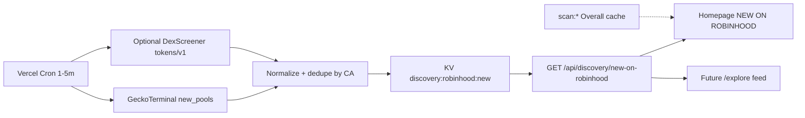

# HANSOME — Just Launched / New on Robinhood Discovery Plan

| Field | Value |
|-------|-------|
| **Date** | 2026-07-27 |
| **Status** | Research + product concept only — **not implemented** |
| **UI reference (external)** | [DexScreener · Robinhood](https://dexscreener.com/robinhood) |
| **Related** | [`HANSOME_ANALYTICS_AND_DISCOVERY_PLAN.md`](./HANSOME_ANALYTICS_AND_DISCOVERY_PLAN.md), [`HANSOME_SCAN_PRODUCTION_CACHE_ARCHITECTURE.md`](./HANSOME_SCAN_PRODUCTION_CACHE_ARCHITECTURE.md), [`ROBINHOOD_UNISWAP_AND_LOCKER_AUDIT.md`](./ROBINHOOD_UNISWAP_AND_LOCKER_AUDIT.md), [`docs/HANSOME_TAXONOMY_AND_EXPLORE.md`](../docs/HANSOME_TAXONOMY_AND_EXPLORE.md) |
| **Priority** | **Below** Overall Score / Data Confidence accuracy — do not derail Score work |
| **Verdict** | **DEFER** (Score gate first; source path clarified via GeckoTerminal) |

---

## 0. Hard gates (do not violate)

| Forbidden now | Reason |
|---------------|--------|
| Homepage **NEW ON ROBINHOOD** section implementation | Score accuracy gate higher priority |
| Production deploy of discovery UI/API | Not approved |
| `/explore` build | Taxonomy roadmap defers Explore |
| Week 2B / Analytics implementation from this plan | Separate plan; Score first |
| Scraping DexScreener HTML | Official API exists for enrichment; chronological feed is **not** on DexScreener API |
| Claiming “all new Robinhood tokens” | No source supports that claim today |
| Inflating Structural / Overall Score from launch feed | Axes stay separate |
| Operator PC online for feed refresh | Cloud-only (Vercel + KV) |

**Allowed now:** this document, taxonomy soft-pointer, optional read-only probe script.

---

## 1. Executive answers

| Question | Answer |
|----------|--------|
| Can DexScreener API do chronological newest pairs for Robinhood? | **Partial / effectively No** for a “newest pairs” feed — see §2 |
| Recommended MVP discovery source | **GeckoTerminal** `GET /api/v2/networks/robinhood/new_pools` |
| DexScreener role | Enrichment (logo, pair stats, Uniswap `labels`) when CA known — **not** primary chronology |
| Completeness claim allowed? | **No** — see §5 |
| Homepage naming until taxonomy | **NEW ON ROBINHOOD** (not NEW MEMES) |
| Cloud-only? | Yes — Vercel Cron/route + KV snapshot; no PC feeder |
| Implement now? | **No** — **DEFER** behind Score gate |

---

## 2. DexScreener API evaluation

### 2.1 Sources

- Official docs index: [docs.dexscreener.com/llms.txt](https://docs.dexscreener.com/llms.txt)
- API reference: [docs.dexscreener.com/api/reference](https://docs.dexscreener.com/api/reference) ([`.md`](https://docs.dexscreener.com/api/reference.md))
- UI chain page (not an API): [dexscreener.com/robinhood](https://dexscreener.com/robinhood)
- Rate guidance (community summaries of docs): DEX/pairs ~300 rpm; profiles/boosts ~60 rpm — treat as soft limits

### 2.2 Chain id

| Layer | Id |
|-------|-----|
| EVM chainId | **4663** |
| DexScreener `chainId` slug | **`robinhood`** (confirmed live: HANSOME pair + profiles) |
| GeckoTerminal `network` | **`robinhood`** (already used in Score Activity) |

### 2.3 Public endpoints relevant to discovery

| Endpoint | Chronological newest pairs by chain? | Notes |
|----------|--------------------------------------|-------|
| `GET /latest/dex/pairs/{chainId}/{pairId}` | **No** | Requires known pair address(es); bare `/pairs/robinhood` → **404** (live probe 2026-07-27) |
| `GET /latest/dex/search?q=` | **No** | Cross-chain search; not a Robinhood “new pairs” feed; ranking ≠ pair age |
| `GET /tokens/v1/{chainId}/{tokenAddresses}` | Enrichment only | Live: HANSOME → `dexId=uniswap`, `labels=["v4"]`, `pairCreatedAt`, liq/vol, optional `info.imageUrl` |
| `GET /token-pairs/v1/{chainId}/{tokenAddress}` | Enrichment only | Pools for one token |
| `GET /token-profiles/latest/v1` | **No** (profile submissions) | Global list (~30); probe: **11/30** `chainId=robinhood` — **paid/submitted token info**, not all new pairs |
| `GET /token-profiles/recent-updates/v1` | **No** | Profile updates, not pool creates |
| `GET /token-boosts/latest/v1` · `/top/v1` | **No** | Paid boosts; probe: **7/30** Robinhood — marketing signal only |
| `GET /ads/latest/v1` · community takeovers | **No** | Ads / CTO — not discovery chronology |
| `GET /orders/v1/{chainId}/{tokenAddress}` | N/A | Paid order status (e.g. HANSOME `tokenProfile` approved) |
| WebSockets (`wss://api.dexscreener.com`) | Profiles/boosts streams | Same product surfaces as REST “latest” — **not** chain-wide new-pair index |

**Finding:** Official DexScreener API has **no** documented “newest pairs on chain X” (or Robinhood-sorted-by-`pairCreatedAt`) endpoint. Chronology is available **after** you already know a token/pair address (`pairCreatedAt` on pair objects).

### 2.4 Live probe snapshot (2026-07-27)

| Check | Result |
|-------|--------|
| `tokens/v1/robinhood/0x2C38…0875` (HANSOME) | OK — Uniswap v4, liq ~$16k, vol24h ~$51, `pairCreatedAt` present |
| `token-profiles/latest` | Robinhood strongly represented among recent **profiles** |
| `token-boosts/latest` | Some Robinhood boosts — **not** a launch feed |
| `latest/dex/pairs/robinhood` | **404** |
| Optional probe script | `scripts/probe-robinhood-new-pools.mjs` (read-only) |

### 2.5 DexScreener verdict for “Just Launched”

| Use | Fit |
|-----|-----|
| Primary chronological discovery | **Reject** |
| Logo / socials / boost badge | Optional enrichment |
| Uniswap version labels (`v2`/`v3`/`v4`) | Useful when enriching known CAs |
| Matching DexScreener UI “new” sort | **Not available via public API** without undocumented/private endpoints (out of scope; do not scrape HTML) |

---

## 3. Existing codebase market APIs

| Integration | Path | Role today | Relevance |
|-------------|------|------------|-----------|
| **GeckoTerminal** | `lib/market/geckoterminal.ts`, `/api/market`, Score Activity in `lib/hansome-score/scan.ts` | HANSOME pool + token pools; in-memory TTL ~25s; labeled `source: geckoterminal` | **Reuse pattern** for discovery cron + Activity fields |
| **DexScreener** | Not in Score engine (docs forbid silent Score influence) | i18n / marketing mentions only | Optional enrichment later |
| **GoPlus / Blockscout / RPC** | Score pipeline | Structural Score | Join Overall **after** scan cache — never invent Score from launch feed |
| **KV / Upstash** | Forum + vault; Scan cache **planned** | Cloud persistence | Reuse for `discovery:*` snapshot |

Score rule (unchanged): third-party market data may label **Activity** only; discovery ranking **must not** feed Structural / Overall Score.

---

## 4. On-chain alternatives (chain 4663)

From [`ROBINHOOD_UNISWAP_AND_LOCKER_AUDIT.md`](./ROBINHOOD_UNISWAP_AND_LOCKER_AUDIT.md):

| Version | Factory / hub | Discovery event | Completeness notes |
|---------|---------------|-----------------|--------------------|
| Uniswap **v2** | `0x8bcEaA40B9AcdfAedF85AdF4FF01F5Ad6517937f` | `PairCreated` | Active — `allPairsLength` ≈ **23k**; strong chronological log source |
| Uniswap **v3** | `0x1f7d7550B1b028f7571E69A784071F0205FD2EfA` | `PoolCreated` | Active |
| Uniswap **v4** | PoolManager `0x8366a39C…0951` | `Initialize` / position activity | Active; **no full pool enumeration** — event index required |
| Quotes | WETH `0x0Bd7…AD73`, USDG `0x5fc5…d168` | — | Filter noise vs quote–quote pools |

**Hybrid reality (from GT probe):** new pools also appear on **non-Uniswap** DEXes indexed by GeckoTerminal (e.g. `pons-dot-family`, `dyorswap-robinhood`) alongside `uniswap-v3-robinhood` / `uniswap-v4-robinhood`. An Uniswap-factory-only indexer **misses** those venues.

On-chain indexer = best path to **broader Uniswap completeness**, still not “all tokens on Robinhood,” and needs a **cloud** worker (Vercel Cron + RPC/Blockscout logs, or Railway sidecar) — never a laptop feeder.

---

## 5. Discovery completeness & honest limitations

### 5.1 Explicit claim ban

> **Do not claim “all new Robinhood tokens”** unless HANSOME runs a multi-factory + multi-DEX on-chain indexer with documented coverage, retention, and reconciliation against explorer/factory counters — **and** product copy still hedges for off-index venues and failed indexing windows.

### 5.2 What each source actually covers

| Source | What you get | What you miss |
|--------|--------------|---------------|
| DexScreener profiles/boosts | Recently promoted / profiled tokens | Silent launches, most thin pairs |
| DexScreener pairs/search | Enrichment & lookup | Chain-wide newest sort |
| **GeckoTerminal `new_pools`** | Newest **indexed pools** on network `robinhood` (probe: page of 20 pools created within ~1 minute at peak) | Pools GT has not indexed; pagination/rate limits; not ERC-20 creates without a pool |
| Uniswap factory logs only | Chronological Uniswap v2/v3 (+ v4 Initialize if indexed) | Other DEXes; incomplete v4 without event pipeline |
| Token contract creates | New ERC-20s | Tokens with no pool; spam flood |

### 5.3 Recommended public wording

- Prefer: *“New pools detected on Robinhood Chain (indexed sources) · last 15 minutes”*
- Avoid: *“Every new Robinhood token”* / *“Complete DexScreener mirror”*

---

## 6. Recommended source strategy

### 6.1 MVP (post–Score gate)

**Primary:** GeckoTerminal  
`GET https://api.geckoterminal.com/api/v2/networks/robinhood/new_pools?page=1`  
(optional `include=base_token,quote_token,dex`)

| Field from GT | Maps to card |
|---------------|--------------|
| `relationships.base_token` | CA (+ name/symbol if `include`) |
| `attributes.name` | Fallback display |
| `attributes.pool_created_at` | Pair age / detected time |
| `attributes.reserve_in_usd` | Liquidity USD |
| `attributes.volume_usd` (m5/h1/h24) | Volume |
| `relationships.dex.data.id` | Venue / Uniswap version hint (`uniswap-v3-robinhood`, `uniswap-v4-robinhood`, …) |

**Secondary (optional enrichment):** DexScreener `tokens/v1/robinhood/{ca}` for logo + `labels` + pair stats — rate-limit carefully; never required for card to render.

**Do not scrape** DexScreener HTML.

### 6.2 Later (completeness upgrade)

1. Cloud log indexer: v2 `PairCreated` + v3 `PoolCreated` (+ v4 `Initialize`) on 4663.  
2. Merge GT + on-chain into KV set keyed by `token` or `pool`.  
3. Reconcile against factory length / Blockscout — then revisit claim language (still cautious).

### 6.3 Hybrid diagram



---

## 7. Recommended refresh interval

| Layer | Interval | Rationale |
|-------|----------|-----------|
| Upstream pull (Cron / scheduled route) | **2–3 min** default (range **1–5 min**) | GT docs note ~30s cache on new pools; free GT ~**30 rpm** — bursty traffic already 429’d other GT routes in probe |
| Public API `Cache-Control` / KV TTL | **60–180 s** | Align with homepage “Last updated” |
| Client auto-refresh | **60–120 s** reading **our** API only | Never hammer GT/DexScreener from browsers |
| Score / Overall join | Lazy from `scan:*` if present | Do not full-scan every new pool on cron |

**Last updated:** show server timestamp from KV snapshot (`updatedAt`).

---

## 8. Proposed cloud architecture

Reuse plans in [`HANSOME_SCAN_PRODUCTION_CACHE_ARCHITECTURE.md`](./HANSOME_SCAN_PRODUCTION_CACHE_ARCHITECTURE.md) and analytics KV inventory:

| Piece | Choice |
|-------|--------|
| Runtime | Vercel serverless (Next.js) |
| Schedule | Add `crons` to `vercel.json` (not present today) — e.g. `*/2 * * * *` → `/api/cron/discovery-new-pools` |
| Store | Existing Upstash / Vercel KV |
| Key prefix | `discovery:robinhood:new:v1` (list snapshot) + optional `discovery:robinhood:seen:{ca}` TTL |
| Isolation | Separate from `forum:*`, `hansome:cv:*`, `scan:*`, `analytics:*` |
| PC / laptop | **Forbidden** as feeder |

### 8.1 Snapshot shape (conceptual)

```json
{
  "updatedAt": "2026-07-27T13:40:00.000Z",
  "source": "geckoterminal",
  "windowMinutes": 15,
  "items": [
    {
      "tokenAddress": "0x…",
      "name": "…",
      "symbol": "…",
      "poolAddress": "0x…",
      "poolCreatedAt": "2026-07-27T13:36:59Z",
      "dexId": "uniswap-v4-robinhood",
      "uniswapVersion": "v4",
      "liquidityUsd": 909.43,
      "volumeUsd": { "m5": 953.24, "h24": 953.24 },
      "logoUrl": null,
      "category": null,
      "overall": null,
      "hansomeLevel": null
    }
  ]
}
```

`overall` / `hansomeLevel` / `category` filled only when Scan cache / taxonomy verify exists — otherwise omit or show “—” / “Not scanned”.

---

## 9. Homepage UX copy & structure

### 9.1 Naming / taxonomy gating

| Phase | Section title | Subhead |
|-------|---------------|---------|
| **Until Category/Taxonomy operational** | **NEW ON ROBINHOOD** | New on Robinhood Chain · Last 15 Minutes |
| Alternate brand (same scope) | **JUST LAUNCHED** | Only if footnote states indexed-pool scope — still **not** “all tokens” |
| **After** verified taxonomy filters | Optional filter row: ALL / MEME / ANIMAL / AI / RWA / DEFI | Then title may become **NEW MEMES — LAST 15 MIN** when filter = MEME |

**Do not ship “NEW MEMES” as the default title before taxonomy is real.**

### 9.2 Card fields (when reliably available)

| Field | Source readiness |
|-------|------------------|
| Logo | DexScreener/`info` or GT image if present — optional |
| Name / symbol | GT include or token meta |
| CA | Required |
| Pair age / detected time | `pool_created_at` |
| Uniswap version / venue | Map `dex` id → `v3`/`v4`/other |
| Liquidity USD | `reserve_in_usd` |
| Volume | GT windows (label timeframe, e.g. 24h or 5m) |
| Category | **Only if verified** taxonomy |
| Overall | **Only if scanned** (cache) |
| HANSOME Level | From Activity when scanned — branded, not safety |
| CTA | **SCAN** → `/scan/[address]` |

### 9.3 Axis separation (locked)

| Axis | Must stay separate |
|------|--------------------|
| JUST LAUNCHED / NEW ON ROBINHOOD | Indexed new pools |
| MOST SEARCHED | Analytics plan — Scan interest |
| TOO HANSOME | Activity / HANSOME Level branding |
| CATEGORY | Taxonomy verified tags |
| OVERALL | Structural composite |

**None of the above inflate Structural Score.**

### 9.4 UI chrome

- “Last updated · {time}”
- Source footnote: e.g. “Indexed new pools via GeckoTerminal · not a complete chain census”
- Empty / degraded state if upstream 429 — serve stale KV snapshot

### 9.5 Future `/explore` (document only)

- Feed list / infinite scroll of same `discovery:*` snapshot  
- Filters (taxonomy) + columns for Overall / Level / Category  
- Tabs elsewhere: Most Searched vs Market Trending vs Just Launched — never mixed with PROMOTED or Score  
- **Do not build `/explore` in this phase**

---

## 10. Eng estimate & dependencies

| Dependency | Status | Blocks |
|------------|--------|--------|
| **Overall Score / Confidence accuracy** | In flight — **hard gate** | Any homepage discovery UI |
| Scan production cache (`scan:*`) | Planned | Showing Overall / Level without live scan storms |
| Category / Taxonomy verify | Planning (`HANSOME_TAXONOMY_AND_EXPLORE.md`) | “NEW MEMES” title + category chips |
| Analytics Most Searched | Separate plan | Must not be conflated with Just Launched |
| Vercel Cron | Not configured today | Cloud refresh (or on-demand + longer TTL as weaker MVP) |

| Phase (after Score gate) | Work | Eng-days |
|--------------------------|------|----------|
| A. Discovery snapshot API + Cron + KV | GT pull, normalize, TTL, public read route | **1–2** |
| B. Optional DexScreener enrich | Logos / labels batch | **0.5–1** |
| C. Homepage section | NEW ON ROBINHOOD cards + SCAN CTA + footnotes | **1–2** |
| D. Join Scan cache fields | Overall / Level when present | **0.5** |
| E. Taxonomy filters → NEW MEMES | After verify workflow | **1–2** (Explore-adjacent) |
| F. On-chain indexer (optional) | v2/v3/v4 events + multi-DEX later | **5–10+** |

**MVP homepage slice after Score gate:** ~**3–5 eng-days** (A–D). Completeness indexer is a separate project.

---

## 11. Probe script (optional, read-only)

| Path | `scripts/probe-robinhood-new-pools.mjs` |
|------|------------------------------------------|
| Purpose | Print sample newest Robinhood pools (GT) + note DexScreener gap |
| Side effects | None (stdout only; no KV/UI) |
| Run | `node scripts/probe-robinhood-new-pools.mjs` |

---

## 12. Verdict

| Dimension | Result |
|-----------|--------|
| DexScreener chronological newest-pairs API | **Insufficient** (Partial at best — enrichment only) |
| Workable MVP data path | **Yes — GeckoTerminal `networks/robinhood/new_pools`** |
| Completeness / “all tokens” | **Not claimable** |
| Product naming / UX concept | Specified (§9) |
| Cloud-only design | Specified (§8) |
| Homepage / deploy / Explore | **Not started** |
| **Plan verdict** | **DEFER** — do not implement until Overall Score accuracy gate clears; then treat source work as **ready for MVP via GeckoTerminal**, not DexScreener-as-primary |

**One-liner:** DexScreener cannot power a honest chronological Robinhood launch rail; GeckoTerminal can power a **scoped** “NEW ON ROBINHOOD” rail after Score work finishes — still without claiming every new token.
