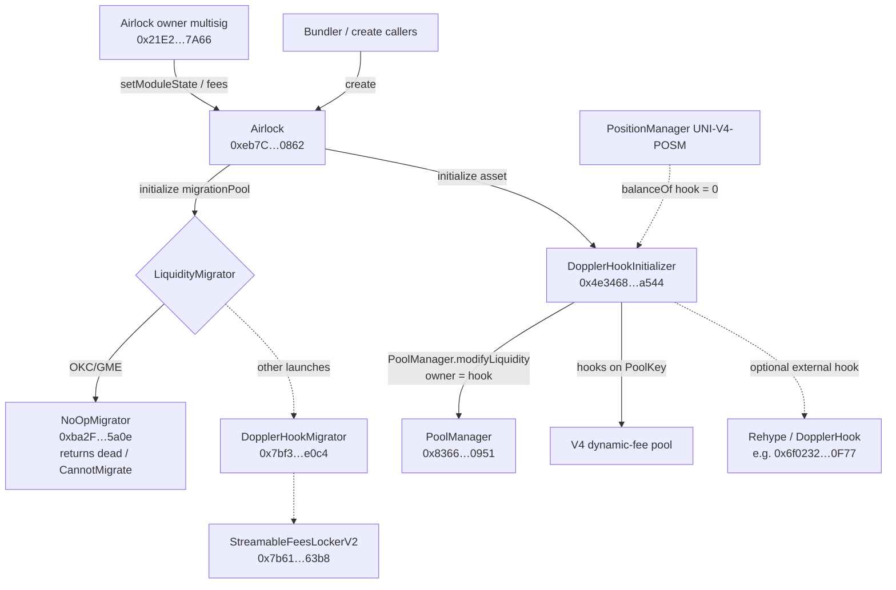
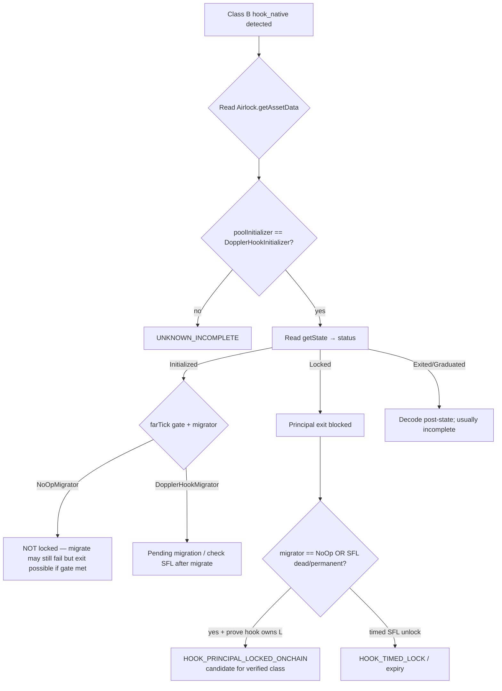

# HANSOME — Phase 11C Research — Doppler / Airlock Hook Lock Verification

| Field | Value |
|-------|--------|
| **Date** | 2026-07-31 |
| **Chain** | Robinhood Chain `4663` |
| **Mode** | Read-only research / architecture design |
| **Code / deploy / Production** | **NONE** |
| **Verdict** | **PASS_NOT_DEPLOYED** |

Prior art:

- `reports/HANSOME_V4_LP_OWNERSHIP_LOCK_VERIFICATION_RESEARCH.md`
- `reports/HANSOME_V4_OWNERSHIP_CLASS_DETECTION.md` (Phase 11A)
- `reports/HANSOME_PHASE11A1_V4_OWNERSHIP_EVIDENCE_UI.md`
- `reports/HANSOME_GME_0xc2362aff_LIQUIDITY_INVESTIGATION.md`

Upstream protocol sources (Whetstone / Doppler):

- [Airlock.sol](https://github.com/whetstoneresearch/doppler/blob/main/src/Airlock.sol)
- [DopplerHookInitializer.sol](https://github.com/whetstoneresearch/doppler/blob/main/src/initializers/DopplerHookInitializer.sol)
- [NoOpMigrator.sol](https://github.com/whetstoneresearch/doppler/blob/main/src/migrators/NoOpMigrator.sol)
- [DopplerHookMigrator.sol](https://github.com/whetstoneresearch/doppler/blob/main/src/migrators/DopplerHookMigrator.sol)
- [StreamableFeesLockerV2.sol](https://github.com/whetstoneresearch/doppler/blob/main/src/lockers/StreamableFeesLockerV2.sol)
- [Deployments.md — Robinhood 4663](https://github.com/whetstoneresearch/doppler/blob/main/Deployments.md)

Machine notes:

- `reports/data/phase11c_doppler_airlock_summary.json`
- `reports/data/phase11c_airlock_rpc_probe.json`
- `reports/data/phase11c_pool_status_beneficiaries.json`
- `reports/data/phase11c_airlock_owner_modules.json`

---

## 1. Executive summary

Hook Native (Class B) V4 liquidity on RH is **not** PositionManager NFT liquidity. For Airlock launches that use `DopplerHookInitializer`, liquidity is minted as **hook-owned PoolManager positions** via `MiniV4Manager` (`_mint`), with **zero** `UNI-V4-POSM` balance on the hook.

For the two Core samples **OKC** and **GME**:

| Fact | Evidence |
|------|----------|
| Pool status | **`Locked` (2)** via `DopplerHookInitializer.getState` |
| Migrator | **`NoOpMigrator`** `0xba2F…5a0e` — `migrate()` **reverts `CannotMigrate()`** |
| Exit path | `exitLiquidity` **requires `Initialized`** — Locked pools **cannot** exit |
| SFL stream | **None** for either poolId |
| PosM NFT | Hook / Airlock balance **0** |
| Token `owner()` | Still **Airlock** (Airlock.`migrate` never completed) |

**Q7 (provable locked today):** **YES — conditional** for Locked + NoOpMigrator principal hook LP (OKC/GME).  
**Production `LOCKED_VERIFIED`:** **NO** until a dedicated adapter encodes these predicates (and never from PoolManager inventory %).

---

## 2. Answers Q1–Q8

| # | Question | Answer |
|---|----------|--------|
| **Q1** | How is liquidity stored? | Hook-owned Uniswap V4 positions inside **PoolManager**, created by `DopplerHookInitializer` multicurve `_mint` (not PosM ERC-721). Identity = `(owner=hook, tickLower, tickUpper, salt)` per curve slug. |
| **Q2** | Who owns the PoolManager position? | **Hook** — `DopplerHookInitializer` `0x4e3468…a544`. Not EOA, not PosM NFT holder, not Airlock (Airlock owns the **token**; hook owns **L**). |
| **Q3** | Can the owner ever withdraw liquidity? | **Only if status == `Initialized`**, via `Airlock.migrate` → `poolInitializer.exitLiquidity` → `_burn`. **Locked pools: no** (`WrongPoolStatus`). OKC/GME are Locked. |
| **Q4** | Can liquidity migrate to another pool? | **Protocol supports yes** (`Airlock.migrate` + LiquidityMigrator modules). **OKC/GME: no** — NoOpMigrator + Locked blocks exit. Alternate path: `DopplerHookMigrator` + `StreamableFeesLockerV2` (timed/permanent fee locker) — **not used** by these samples. |
| **Q5** | Can governance change the owner? | **Token owner:** stays Airlock until successful `migrate` (then → timelock). OKC/GME timelock=`0`, governance=`dead` (NoOp). **Airlock Ownable** = multisig `0x21E2…7A66` (`getOwners` length 6) — can whitelist modules / collect protocol fees; **cannot** flip Locked→Initialized. Fee **beneficiaries** can `updateBeneficiary` (fee shares only). |
| **Q6** | Timelock / escrow / vesting / migration / graduation? | **All exist in the stack**, module-dependent. OKC/GME: **beneficiary lock at init** (Locked) + **NoOp migrator** + **NoOp governance**; **graduation** API exists for Locked pools (`graduate`) but does **not** withdraw LP; **StreamableFeesLockerV2** present on RH but **no stream** for these pools. |
| **Q7** | Provable locked on-chain today? | **YES (conditional)** for Locked+NoOp principal hook LP — see §7. **Not** Titan-equivalent `LOCKED_VERIFIED` in Scan today. |
| **Q8** | Future Hook Lock Adapter? | Architecture only — §8. |

---

## 3. Architecture

### 3.1 Hook Native liquidity path (multicurve initializer)



### 3.2 PoolStatus state machine (DopplerHookInitializer)

```mermaid
stateDiagram-v2
  [*] --> Uninitialized
  Uninitialized --> Initialized: initialize, beneficiaries.length == 0
  Uninitialized --> Locked: initialize, beneficiaries.length != 0
  Initialized --> Exited: Airlock.migrate → exitLiquidity + _burn
  Locked --> Graduated: graduate farTick gate + ON_GRADUATION_FLAG
  note right of Locked: exitLiquidity reverts\n(source comment: locked cannot be exited)
  note right of Graduated: still no exitLiquidity path
  note right of Exited: balances sent to Airlock then migrator
```

### 3.3 Lock / migrate decision tree (adapter design)



---

## 4. Contract references (4663)

| Role | Address | ModuleState / note |
|------|---------|-------------------|
| **Airlock** | `0xeb7C034704eF8Dcd2D32324c1545f62fB4aD0862` | Ownable → multisig below |
| **Airlock owner** | `0x21E2ce70511e4FE542a97708e89520471DAa7A66` | Contract; `getOwners()` → 6 EOAs |
| **DopplerHookInitializer** | `0x4e3468951D49f2EEa976eD0D6e75fFCb44a9a544` | ModuleState **3** PoolInitializer |
| **NoOpMigrator** | `0xba2F330EDb16cD8056f5988d8CE19BbC63475A0e` | ModuleState **4**; OKC/GME migrator |
| **DopplerHookMigrator** | `0x7bf319d8e969f7596b1bc171da9ce322f67ae0c4` | ModuleState **4**; SFL-approved |
| **StreamableFeesLockerV2** | `0x7b6147ac3f615bdb764e7ebd5f517dac1ad163b8` | Owner `0xEDeA…eDa8`; no OKC/GME streams |
| **NoOpGovernanceFactory** | `0x85f37f74ef2478a770318bc810177a9835911ad7` | ModuleState **2** |
| **PoolManager** | `0x8366a39CC670B4001A1121B8F6A443A643e40951` | Singleton inventory |
| **PositionManager** | `0x58daec3116aae6D93017bAAea7749052E8a04fA7` | Hook NFT bal **0** |
| **StateView** | `0xf3334192d15450cdd385c8b70e03f9a6bd9e673b` | active L / slot0 |
| **Associated DopplerHook (OKC/GME)** | `0x6f02324d20CC679d0E585290CAa6b16baCbC0F77` | `isDopplerHookEnabled` = **3** |

Canonical Deployments.md also lists Bundler, factories, Rehype variants, UniswapV2MigratorSplit, etc.

---

## 5. ABI references (lock-critical)

### Airlock

```solidity
function getAssetData(address asset) view returns (
  address numeraire,
  address timelock,
  address governance,
  ILiquidityMigrator liquidityMigrator,
  IPoolInitializer poolInitializer,
  address pool,
  address migrationPool,
  uint256 numTokensToSell,
  uint256 totalSupply,
  address integrator
);
function migrate(address asset) external; // anyone; conditions in initializer
function owner() view returns (address);
function getModuleState(address module) view returns (ModuleState);
function setModuleState(address[] modules, ModuleState[] states) external onlyOwner;
```

`migrate` sequence (source): `unlockPool` → `transferOwnership(timelock)` → `exitLiquidity` → fee split → `liquidityMigrator.migrate(...)`.

### DopplerHookInitializer

```solidity
enum PoolStatus { Uninitialized, Initialized, Locked, Graduated, Exited }

function getState(address asset) view returns (/* non-dynamic members */);
function getBeneficiaries(address asset) view returns (BeneficiaryData[]);
function exitLiquidity(address asset) external returns (...); // onlyAirlock; status==Initialized
function graduate(address asset) external; // Locked → Graduated; does not burn LP
function collectFees(PoolId poolId) external; // FeesManager — fees only
function updateBeneficiary(PoolId poolId, address newBeneficiary) external; // fee shares
```

Public `getState` getter **skips** dynamic `beneficiaries` / `adjustedCurves` but **includes** `graduationDopplerHookCalldata` (`bytes`). Working decode ABI used in probes:

`address,uint256,address,bytes,uint8,address,address,uint24,int24,address,int24`  
→ `(numeraire, totalTokensOnBondingCurve, dopplerHook, graduationCalldata, status, currency0, currency1, fee, tickSpacing, hooks, farTick)`.

### NoOpMigrator

```solidity
function initialize(...) external view onlyAirlock returns (address); // returns 0xdead…dEaD
function migrate(...) external payable onlyAirlock returns (uint256); // revert CannotMigrate()
```

### StreamableFeesLockerV2 (post-migration path — not OKC/GME)

```solidity
function lock(PoolKey, uint32 lockDuration, address recipient, BeneficiaryData[], Position[]) external;
function streams(PoolId) view returns (...);
// recipient == 0xdead → permanent; else unlock burns positions to recipient after lockDuration
```

---

## 6. On-chain evidence — OKC / GME

### 6.1 Airlock asset data (RPC 2026-07-31)

| Field | OKC | GME |
|-------|-----|-----|
| token | `0xddEB…2bA3` | `0xc236…BA3` |
| `token.owner()` | Airlock | Airlock |
| numeraire | WETH `0x0Bd7…AD73` | GME(RH) `0x1b0E…153E` |
| timelock | `0x0` | `0x0` |
| governance | `0xdead` | `0xdead` |
| liquidityMigrator | NoOpMigrator | NoOpMigrator |
| poolInitializer | DopplerHookInitializer | same |
| pool (V4 sentinel) | asset address | asset address |
| migrationPool | `0xdead…dEaD` | `0xdead…dEaD` |
| numTokensToSell | 85e27 (85% of 1e29) | same |
| PM inventory share | ~**77.73%** | ~**5.86%** |
| Hook ERC-20 bal | >0 (fees/dust path) | >0 |
| Hook PosM NFT bal | **0** | **0** |

### 6.2 Hook pool state

| Field | OKC | GME |
|-------|-----|-----|
| **status** | **Locked (2)** | **Locked (2)** |
| poolId | `0xd307…35cf` | `0x3623…11c2` |
| fee / spacing / hooks | `0x800000` / 200 / DopplerHookInitializer | same |
| farTick | `-887000` | `-887000` |
| current tick (live) | ~227k | ~126k |
| farTick gate (`tick <= far` for token1) | **false** | **false** |
| active L (StateView) | >0 | >0 |
| beneficiaries | 95% `0x537C…` + 5% `0xEDeA…` | 95% `0xe311…` + 5% `0xEDeA…` |
| SFL `streams(poolId).startDate` | **0** | **0** |

### 6.3 Withdraw / migrate functions (exact)

| Function | Who | Effect on Locked OKC/GME |
|----------|-----|---------------------------|
| `DopplerHookInitializer.exitLiquidity` | Airlock only | **Reverts** `WrongPoolStatus(Initialized, Locked)` |
| `Airlock.migrate` | anyone | Cannot complete exit; would also hit NoOp `CannotMigrate` if exit succeeded |
| `NoOpMigrator.migrate` | Airlock only | **Reverts** `CannotMigrate()` |
| `graduate` | anyone (gate) | Status → Graduated; **does not** withdraw principal LP |
| `collectFees` / `updateBeneficiary` | fee claimants | **Fees / share routing only** — not principal |
| PosM `decreaseLiquidity` / Titan | N/A | No NFT to escrow |

Source comment on enum: *"note a locked pool cannot be exited"*.

---

## 7. Q7 — Provable lock today?

### YES — conditional on-chain proof (principal hook LP)

For an asset where **all** hold:

1. `Airlock.getAssetData(token).poolInitializer == DopplerHookInitializer`
2. `getState(token).status == Locked` (2)
3. Prefer also `liquidityMigrator == NoOpMigrator` (or prove SFL permanent / unexpired after a real migrate)
4. Hook `balanceOf(PosM) == 0` and StateView active L > 0 (or reconstruct hook positions)

…then **principal liquidity minted by the initializer cannot be withdrawn** through the documented Airlock/exit/migrator APIs. OKC and GME satisfy (1)–(4).

### NO — for Production `LOCKED_VERIFIED` as Titan-class

| Gap | Why |
|-----|-----|
| Semantic mismatch | This is **protocol-status lock + fee beneficiaries**, not Titan child NFT escrow + `unlockTime` |
| Incomplete position valuation | Active L ≠ full per-slug inventory; lock **% of supply/TVL** still needs amount math |
| Same-pool external LP | Hook permissions do **not** set `beforeAddLiquidity` — third parties may add **their own** unlocked positions into the same PoolKey |
| Inventory trap | PM `balanceOf(token)` must **never** be labeled Locked |
| Variant launches | `Initialized` + real migrator + timed SFL unlock = **different** lock class; Graduated/Exited need separate decode |
| Adapter not shipped | Phase 11A only labels `hook_native` + incomplete |

**Parent YES/NO for Q7:** treat as **YES (conditional proof exists for Locked+NoOp samples)** / **NO (do not ship `LOCKED_VERIFIED` yet)**. Return card uses: **Q7 = YES (conditional; not Production LOCKED_VERIFIED)**.

---

## 8. Future Hook Lock Adapter (architecture only)

### 8.1 Goals

- Decode Class B lock **honesty** without inventing Titan semantics.
- Emit a distinct state, e.g. `HOOK_PRINCIPAL_LOCKED_ONCHAIN` / `HOOK_TIMED_LOCK` / `HOOK_UNLOCKABLE` / `UNKNOWN_INCOMPLETE`.
- Never alter Score formulas until product approval.

### 8.2 Components

| Component | Responsibility |
|-----------|----------------|
| `DopplerRegistry` | Allowlist RH module addresses from Deployments.md (initializer / migrators / SFL / Rehype) |
| `AirlockAssetReader` | `getAssetData`, module state, token.owner |
| `HookStateReader` | Decode `getState` + `getBeneficiaries` + `getShares` |
| `SflReader` | `streams(poolId)` for migrator path |
| `HookPositionValuer` (later) | Reconstruct multicurve positions → amounts/USD (Phase 11D-like) |
| `HookLockClassifier` | Map status+migrator+SFL → lock enum |
| Presentation | Separate from Titan “Locked”; keep UNKNOWN until classifier green |

### 8.3 Suggested predicates for `LOCKED_VERIFIED`-class (Hook)

Minimum for a **verified principal lock** claim:

```text
ownershipClass == hook_native
AND poolInitializer ∈ DopplerHookInitializerRegistry
AND status == Locked
AND (
      liquidityMigrator == NoOpMigrator
      OR (post-migrate SFL.stream exists AND (recipient == DEAD OR now < start+lockDuration) AND !isUnlocked)
    )
AND hooks.balanceOf(PosM) == 0
AND material hook-owned L proven (active L or position reconstruct)
AND lock% only over valued hook-owned amounts (exclude foreign PosM/EOA L in same pool)
```

Until position reconstruct + foreign-LP exclusion exist → keep **incomplete** even if status Locked.

### 8.4 Implementation order (when approved)

1. Research harness: status/migrator/SFL decode for OKC/GME fixtures (no Production tip change).
2. Adapter stub returns structured evidence only (extend Phase 11A.1).
3. Classifier → non-Titan lock labels.
4. Optional valuation / % (after 11B/11D lessons).
5. Product copy + Score wiring — **separate approval**.

---

## 9. Security risks

| Risk | Severity | Mitigation |
|------|----------|------------|
| Labeling PM inventory % as locked | **Critical** | Forbidden |
| Treating all `hook_native` as Locked | **Critical** | Require status+migrator predicates |
| Confusing fee beneficiary rights with LP ownership | **High** | Fees ≠ principal; document |
| Ignoring same-pool unlocked external L | **High** | Lock% only on hook-owned positions |
| Assuming migrate is impossible for Initialized+NoOp | **Medium** | Initialized can `exitLiquidity` if farTick met; NoOp then reverts migrate *after* burn — **dangerous** if ever Initialized |
| Airlock multisig module governance | **Medium** | Cannot un-lock existing Locked state via `setModuleState`, but can affect *future* launches |
| Rehype / dynamic fee hook privilege | **Low–Med** | Fee updates ≠ withdraw; still monitor `setDopplerHook` authority |
| Equating Locked with Titan timed escrow | **High** (product) | Distinct enum / UI copy |

---

## 10. Recommendation

| Item | Recommendation |
|------|----------------|
| **Implement adapter now?** | **No** for Production. Research-complete; optional research harness only. |
| **When to implement** | After explicit approval; after Phase 11A evidence UX is accepted; prefer fixtures OKC/GME Locked+NoOp first. |
| **What unlocks `LOCKED_VERIFIED` (Hook)** | Predicates in §8.3 + valued hook-owned amounts + foreign-LP exclusion + dedicated UI label. |
| **Until then** | Keep Class B → `UNKNOWN_INCOMPLETE` / no lock% (Phase 11A behavior). |

**One-sentence recommendation:** Do not ship a Production Hook lock adapter yet; OKC/GME principal LP is on-chain Locked under NoOpMigrator, but Scan should only claim a distinct verified Hook lock after an approved decoder enforces status+migrator(+SFL) predicates and excludes non-hook liquidity.

---

## 11. Final verdict

**PASS_NOT_DEPLOYED**

Research only. No code changes, no deployment, no Production tip changes.

---

## 12. Parent return card

| Item | Value |
|------|--------|
| Verdict | **PASS_NOT_DEPLOYED** |
| Report | `reports/HANSOME_PHASE11C_DOPPLER_AIRLOCK_HOOK_LOCK_VERIFICATION_RESEARCH.md` |
| Q7 provable locked today? | **YES (conditional)** — Locked+NoOp principal hook LP (OKC/GME); **not** Production `LOCKED_VERIFIED` |
| Recommendation | Defer Production adapter; require status+migrator(+SFL) predicates before any Hook `LOCKED_VERIFIED`-class claim |
