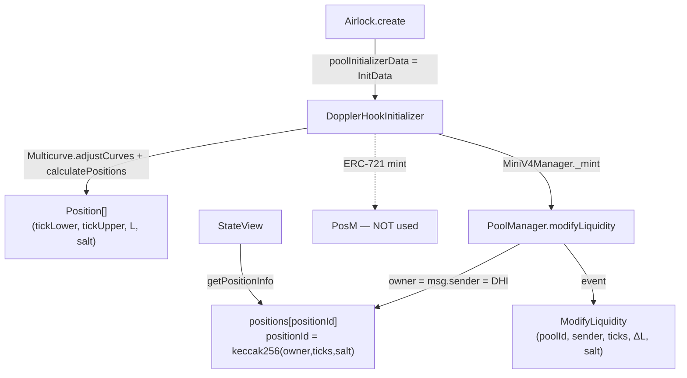
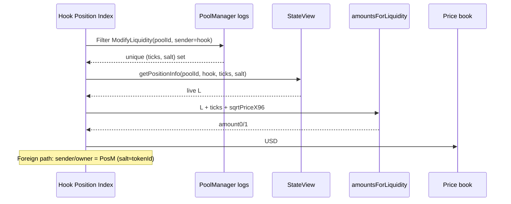
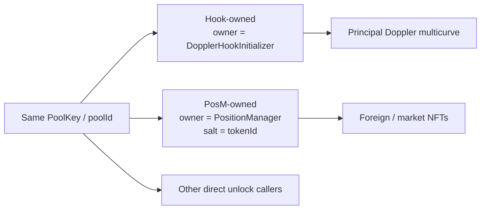

# HANSOME — Phase 11D Research — Hook Position Reconstruction

| Field | Value |
|-------|--------|
| **Date** | 2026-07-31 |
| **Chain** | Robinhood Chain `4663` |
| **Mode** | Read-only research / architecture design |
| **Code / deploy / Production** | **NONE** |
| **Score / lock status** | **Unchanged** — no lock claims |
| **Verdict** | **PASS_NOT_DEPLOYED** |

Prior art:

- `reports/HANSOME_PHASE11C_DOPPLER_AIRLOCK_HOOK_LOCK_VERIFICATION_RESEARCH.md`
- `reports/HANSOME_V4_LP_OWNERSHIP_LOCK_VERIFICATION_RESEARCH.md`
- `reports/HANSOME_V4_OWNERSHIP_CLASS_DETECTION.md`
- `reports/HANSOME_PHASE11A1_V4_OWNERSHIP_EVIDENCE_UI.md`

Upstream (Whetstone / Doppler / Uniswap):

- [DopplerHookInitializer.sol](https://github.com/whetstoneresearch/doppler/blob/main/src/initializers/DopplerHookInitializer.sol)
- [MiniV4Manager.sol](https://github.com/whetstoneresearch/doppler/blob/main/src/base/MiniV4Manager.sol)
- [Multicurve.sol](https://github.com/whetstoneresearch/doppler/blob/main/src/libraries/Multicurve.sol)
- [IStateView.sol](https://github.com/Uniswap/v4-periphery/blob/main/src/interfaces/IStateView.sol)
- [IPoolManager.sol](https://github.com/Uniswap/v4-core/main/src/interfaces/IPoolManager.sol) — `ModifyLiquidity` event

Machine notes:

- `reports/data/phase11d_hook_position_summary.json`
- `reports/data/phase11d_hook_position_probe3.json`
- `reports/data/phase11d_okc_gme_positions.json`

---

## 1. Executive summary

Hook Native (Class B) liquidity has **no Position NFTs**. Doppler multicurve mints create **PoolManager positions owned by `DopplerHookInitializer`**, keyed by `(owner, tickLower, tickUpper, salt)` inside a `poolId`.

**Full reconstruction is PARTIAL today as a product capability** (no single view enumerator), but **YES for hook-owned principal once the create `ModifyLiquidity` set is known** — proven live on **GME**:

| Fact | GME evidence (2026-07-31) |
|------|---------------------------|
| Create tx | `0xf3dfb544…8c82` @ block `16864619` |
| Hook-owned positions | **8** |
| Salts | **0…7 sequential** (`bytes32(i)`) |
| Live L vs mint Δ | **Match** via `StateView.getPositionInfo` |
| Σ position L | `≈5.60e25` |
| Active in-range L | `≈3.86e24` (**≠** Σ L) |
| Σ token amounts | token0 `≈3.39e21` · token1 `≈4.89e27` (CLMM math) |
| PosM on same ticks/salt | **L = 0** (separate position key) |

OKC shares the same Class B architecture (Locked + same initializer + active L > 0). Create-tx recovery was blocked in this session by **public RPC `eth_getLogs` range limits** and **Blockscout rate limits**; the reconstruction **method is identical**.

**Missing Scan capability:** a Hook Position Index that replays pool-scoped `ModifyLiquidity` (sender = hook) and values positions — without using PoolManager ERC-20 balances, without claiming lock.

---

## 2. Answers Q1–Q8

| # | Question | Answer |
|---|----------|--------|
| **Q1** | How many positions in one Hook pool? Determinable on-chain? | **Count = Σ `curve.numPositions`** (+ optional head if `otherCurrencySupply > 0`; Doppler init uses `0`). **Not** via one public getter. **Yes** via create-tx `ModifyLiquidity` set or InitData curves. GME = **8**. |
| **Q2** | Unique ID `(owner, tickLower, tickUpper, salt)`? Discover all combos? | **Yes** that is the ID (`positionId = keccak256(abi.encodePacked(...))`). **Not** by brute-forcing tick×salt space. **Yes** by event replay / multicurve recompute. Owner for Doppler mint = **hook** (`0x4e3468…a544`). Salt = `bytes32(curveIndex * numPositions + i)`. |
| **Q3** | Reconstruct via logs / StateView / storage / calldata / multicurve? | See §5 — **ModifyLiquidity = primary**; StateView = live read; InitData/multicurve = deterministic alternative; `adjustedCurves` stored but **hidden** from public `getState`; `getPositions` **internal** (reverts externally). |
| **Q4** | Total hook-owned L / amounts / USD? | **Yes** once keys known: L per position + Σ L; token0/1 via existing `amountsForLiquidity`; USD via price book. **Never** from PM ERC-20 inventory. Active L ≠ total hook L. |
| **Q5** | Separate foreign PosM LPs in same PoolKey? | **Yes.** `beforeAddLiquidity = false`. Classify by **position owner / ML sender**: hook vs PosM vs other. Design in §7. |
| **Q6** | Hook-owned % without PM ERC-20 balances? | **Yes** for % of *reconstructed pool TVL* = hookAmounts / (hook + foreign valued amounts). Supply-% needs token amounts from positions + `totalSupply` — still no PM balance. Incomplete foreign set → incomplete %. |
| **Q7** | Caching / invalidation / replay? | Incremental index of ML by `(poolId, owner)`; invalidate on new ML; full replay from create block. See §9. |
| **Q8** | Hook Position Index vs PosM NFT discovery? | Parallel to V3/V4 PosM index, but key = `(poolId, owner, ticks, salt)` not ERC-721 `tokenId`. See §10. |

---

## 3. Architecture

### 3.1 How Hook Native positions are created



### 3.2 Discovery vs valuation split



### 3.3 Ownership classes inside one PoolKey



---

## 4. Contract / ABI references (4663)

| Role | Address |
|------|---------|
| DopplerHookInitializer (hooks + position owner) | `0x4e3468951D49f2EEa976eD0D6e75fFCb44a9a544` |
| PoolManager | `0x8366a39CC670B4001A1121B8F6A443A643e40951` |
| PositionManager | `0x58daec3116aae6D93017bAAea7749052E8a04fA7` |
| StateView | `0xf3334192d15450cdd385c8b70e03f9a6bd9e673b` |
| Airlock | `0xeb7C034704eF8Dcd2D32324c1545f62fB4aD0862` |

### Identity & reads

```solidity
// Uniswap V4 position key
positionId = keccak256(abi.encodePacked(owner, tickLower, tickUpper, salt));

// StateView — live liquidity (not enumerable)
function getPositionInfo(PoolId, address owner, int24 tickLower, int24 tickUpper, bytes32 salt)
  returns (uint128 liquidity, uint256 feeGrowthInside0LastX128, uint256 feeGrowthInside1LastX128);

// PoolManager event — PRIMARY discovery
event ModifyLiquidity(
  PoolId indexed id,
  address indexed sender,
  int24 tickLower,
  int24 tickUpper,
  int256 liquidityDelta,
  bytes32 salt
);
// topic0 = 0xf208f4912782fd25c7f114ca3723a2d5dd6f3bcc3ac8db5af63baa85f711d5ec
```

### Doppler mint / salt (source)

```solidity
// Multicurve.calculateLogNormalDistribution
salt: bytes32(params.index * numPositions + i)

// MiniV4Manager._handleMint — owner = address(this) = DopplerHookInitializer
poolManager.modifyLiquidity(poolKey, ModifyLiquidityParams({
  tickLower, tickUpper, liquidityDelta: +L, salt
}), "");
```

### What is *not* publicly readable

| Surface | Status |
|---------|--------|
| `getPositions(asset)` | **`internal`** — eth_call reverts (`probe1`) |
| `getState` auto-getter | Skips dynamic **`beneficiaries`** and **`adjustedCurves`** (Phase 11C) |
| PosM `balanceOf(hook)` | **0** for OKC/GME — confirms non-NFT path |

---

## 5. Q3 — Source-by-source evaluation

| Source | Can it list every hook position? | Can it value them? | Verdict |
|--------|----------------------------------|--------------------|---------|
| **PoolManager `ModifyLiquidity` logs** | **Yes** (filter `id=poolId`, `sender=hook`; coalesce unique keys; net Δ over life) | Indirect (then StateView) | **PRIMARY discovery** |
| **Initialize logs** | No — only PoolKey + start price/tick | No | Pool bootstrap only |
| **StateView** | No enumeration | **Yes** — authoritative live L | **PRIMARY valuation read** |
| **extsload / storage layout** | Only if `positionId` known; hook `PoolState.adjustedCurves` needs reverse layout | Possible | Research backup; fragile |
| **Hook / Airlock calldata (`InitData`)** | **Yes if curves decoded** — then `Multicurve.calculatePositions` | Initial L; live still needs StateView | Strong when create input is plain; weak for ERC-4337 nested ops (GME create → EntryPoint) |
| **Multicurve definitions (off-chain)** | Yes given `adjustedCurves` + `totalTokensOnBondingCurve` + `isToken0` | Initial schedule | Complements logs; must verify live L |
| **Hook `ModifyLiquidity` event** (Doppler) | Yes in theory (emitted in afterAdd/Remove) | No | Secondary; less indexed than PM event |
| **PoolManager ERC-20 `balanceOf`** | No | **Unsafe** | **Forbidden** for ownership / % |

---

## 6. On-chain evidence — GME (full), OKC (partial)

### 6.1 GME reconstruction (complete for create-mint set)

**Create:** [`0xf3dfb544…`](https://robinhoodchain.blockscout.com/tx/0xf3dfb544e8ab2ff8041b087c879095eb9c36790fb9c7207ba095a72d240b8c82)  
**poolId:** `0x3623694d…11c2` · hooks = DopplerHookInitializer · fee = `0x800000` · spacing = 200

| # | tickLower | tickUpper | salt | live L (= mint Δ) | in-range @ probe |
|---|-----------|-----------|------|-------------------|------------------|
| 0 | 189400 | 196400 | 0 | 4.70e23 | no |
| 1 | 182600 | 189400 | 1 | 8.11e24 | no |
| 2 | 179200 | 182600 | 2 | 2.36e24 | no |
| 3 | 171600 | 179200 | 3 | 1.34e25 | no |
| 4 | 157600 | 171600 | 4 | 3.17e24 | no |
| 5 | 125400 | 157600 | 5 | 1.21e24 | **yes** (tick≈126k) |
| 6 | 79400 | 125400 | 6 | 8.05e24 | no |
| 7 | -887200 | 79400 | 7 | 1.93e25 | no |

Interpretation: eight positions with salts `0…7` fits **eight curves × `numPositions=1`** (or equivalent salt schedule), not a single shared-farTick fan — still 100% within Multicurve salt rules.

**Valuation shape (research probe):** Σ amount0 ≈ `3.389e21`, Σ amount1 ≈ `4.889e27` at live `sqrtPriceX96` using existing Score `amountsForLiquidity` (same CLMM path as PosM).

### 6.2 OKC

| Field | Value |
|-------|-------|
| poolId | `0xd3073ec4…35cf` |
| status | Locked (2) |
| active L | `≈8.91e23` |
| hook PosM NFT bal | 0 |
| create tx in this session | **Not recovered** (RPC/Blockscout limits) |
| Method applicability | **Same as GME** |

### 6.3 Separation probe

Same GME ticks/salt under `owner=PositionManager` → **liquidity 0**. Hook and PosM positions never collide in storage.

---

## 7. Foreign LP separation algorithm

```text
INPUT: poolId, PoolKey, hookAddress (= PoolKey.hooks for DopplerHookInitializer launches)
OUTPUT: { hookPositions[], foreignPosmPositions[], foreignOther[], completeness }

1. Resolve poolId / PoolKey (Phase 11A detector).
2. Discover candidate keys:
   A. Backfill PoolManager.ModifyLiquidity where topics[1]=poolId
      from Initialize/create block → reorg-safe head
      (ALWAYS verify topics client-side — RH public RPC may return false positives)
   B. Optional: decode InitData → expected hook keys; reconcile with A
3. For each unique (sender/owner, tickLower, tickUpper, salt):
   - if owner/sender == hookAddress → HOOK_OWNED
   - else if owner/sender == PositionManager → FOREIGN_POSM
        salt typically = tokenId; optional ownerOf(tokenId) for holder/Titan
   - else → FOREIGN_OTHER
4. StateView.getPositionInfo for each key → drop L==0 (unless tracking burns)
5. Value HOOK_OWNED and FOREIGN_* separately
6. completeness:
   - hook_complete if create mint set closed (salts 0..n-1 present OR InitData match)
   - foreign_complete only if ML index exhaustive for poolId
```

Hook permissions confirm third parties **may** add liquidity (`beforeAddLiquidity: false` in DopplerHookInitializer).

---

## 8. Valuation algorithm (no PM ERC-20)

```text
for each hook position with live L > 0:
  slot0 = StateView.getSlot0(poolId)
  amounts = amountsForLiquidity(L, tickLower, tickUpper, sqrtPriceX96)  // existing lib
  usd = amount0 * price0 + amount1 * price1                             // TokenPriceBook

hookOwnedUsd = Σ usd
foreignUsd   = Σ usd(foreign positions)   // only if discovered
poolTvlUsd   = hookOwnedUsd + foreignUsd  // reconstructed; not Gecko/PM inventory

hookShareOfPool = hookOwnedUsd / poolTvlUsd   // only if foreign discovery complete enough
hookShareOfSupply = tokenAmountInHookPositions / totalSupply

FORBIDDEN:
  PoolManager.balanceOf(token) as numerator or denominator for lock% / ownership%
```

**Active L** (`StateView.getLiquidity`) is only the in-range slice — useful for “pool alive” (Phase 11A) but **not** total hook inventory.

---

## 9. Cache strategy

| Concern | Design |
|---------|--------|
| **Store key** | `scan:v4hook:{chainId}:{poolId}` (do not overload PosM / V3 namespaces) |
| **Record** | `{ owner, tickLower, tickUpper, salt, firstMintBlock, lastMlBlock, lastL, source }` |
| **Bootstrap** | Create/Initialize block → full ML backfill for `sender=hook` (+ optional PosM) |
| **Incremental** | Append ML from `lastSyncedBlock+1` → reorg-safe head |
| **Invalidation** | Any new ML for `(poolId, owner∈{hook,PosM,…})`; reorg depth N |
| **Replay** | Drop generation; re-backfill from create; re-read StateView for tip L |
| **Tip read** | Always refresh L/amounts at scan time (cache keys, not economic tip) |
| **Completeness flags** | `hookDiscoveryComplete`, `foreignDiscoveryComplete` separately |

Mirror Phase 10B/10C V3 index patterns (`v3-position-index`) with different event ABI and key shape.

---

## 10. Hook Position Index vs current Position NFT discovery

| Dimension | Class A — PosM NFT | Class B — Hook Position Index |
|-----------|--------------------|-------------------------------|
| Enum key | ERC-721 `tokenId` | `(poolId, owner, ticks, salt)` |
| Discovery | Transfers + Titan + seeds; `totalSupply` reverts | PM `ModifyLiquidity` + InitData |
| Ownership | `ownerOf(tokenId)` | `owner` field (= hook / PosM / other) |
| Liquidity read | `PosM.getPositionLiquidity` | `StateView.getPositionInfo` |
| Lock adapters | Titan (exists) | Phase 11C predicates (not this phase) |
| Existing code | `detect.ts` / PosM path | **Missing** — design only |
| UI id | `#47299` | e.g. `v4-hook:{poolId}:{salt}` |

---

## 11. Performance analysis

| Path | Cost order | Notes |
|------|------------|-------|
| Known create tx receipt decode | **O(positions)** eth_calls (~8 for GME) | Best case — seconds |
| InitData → Multicurve recompute | CPU + 1 StateView/pos | Fast if calldata plain |
| Full ML backfill per pool | **O(blocks/chunk)** getLogs | Dominated by RPC limits on RH public endpoint |
| Brute tick×salt sweep | **Infeasible** | Do not ship |
| Tip valuation | 1× slot0 + N× getPositionInfo + CLMM | Fine for N≈8–64 Doppler |
| Foreign exhaustive index | Heavier; optional for lock% honesty | Required before claiming pool-share % |

**Ops note:** Robinhood public RPC `eth_getLogs` often rejects large ranges and can return **topic-filter false positives** — production index must verify `topics[0..2]` client-side. Blockscout `/api` hit rate limits quickly during this research.

---

## 12. Security risks

| Risk | Severity | Mitigation |
|------|----------|------------|
| Using PM ERC-20 inventory as hook L / lock% | **Critical** | Forbidden (Phase 11A/11C) |
| Treating active L as total hook L | **High** | Sum per-position L / amounts |
| Claiming exhaustive discovery without ML index | **High** | `UNKNOWN_INCOMPLETE` until flags green |
| Attributing foreign PosM L to hook / lock | **High** | Owner/sender classifier |
| Trusting RPC getLogs without topic verify | **High** | Client-side filter |
| Assuming salts always 0..n-1 for all hooks | **Medium** | Prefer events; treat salt formula as Doppler-specific |
| Confusing fee collect / beneficiary updates with principal burn | **Medium** | ΔL=0 pokes ≠ withdraw |
| Shipping lock claims from reconstruction alone | **Critical** (product) | Phase 11C predicates still required |

---

## 13. Implementation roadmap (when approved — not this phase)

| Step | Phase name | Deliverable |
|------|------------|-------------|
| 1 | **PHASE11E_HOOK_POSITION_INDEX** | Research harness → KV index: ML backfill/incremental for allowlisted Doppler pools (OKC/GME fixtures) |
| 2 | **PHASE11E1_HOOK_POSITION_VALUER** | StateView + `amountsForLiquidity` + USD; expose structured evidence only |
| 3 | **PHASE11E2_FOREIGN_LP_SEPARATOR** | Owner classifier; dual totals; completeness flags |
| 4 | Wire to Phase 11C Hook Lock Adapter | Lock% only over valued **hook-owned** amounts when predicates + completeness hold |
| 5 | Score / Production tip | **Separate explicit approval** |

Do **not** implement in Production until approved. Keep Class B → `UNKNOWN_INCOMPLETE` / no lock% until then.

---

## 14. Feasibility verdict

| Scope | Feasibility |
|-------|-------------|
| Reconstruct **every hook-owned** Doppler multicurve position for a known create set | **YES** (proven GME) |
| Reconstruct via **single eth_call** / public getter | **NO** |
| Reconstruct **all** liquidity in PoolKey including foreign | **PARTIAL** — needs Hook Position Index + PosM correlation |
| Accurate hook-owned **%** without PM balances | **YES** if hook set complete; pool-share needs foreign completeness |
| Ship as Scan lock claim | **NO** this phase |

**Overall:** **PARTIAL** — architecturally sound and fixture-proven for hook principal; blocked as a general Scan feature by discovery/indexing (not by CLMM math).

**Key bottleneck:** absence of an on-chain enumerator + hidden `adjustedCurves` / internal `getPositions` → must index `ModifyLiquidity` (or decode InitData) before StateView valuation.

**Recommended next implementation phase:** `PHASE11E_HOOK_POSITION_INDEX`

---

## 15. Final verdict

**PASS_NOT_DEPLOYED**

Research only. No Production code changes, no deploy, no Score changes, no lock-status changes, no lock claims.

---

## 16. Parent return card

| Item | Value |
|------|--------|
| Verdict | **PASS_NOT_DEPLOYED** |
| Report | `reports/HANSOME_PHASE11D_HOOK_POSITION_RECONSTRUCTION_RESEARCH.md` |
| Full reconstruction feasible? | **PARTIAL** |
| Key bottleneck | No enumerator; must replay `ModifyLiquidity` / InitData before StateView; public RPC log indexing painful |
| Recommended next phase | **PHASE11E_HOOK_POSITION_INDEX** |
