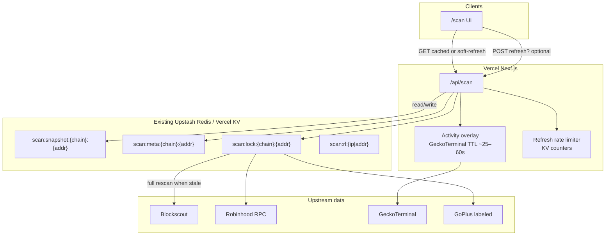

# HANSOME Scan — Production Refresh / Cache Architecture

| Field | Value |
|-------|-------|
| **Date** | 2026-07-27 |
| **Status** | **MVP implemented in code** — **not production-deployed** (await explicit user approve) |
| **Implementation** | `lib/hansome-score/scan-cache.ts` · wired in `app/api/scan/route.ts` + SSR peek in `app/scan/[address]/page.tsx` |
| **Scope** | Production serving of `/scan` + `/api/scan` on existing cloud infra |
| **Primary token** | HANSOME `0x2C38Df5F59b04C3F3BB8c9E6C445E211eB1b0875` · chainId **4663** |
| **Verdict (architecture proposal)** | **PASS** — MVP shipped locally; see latency audit + Public Beta GO/NO-GO |

---

## 0. Non-negotiables

1. **No personal PC dependency.** Scan must work when the operator’s laptop is offline. Serving, caching, refresh, and rate limits run entirely on existing cloud deployment (Vercel + already-provisioned Upstash/KV).
2. **PC bots / ops scripts are unrelated** to Scan serving. Trading bots (`bot/`), settlement workers, and local `contracts/scripts/*` must not be required for `/api/scan` to answer.
3. **Do not run a full Blockscout + RPC structural scan on every page view.**
4. Every Scan response exposes **Last updated** (`scannedAt` already exists; keep and surface consistently).
5. Manual refresh is allowed but **rate-limited**.

---

## 1. Current infrastructure inventory (facts from repo)

### 1.1 Hosting

| Layer | Fact | Evidence |
|-------|------|----------|
| **Next.js app (website + game + APIs)** | **Vercel** | `vercel.json` (Next.js framework); `docs/MAINNET_VERCEL_CUTOVER.md` (`game.hansomealpacas.xyz`); production aliases in Forum KV reports |
| **Settlement worker** | **Railway** (separate from Scan) | `settlement-worker/docs/DEPLOYMENT.md`; `reports/WORKER_ISOLATION_AUDIT.md` |
| **Cloudflare Workers / Wrangler** | **Not present** | No `wrangler.toml` / Workers config in repo |
| **GitHub Actions cron** | **Not present** | No `.github/workflows/*` in repo |
| **Vercel Cron** | **Not configured** | `vercel.json` has install/build/framework only — **no `crons` key** |

### 1.2 KV / Redis

| Resource | Fact | Evidence |
|----------|------|----------|
| **Upstash Redis via Vercel KV integration** | **Provisioned on Production/Preview** | `reports/FORUM_KV_PRODUCTION_VERIFICATION.md` — store `upstash-kv-apricot-nest`; env `KV_REST_API_URL`, `KV_REST_API_TOKEN` (also `KV_URL`, `REDIS_URL`) |
| **Dependencies** | `@vercel/kv`, `@upstash/redis` in root `package.json` | Used by forum + commit vault |
| **Forum persistence** | KV path deployed (`forum:*` keys) | `reports/FORUM_KV_POST_DEPLOY_VERIFICATION.md`, `lib/game/forum/kvStore.ts` |
| **Commit vault (gasless)** | Upstash Redis REST required in Production | `.env.example`, `lib/game/server/testnetCommitVault.ts` — keys `hansome:cv:v1:*` |
| **Settlement worker Redis** | Optional Upstash; live audit reported file-backed state | `settlement-worker/.env.*.example`, `reports/WORKER_ISOLATION_AUDIT.md` — **not used for Scan** |

### 1.3 Database

| Store | Fact |
|-------|------|
| **Postgres / Prisma / Drizzle** | **Not used** by the Next.js app |
| **SQLite** | Exists only under `bot/` (local ops bot) — **not** Scan serving |
| **Filesystem JSON** | Forum local fallback (`data/forum/store.json`); market history helper writes `data/market-history.json` (ephemeral on Vercel — not durable production storage) |

### 1.4 Existing market / cache patterns

| Pattern | Behavior | Evidence |
|---------|----------|----------|
| `/api/market` | On-demand GeckoTerminal fetch; **module in-memory TTL 25s**; stale-on-error fallback; HTTP `Cache-Control: no-store` | `lib/market/geckoterminal.ts`, `lib/market/constants.ts` (`MARKET_CACHE_TTL_MS`), `app/api/market/route.ts` |
| Client refresh cadence | `MARKET_REFRESH_MS = 30s` | `lib/market/constants.ts` |
| Snapshot helper | Optional FS history every 5 min | `lib/market/snapshots.ts` — not suitable as sole production store on serverless |

### 1.5 How `/api/scan` works today

| Aspect | Current state |
|--------|----------------|
| Routes | `GET`/`POST` `app/api/scan/route.ts` → `scanToken()` |
| Runtime | `nodejs`, `dynamic = "force-dynamic"` |
| Cache | **MVP shipped** — `getCachedScan()` memory + optional KV (`scan:*`); Activity overlay 45s; full Score 15m; SWR to 60m |
| Work per scan (cold) | Parallel Blockscout + GoPlus + Gecko + RPC + funding edges + creator transfers (≤40 pages) + multi-version LP + Supply & Burn P0/P1 |
| Timestamps | `scannedAt`, `scoreComputedAt`, `activityUpdatedAt` + `cache` meta |
| UI | Last Updated + Refresh; progressive load when SSR miss |

### 1.6 Game / server indexing patterns (reusable ideas)

| Pattern | Relevance to Scan |
|---------|-------------------|
| Forum KV facade (`isForumKvConfigured` → `@vercel/kv`) | **Reuse** for scan snapshot keys with isolated prefix `scan:*` |
| Commit vault Upstash client | Same Redis instance; **must not collide** with vault/forum keys |
| Settlement worker poll loop (Railway) | Long-running job host exists, but is **game settlement**, not Scan. Prefer **not** coupling Scan refresh to settlement worker for MVP |
| Market in-memory TTL + stale serve | Template for Activity / price overlay inside Scan responses |

### 1.7 Explicitly unrelated to Scan serving

- Local Titan / LP / trading ops under `contracts/scripts/*` and `bot/`
- Operator PC being online
- Settlement worker liveness (game day cycle ≠ token Scan)

---

## 2. Proposed architecture

### 2.1 Goals

- Serve Scan from **Vercel** using **cached snapshots** in the **existing Upstash/KV**.
- Cheap reads for page views; expensive full structural rescans on a **TTL schedule** or **rate-limited manual refresh**.
- Faster overlay for **market Activity / price** without re-running LP/relationship/creator indexing.
- Keep Score / Activity / Data Confidence axes separate (unchanged product rules).

### 2.2 Diagram



### 2.3 Request flow (MVP)

1. Client `GET /api/scan?address=…`
2. Normalize address → load `scan:snapshot:{chainId}:{address}` from KV.
3. If snapshot **fresh** (within full-score TTL):
   - Optionally refresh **Activity/price fields only** if activity TTL expired (GeckoTerminal, reuse market module pattern).
   - Return snapshot + updated activity overlay; set `scannedAt` / `scoreComputedAt` / `activityUpdatedAt` appropriately.
4. If snapshot **missing or stale**:
   - Acquire short **refresh lock** in KV (`SET NX EX`) to coalesce stampedes.
   - Winner runs `scanToken()` (full structural path).
   - Write snapshot + meta to KV with TTLs.
   - Losers wait briefly then read snapshot (or return previous stale + `stale: true` if lock wait times out).
5. Manual refresh: `POST /api/scan` with `{ address, refresh: true }` subject to rate limit; if denied, return cached + `429` or `200` with `refreshDenied: true` + Retry-After semantics.

---

## 3. Cache layers and TTLs by data class

### 3.1 Layers

| Layer | Role | MVP |
|-------|------|-----|
| **L0 — Browser** | Optional short `stale-while-revalidate` later; not required | Skip (keep `no-store` or `private, max-age=0`) |
| **L1 — Vercel instance memory** | Coalesce concurrent lambdas for Activity (same as `/api/market` 25s) | **Yes** for Activity/price |
| **L2 — Upstash/KV** | Durable scan snapshots across instances/redeploys | **Yes** (already provisioned) |
| **L3 — DB (Postgres)** | History, Explore index, analytics | **Later** — not required for MVP Scan |
| **Edge CDN cache of score** | Risky (personalized/rate-limit, multi-tenant addresses) | **No** for MVP |

### 3.2 Recommended TTLs

| Data class | Suggested refresh | Cache home | Notes |
|------------|-------------------|------------|-------|
| **Price** | **30–60s** | L1 (+ optional KV `scan:activity:`) | Mirror `/api/market`; Activity axis only |
| **Volume / Activity** | **30–60s** (UI poll ≤30s ok) | L1 / overlay on snapshot | Does **not** recompute Score |
| **Holder count** | **5–15 min** | Part of full snapshot | Blockscout counters |
| **Holder concentration** | **15 min** | Full snapshot | Top holders + adjusted math |
| **Wallet relationships** | **15–60 min** (MVP: with full score) | Full snapshot | Expensive (funding edges); soft signals |
| **Creator behaviour** | **15–60 min** (MVP: with full score) | Full snapshot | Paged transfers — costliest Blockscout path |
| **Uniswap v2/v3/v4 LP positions** | **15 min** MVP; event-driven later | Full snapshot | RPC + discovery |
| **LP lock / removability** | **15 min** MVP; event-driven later | Full snapshot | Critical structural |
| **Supply & Burn — dead balances** | **5–15 min** (with full snapshot; optional mid-TTL refresh) | Full snapshot + optional `scan:burn:{addr}` | Allowlisted `balanceOf` only (~0.5s); never permanently cache failed/Unknown |
| **Supply & Burn — mechanisms** | **TTL with ABI/source** (hours–days while verified) | Reuse wave1 ABI/source; mechanism CPU ~1ms | Do **not** re-fetch Blockscout source on every view; re-run detector when ABI changes |
| **Structural Score** | **~15 min** | Full snapshot | Recomputed only on full rescan |
| **Overall Score** (= HANSOME Score in product) | **~15 min** | Full snapshot | Same cadence as structural |
| **Data Confidence** | **~15 min** (with full scan) | Full snapshot | Coverage of *that* scan’s inputs; may note activity overlay age separately |

**MVP rule:** One **full Score computation TTL ≈ 15 minutes**. Activity/price overlay refreshes **faster (~30–60s)** without touching structural fields.

**Supply & Burn cache notes (from latency audit):** Dead-address RPC is cheap vs LP/creator but still should ride the snapshot. Mechanism analysis must reuse cached ABI/source (already fetched in wave1). Failed inventory / Unknown tri-states must not be sticky-cached as No.

---

## 4. Manual refresh + rate limiting

### 4.1 UX

- Show **Last updated** prominently (ISO → local relative + absolute).
- Distinguish when useful:
  - `scoreComputedAt` — last full structural/Score run
  - `activityUpdatedAt` — last Activity/price overlay
  - `scannedAt` — keep as primary “Last updated” (prefer max of the above, or alias to `scoreComputedAt` with subtitle for activity)
- Button: **Refresh analysis** (disabled / countdown while rate-limited).

### 4.2 Limits (MVP proposal)

| Scope | Limit | Storage |
|-------|-------|---------|
| Per client IP | 1 full refresh / **2 min** | KV `scan:rl:ip:{hash}` TTL 120s |
| Per token address | 1 full refresh / **60s** (global coalesce) | KV lock + `scan:rl:addr:{addr}` |
| Automatic background | Only on stale read (TTL expiry), not every view | Lock key |
| Burst protection | If lock held > N seconds, serve stale snapshot | Soft fail open for reads |

Do **not** allow unauthenticated users to force unlimited creator-transfer pagination.

### 4.3 Response headers / fields

```json
{
  "scannedAt": "2026-07-27T13:00:00.000Z",
  "scoreComputedAt": "2026-07-27T13:00:00.000Z",
  "activityUpdatedAt": "2026-07-27T13:12:40.000Z",
  "cache": {
    "hit": true,
    "fullScoreTtlSec": 900,
    "stale": false,
    "refreshAvailableInSec": 0
  }
}
```

(Additive fields — keep existing `ScanResponse` shape stable; nest `cache` or top-level optional meta.)

---

## 5. KV key schema (isolated)

Prefix: `scan:` (must not overlap `forum:*` or `hansome:cv:v1:*`).

| Key | Type | TTL | Content |
|-----|------|-----|---------|
| `scan:snapshot:4663:{addr}` | JSON blob | ≥24h soft retention (logical freshness via meta) | Full `ScanResponse` (or slim + recompute Confidence locally if needed) |
| `scan:meta:4663:{addr}` | object | same | `{ scoreComputedAt, activityUpdatedAt, version, sourcesOk }` |
| `scan:lock:4663:{addr}` | string | 45–90s | Refresh in progress |
| `scan:rl:ip:{hash}` | counter/flag | 120s | Manual refresh throttle |
| `scan:rl:addr:{addr}` | flag | 60s | Address-level coalesce |
| `scan:activity:4663:{addr}` | object | 60s | Optional Activity overlay if not embedding in snapshot |

Payload size: full Scan JSON for HANSOME is moderate; monitor Upstash value size. If too large later, store summary + lazy detail — **not** needed for MVP single-token focus.

---

## 6. Event-driven future path (post-MVP)

Critical structural changes should eventually rescore faster than 15 minutes:

| Trigger | Action |
|---------|--------|
| PositionManager / PoolManager / TitanLocker events for known pools | Invalidate LP slice → partial or full rescan |
| Large holder Transfer storms | Invalidate concentration / relationships |
| Verified contract / proxy admin changes | Invalidate contract risk |
| New Uniswap pool create involving token | Invalidate multi-version coverage |

**Implementation options (later):**

1. **Vercel Cron** (add `crons` to `vercel.json`) every 5–15 min for a **watchlist** (HANSOME first) — simplest scheduled path; still cloud-only.
2. Lightweight **Railway sidecar** or queue worker that tails Blockscout/RPC logs — only if cron + on-demand is insufficient.
3. Do **not** require the settlement worker or PC bots for this.

Partial rescoring (LP-only / creator-only) is a hardening phase after snapshot caching ships.

---

## 7. MVP recommendation: 15-min full Score + faster Activity

### Verdict: **YES — approve**

| Question | Answer |
|----------|--------|
| Is ~15-minute caching for full Score calculations appropriate for initial production MVP? | **Yes** |
| Faster refresh for market Activity? | **Yes** — **30–60s**, reusing the existing GeckoTerminal in-memory pattern |

### Rationale

1. Full `scanToken()` is **multi-source and expensive** (Blockscout pagination, many RPC calls, LP multi-version probes). Uncached page views will hit rate limits and inflate latency.
2. Structural risk (locks, concentration, creator dumps, relationships) **rarely needs sub-minute freshness** for a transparency Score; 15 minutes matches product honesty (“Last updated”) better than pretending live tick-by-tick Score.
3. Users *do* expect price/volume to feel fresher — Activity is already a **separate axis** and already has a 25s market cache precedent.
4. Manual refresh + rate limits cover “I just locked LP / dumped” without opening an abuse vector.
5. Fits **existing** Vercel + Upstash without new hosts or a PC.

### Revisions / guardrails (still PASS)

- Prefer documenting **scoreComputedAt vs activityUpdatedAt** so a 15-min Score + 30s Activity is not misread as a 30s Score.
- On first-ever address (cold miss), accept slower full scan; thereafter serve KV.
- If KV is temporarily unavailable: degrade to **in-memory TTL only** (instance-local) + clear warning — do not hang the site; do not fall back to requiring a PC.

---

## 8. Can we ship MVP without Redis/DB?

| Component | Need for MVP? | Answer |
|-----------|---------------|--------|
| **Redis/KV (existing Upstash)** | **Strongly recommended — use what you already have** | **Yes, use existing KV** (not a new purchase). Snapshots must survive multi-instance serverless. |
| **New Redis** | No | Reuse `KV_REST_API_*` with `scan:*` prefix |
| **Cron jobs** | **Later / optional for MVP** | On-demand stale-on-read + lock is enough for single-token MVP; add Vercel Cron when watchlist/Explore grows |
| **Postgres / DB** | **No for MVP** | Later for history, Explore indexing, analytics |
| **In-memory only (no KV)** | Possible but **weak** | Cold starts + multi-instance → duplicate full scans; loses durability across redeploys. Acceptable only for local/dev |

### Tradeoffs summary

| Approach | Pros | Cons |
|----------|------|------|
| **KV snapshots + 15m TTL + Activity overlay (recommended MVP)** | Cloud-only; durable; matches existing infra; low ops | Slight Score lag; need lock/rate-limit code |
| In-memory only | Zero new keys | Stampede + inconsistent Score across regions; **not** production-grade |
| Full scan every view | Always freshest | Blockscout/RPC pain; cost; latency; **fail** requirement 3 |
| New Postgres now | History-ready | Extra infra for no MVP need |
| PC cron / local bot feeder | — | **Forbidden** by product constraint |

**Answer:** Ship MVP **with existing KV**, **without** a new DB and **without** requiring Cron on day one. Cron is the first hardening step for proactive HANSOME refresh.

---

## 9. Open questions / dependencies

| Item | Notes |
|------|-------|
| **RPC URL / keys** | Production uses `NEXT_PUBLIC_GAME_RPC_URL` / public Robinhood RPC today; heavy Scan may need a dedicated `GAME_RPC_URL` or provider key to avoid public RPC throttling |
| **Blockscout rate limits** | Creator pagination (up to 40 pages) + holder/funding fan-out is the main risk; caching + locks are mandatory before public traffic |
| **GoPlus availability** | Labeled supplement only; failures must not block cached Score serve |
| **GeckoTerminal 429s** | Already mitigated for `/api/market` (25s TTL + retry + stale); Scan Activity overlay should **reuse** that helper where possible |
| **KV value size / cost** | Monitor snapshot bytes and Upstash command rate under concurrent addresses |
| **Forum/vault key isolation** | Enforce `scan:` prefix; never write into `forum:` or `hansome:cv:` |
| **Multi-tenant abuse** | Arbitrary address scans can DoS upstream — address-level RL + maybe MVP allowlist (HANSOME + N) until Explore |
| **Settlement worker coupling** | Do not block Scan on Railway worker health |
| **Legal/UI copy** | Cached Score must still show incomplete Confidence honestly; stale ≠ “safe” |

---

## 10. Minimal MVP path vs later hardening

### MVP (cloud-only, no deploy in this design task)

1. KV read-through cache around `scanToken()` with **900s** full-score freshness.
2. Activity/price overlay **30–60s** (reuse market Gecko path).
3. Rate-limited manual refresh.
4. UX: Last updated + optional dual timestamps.
5. Isolated `scan:*` keys on existing Upstash.

### Later hardening

1. Vercel Cron watchlist prewarm (HANSOME every 10–15 min).
2. Partial invalidation / event-driven LP rescoring.
3. Postgres (or KV history list) for Score history charts.
4. Explore / taxonomy indexing (out of Score — separate docs).
5. Dedicated RPC + Blockscout budget monitoring.

---

## 11. Soft links from Score specs

Planned production caching does **not** change Score formulas, Activity semantics, or Data Confidence weights. Pointers:

- [`docs/HANSOME_SCORE_V1_1_SPEC.md`](../docs/HANSOME_SCORE_V1_1_SPEC.md) — § “Production caching (planned)”
- [`docs/HANSOME_SCORE_V1_SPEC.md`](../docs/HANSOME_SCORE_V1_SPEC.md) — historical freeze note + pointer

---

## 12. Architecture proposal verdict

| Criterion | Result |
|-----------|--------|
| Uses only existing cloud infra (Vercel + Upstash KV) | Met |
| No PC dependency; bots unrelated | Met |
| Avoids full scan per page view | Met (15m snapshot) |
| Last updated + rate-limited refresh | Met (design) |
| 15m Score + faster Activity | **Approved** |
| New Redis/DB/Cron required day-one? | **KV: reuse existing · DB: no · Cron: later** |
| Deploy performed? | **No** |

### Recommendation: **PASS**

Approve this architecture for implementation planning. First implementation PR should add KV snapshot + Activity overlay + rate limits only — **no** Score rule changes, **no** PC feeder, **no** new database.

---

## 13. Return checklist (for parent agent)

1. **Infra already available:** Vercel Next.js; Upstash Redis / Vercel KV (`KV_REST_API_*`); `@vercel/kv` + `@upstash/redis`; Forum + commit-vault KV patterns; market in-memory 25s cache; Railway settlement workers (unrelated); **no** Postgres; **no** Vercel Cron; **no** Cloudflare Workers; **no** GitHub Actions cron.
2. **MVP recommendation:** **Yes** — ~15-min full Score cache + faster (~30–60s) Activity/price.
3. **Need Redis/KV/cron/DB?** KV: **Yes — reuse existing**. Cron: **Later**. DB: **No for MVP**.
4. **Report path:** `reports/HANSOME_SCAN_PRODUCTION_CACHE_ARCHITECTURE.md`
5. **Architecture:** **PASS**
6. **Deploy:** **None** (design-only)
