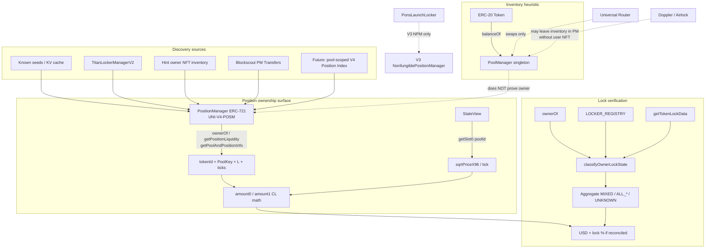

# HANSOME — Uniswap V4 Liquidity Ownership & Lock Verification Research

| Field | Value |
|-------|-------|
| **Date** | 2026-07-31 |
| **Chain** | Robinhood Chain · `4663` |
| **Mode** | Research + design only |
| **Production code changes** | **NONE** |
| **Deployment** | **NONE** |
| **Verdict** | **PASS_NOT_DEPLOYED** |
| **Recommended next phase** | `Phase11A_V4_Position_Index_Prototype` |

Artifacts (read-only probes, not Production scan path):

- `reports/data/_tmp_v4_liquidity_ownership_probe.ts`
- `reports/data/v4_liquidity_ownership_probe.json`
- `reports/data/_tmp_v4_titan_supplement.ts`
- `reports/data/v4_titan_okc_supplement.json`

Primary sources:

- `docs/CURSOR_AGENT_HANDOFF.md`
- `lib/hansome-score/lp/adapters/v4.ts`, `detect.ts`, `titan.ts`, `position-value.ts`, `deployments.ts`, `registry.ts`
- `lib/hansome-score/lp/lockers/pons.ts` (+ `reports/HANSOME_PONS_LOCKER_ADAPTER.md`)
- `reports/ROBINHOOD_UNISWAP_AND_LOCKER_AUDIT.md`
- Phase 10A/10B/10C V3 position-index reports (contrast only — **V3 ≠ V4**)
- Live public RPC + Blockscout (2026-07-31)

---

## Executive summary

Robinhood Chain Uniswap V4 **does use Position NFTs** via the verified PositionManager (`UNI-V4-POSM`). Liquidity inventory lives in the singleton **PoolManager**; ownership of withdrawable CL positions is proven by **`PositionManager.ownerOf(tokenId)`**, with timed locks decoded today only through **TitanLockerManagerV2** when the locked asset is that Position NFT.

**PonsLaunchLocker is a V3 NPM permanent-escrow path — it does not implement V4 liquidity locks.** Doppler/Airlock-style launches can leave large token balances inside PoolManager without a discoverable user Position NFT set; that must stay **Unknown / Incomplete**, never invented Locked.

Lock **percentage** is already mathematically feasible for discovered + USD-valued positions (HANSOME known-seed path proves it), but **honest % requires near-complete material position discovery + pool-TVL reconcile**. Full enumeration of PositionManager is **not** available on-chain (`totalSupply` reverts; `nextTokenId ≈ 416568`).

---

## 1. Answers to the 10 research questions

### Q1. Does Robinhood Chain V4 use Position NFTs?

**YES.**

Live probe (2026-07-31):

| Check | Result |
|-------|--------|
| PositionManager | `0x58daec3116aae6D93017bAAea7749052E8a04fA7` |
| `name()` | `Uniswap v4 Positions NFT` |
| `symbol()` | `UNI-V4-POSM` |
| `nextTokenId()` | `416568` |
| `totalSupply()` | **reverts** (not enumerable via that surface) |
| Blockscout source | `PositionManager.sol` (v4-periphery) verified |
| HANSOME seeds | `#47299`, `#357867`, `#142938` all `ownerOf` + `getPositionLiquidity` + `getPoolAndPositionInfo` succeed |

### Q2. If NO, what uniquely identifies a position?

N/A for the NFT path — but the full identity tuple is:

1. **Primary key:** `PositionManager` ERC-721 **`tokenId`**
2. **Pool key:** `(currency0, currency1, fee, tickSpacing, hooks)` from `getPoolAndPositionInfo`
3. **Pool id:** `keccak256(abi.encode(currency0, currency1, fee, tickSpacing, hooks))`
4. **Range:** `tickLower` / `tickUpper` packed in `positionInfo`
5. **Size:** `getPositionLiquidity(tokenId)` → `uint128 L`

**Caveat:** Hook / Doppler / Airlock inventory can place ERC-20 balances in PoolManager **without** a corresponding user-held Position NFT. That inventory is **not** identified by a Position NFT id and must not be treated as an owned/locked LP position until a verified decode exists.

### Q3. Can positions be enumerated?

**PARTIALLY — not exhaustively from a single on-chain view.**

| Method | Exhaustive? | Notes |
|--------|-------------|-------|
| `totalSupply` / ERC-721Enumerable | **No** | `totalSupply` reverts |
| Scan `tokenId ∈ [1, nextTokenId)` | Theoretical only | ~416k RPC calls — unusable on-demand |
| Titan lock index (`tokenLockerCount` ≈ 27) | Token-scoped subset | Cheap; misses EOA / non-Titan |
| Hint-address NFT inventory (Blockscout) | Owner-scoped | Needs known holders |
| Recent PositionManager Transfer pages | Recency-biased | Cold cost dominant historically (~34s pages + ~123s eval) |
| Known seeds / discovery cache | Known-token only | HANSOME `#47299/357867/142938` |
| **Proposed:** pool-scoped V4 position index | Per-pool exhaustive *if* backfill complete | Analog of Phase 10B/10C V3 index, different events |

Default Production honesty: `discoveryComplete=false` unless a verified complete set is proven.

### Q4. Can LP ownership be proven?

**YES — for each discovered Position NFT.**

Proof chain (already in `detect.ts`):

1. `PositionManager.ownerOf(tokenId)` → current controller  
2. Optional `getCode(owner)` → EOA vs contract  
3. If Titan: `getTokenLockData(lockId)` → `asset == PositionManager`, `tokenId`, `childLocker`, `unlockTime`; require `ownerOf == childLocker` (or registry address) for `LOCKED_VERIFIED_ONCHAIN`  
4. Filter: `getPoolAndPositionInfo` currencies must include scanned token  

**NOT proof:** `token.balanceOf(PoolManager) > 0` alone (inventory heuristic only).

### Q5. Can lock percentage be calculated?

**YES, conditionally — already designed in `position-value.ts` / `computeEconomicLockDistribution`.**

Requires **all** of:

1. Material positions discovered (L > 0)  
2. Each has reliable current `amount0/1` + USD  
3. Sum reconciles with labeled pool TVL within band (~0.55–1.45) when pool USD exists  
4. Aggregate completeness semantics: one locked NFT ≠ 100% locked liquidity  

| Situation | Lock % feasible? |
|-----------|------------------|
| HANSOME known seeds (MIXED) + prices | **Yes** (production path demonstrated) |
| Incomplete discovery / missing USD | **No** — refuse % (`available=false`) |
| PoolManager inventory w/ 0 Position NFTs found | **No** — Unknown |

### Q6. How are current token amounts derived?

**Concentrated-liquidity math — never raw L for economics.**

```
StateView.getSlot0(poolId) → (sqrtPriceX96, tick)
PositionManager.getPositionLiquidity(tokenId) → L
ticks from getPoolAndPositionInfo.positionInfo
→ amountsForLiquidity(L, tickLower, tickUpper, sqrtPriceX96)
→ amount0Raw / amount1Raw
```

Implemented in `lib/hansome-score/lp/position-value.ts` using `@uniswap/v3-sdk` `SqrtPriceMath` / `TickMath` (V4 CL math is the same shape for standard positions).

### Q7. Can USD value be reconstructed?

**YES, when prices exist.**

Per position: `amount0 * price0 + amount1 * price1` with RH quotes (WETH→ETH/USD, USDG≈$1, token→oracle/Gecko). Optional reconcile vs GeckoTerminal / DEXScreener pool TVL before publishing lock %. Multi-pool presentation may withhold per-card USD (separate UX rule) without blocking token-level economics when single material pool.

### Q8. How does Pons implement V4 liquidity?

**It does not.**

| Protocol | Version affinity | Mechanism |
|----------|------------------|-----------|
| **PonsLaunchLocker** `0x736D7669…7F35` | **V3 NPM only** | `getLaunchedToken(token)` → `positionId` on RH V3 NPM `0x73991a25…`; permanent escrow; no unlock in ABI |
| **TitanLockerManagerV2** `0x26b0654A…` | **V4 Position NFTs** (also locks V3 NPM / ERC-20 in other rows) | Timed child escrow holding NFT / asset |
| **Doppler / Airlock** | Launch bootstrapping into **PoolManager** | Not a HANSOME verified locker adapter |

Pons remains on `V3_LOCKER_ADAPTERS`; Titan remains on the V4 `detect.ts` path. Do **not** map Pons semantics onto V4 PositionManager.

### Q9. What APIs or contracts are required?

**Required (ownership / lock):**

| Contract / API | Address / endpoint | Role |
|----------------|--------------------|------|
| PoolManager | `0x8366a39CC670B4001A1121B8F6A443A643e40951` | Singleton inventory; `Initialize` / `ModifyLiquidity` index source |
| PositionManager | `0x58daec3116aae6D93017bAAea7749052E8a04fA7` | ERC-721 ownership + position decode |
| StateView | `0xf3334192d15450cdd385c8b70e03f9a6bd9e673b` | `getSlot0` for amounts |
| TitanLockerManagerV2 | `0x26b0654A0756DCd036D4e7215324f3D2Be34D79e` | Timed V4 NFT locks (`positionManagerKind` allowed=true, kind=2) |
| Public RPC | `https://rpc.mainnet.chain.robinhood.com` | `eth_call` / logs |
| Blockscout | `https://robinhoodchain.blockscout.com` | PM Transfer / address NFT inventory assist |

**Supporting (not ownership proof):**

| Contract / API | Role |
|----------------|------|
| Universal Router `0x53BF6B0684Ec7eF91e1387Da3D1a1769bC5A6F77` | Swaps / ops — not LP ownership |
| Permit2 | Approvals for UR |
| GeckoTerminal / DEXScreener | Labeled TVL / USD enrichment |
| Airlock `0xeb7C0347…` + Doppler hooks | Launchpad inventory class (GME) — future adapter research |
| PonsLaunchLocker | **V3 only** — keep out of V4 lock claims |

### Q10. What are the limitations?

1. **No full PositionManager enumeration** — discovery inherently partial without a durable index.  
2. **On-demand PM Transfer scan is expensive** and mostly unrelated IDs (historical ~191s cold).  
3. **PoolManager balance ≠ locked LP** — OKC holds ~**77.7%** supply in PoolManager with **0** Titan matches and **0** hits in a recent-PM-transfer sample.  
4. **Hook / Doppler liquidity** may not surface as user Position NFTs (GME class).  
5. **Titan is multi-asset** — many locks are ERC-20 or V3 NPM, not V4 PM; adapter must filter `asset == PositionManager`.  
6. **Pons ≠ V4** — do not reuse V3 locker adapters for V4.  
7. **Lock % refuses** when discovery or USD reconcile fails — correct honesty.  
8. **`ALL_LOCKED` forbidden** unless `discoveryComplete=true` and every material position verified locked.  
9. **FOX / multi-version tokens** — dust V4 inventory + material V3 book; V4 adapter alone is insufficient for token-level lock truth.  
10. **Cross-version aggregate** must not claim chain-wide lock from V4-only evidence.

---

## 2. Architecture (current + target)



### Contrast: V3 Position Index (Phase 10A/B/C) vs V4

| Dimension | V3 (Phase 10) | V4 (this research) |
|-----------|---------------|---------------------|
| Pool object | Per-pool contract from Factory `getPool` | Singleton PoolManager + `poolId` from PoolKey |
| Position NFT | V3 NPM `0x73991a25…` | V4 PositionManager `0x58daec…` |
| Exhaustive discovery | Pool `Mint` → receipt → NPM tokenId | PoolManager `Initialize`/`ModifyLiquidity` + PosM `Transfer` / salt mapping → tokenId |
| Index key | `scan:v3pos:{chain}:{npm}:{t0}:{t1}:{fee}` | Proposed `scan:v4pos:{chain}:{posm}:{poolId}` |
| Verified locker today | Pons (V3 permanent) + Titan if asset=NPM | Titan when asset=PositionManager |
| Do not reuse | — | Do **not** feed V4 into V3 index namespaces |

---

## 3. Data flow (ownership → lock → %)

```text
Token CA
  │
  ├─ balanceOf(PoolManager) → poolDetected heuristic
  │
  ├─ Candidate tokenIds
  │     known seeds / cache
  │     Titan locks (asset=PosM)
  │     hint owners' NFT inventory
  │     optional PM Transfer pages
  │     future: pool-scoped V4 index
  │
  ├─ For each tokenId
  │     ownerOf
  │     getPositionLiquidity
  │     getPoolAndPositionInfo → involvesToken?
  │     StateView.getSlot0 → amounts
  │     Titan match? → timed lock
  │     else EOA / unsupported contract / unknown
  │
  ├─ Aggregate (material L>0 only)
  │     MIXED / ALL_UNLOCKED / ALL_LOCKED / UNKNOWN_INCOMPLETE
  │     ALL_LOCKED only if discoveryComplete
  │
  └─ Economic lock distribution
        USD per position → locked/unlocked/unknown %
        reconcile vs pool TVL or refuse %
```

---

## 4. Required contracts (Robinhood 4663)

| Name | Address | Bytecode (probe) |
|------|---------|------------------|
| PoolManager | `0x8366a39CC670B4001A1121B8F6A443A643e40951` | Yes |
| PositionManager | `0x58daec3116aae6D93017bAAea7749052E8a04fA7` | Yes |
| StateView | `0xf3334192d15450cdd385c8b70e03f9a6bd9e673b` | Yes |
| Universal Router | `0x53BF6B0684Ec7eF91e1387Da3D1a1769bC5A6F77` | Yes |
| Permit2 | `0x000000000022D473030F116dDEE9F6B43aC78BA3` | Canonical |
| TitanLockerManagerV2 | `0x26b0654A0756DCd036D4e7215324f3D2Be34D79e` | Yes · count=27 · PosM allowed |
| PonsLaunchLocker | `0x736D76699C26D0d966744cAe304C000d471f7F35` | Yes · **V3 path** |
| Airlock (Doppler) | `0xeb7C034704eF8Dcd2D32324c1545f62fB4aD0862` | Yes · GME `owner()` |

Quotes: WETH `0x0Bd7…AD73`, USDG `0x5fc5…d168`.

---

## 5. Multi-token probe snapshot (2026-07-31)

| Token | Address | PoolManager share | V4 Position NFT notes |
|-------|---------|-------------------:|------------------------|
| **OKC** (target) | `0xddEB6C54…2bA3` | **~77.73%** | No Titan V4 match; recent PM Transfer sample found **0** OKC positions |
| **HANSOME** | `0x2C38…0875` | ~12.46% | Seeds `#47299` Titan-locked; `#357867` / `#142938` EOA — MIXED class |
| **FOX** | `0x2103…bf1` | ~0% (dust) | Material book is **V3**; V4 dust only |
| **GME** | `0xc236…BA3` | ~5.92% | Doppler/Airlock owner; V4 NFT decode historically incomplete |
| **CASHCAT** | `0x020b…18b4` | ~0.85% | Multi-pool / incomplete class |
| **PONS** | `0x39db…4571` | ~0.96% | Token named Pons ≠ PonsLaunchLocker V4 |
| **TYGR** | `0x6998…e744` | ~0.46% | Inventory present; no seeds |

HANSOME seed decode (live):

| tokenId | ownerOf | L > 0 | Pool |
|--------:|---------|-------|------|
| 47299 | Titan child `0x4a5076…3828` | Yes | ETH/HANSOME fee 500 ts 10 hooks 0 |
| 357867 | EOA `0x0bd54a…` | Yes | same poolId `0x1165db4c…` |
| 142938 | EOA `0xcE1528…` | Yes | same |

Titan lock #13 confirms asset=PositionManager, nft=`47299`, unlock≈`1815622680` (≈2027-07-15 UTC).

---

## 6. Discovery algorithm (design)

### Phase A — Fast known-first (exists)

1. If `balanceOf(PoolManager)==0` → v4 empty complete.  
2. Load seeds + KV discovery cache + Titan locks for token.  
3. Revalidate each id on-chain; emit positions; allow MIXED / lock % when economics reconcile.  
4. Set `knownPositionsVerified`; keep `discoveryComplete=false` unless exhaustive proven.

### Phase B — Bounded assist (exists, expensive)

1. Hint-address NFT inventories.  
2. Bounded Blockscout PositionManager Transfer pages → filter via `getPoolAndPositionInfo`.  
3. Never claim completeness from recent pages alone.

### Phase C — Pool-scoped V4 Position Index (**recommended next**)

Key:

```
scan:v4pos:{chainId}:{positionManager}:{poolId}
```

Backfill algorithm (design):

1. Resolve candidate `poolId`s: from known Position NFTs, or from PoolManager `Initialize` logs where currencies include token (+ quotes WETH/USDG/native).  
2. For each `poolId`, sync PoolManager `ModifyLiquidity` (and/or PositionManager mint Transfers correlated by tx) from creation → reorg-safe head.  
3. Map to PositionManager `tokenId`s; validate with `getPoolAndPositionInfo` exact PoolKey match.  
4. Persist tokenIds + sync cursor + completeness flags (mirror Phase 10B V3 prototype isolation rules).  
5. Read path: load index → `ownerOf` + liquidity + Titan/registry classify → economics.

**Do not** overload `scan:v3pos:` or ERC-20 transfer-index namespaces.

### Phase D — Launchpad adapters (later)

- Doppler/Airlock: decode whether liquidity is hook-owned / non-NFT; only then consider a separate lock class.  
- Never mark Locked from PoolManager inventory alone.

---

## 7. Caching strategy

| Layer | Contents | TTL / policy |
|-------|----------|--------------|
| In-process / KV discovery cache (`position-cache`) | Proven Position NFT ids + poolIds + locker candidates | Keep; never persist unverified PM-history candidates; never persist lock classification as truth |
| Known-first seeds | HANSOME-only seeds today; generalize via cache after first prove | Revalidate `ownerOf`/L every read |
| Proposed `scan:v4pos:` | Per-poolId tokenId set + sync cursor + generation | Incremental; reorg overlap like V3 index |
| Titan snapshot | Optional lockId→nft map (count≪100) | Refresh each scan (cheap) |
| USD / TVL labels | Gecko/DEX | Short TTL; reconcile gate for % |

Honesty: cache accelerates rediscovery; **classification always re-reads chain**.

---

## 8. Implementation phases

| Phase | Name | Goal | Deploy? |
|-------|------|------|---------|
| **Done (partial)** | V4 detect + Titan + known-first | Ownership/lock for discovered NFTs; HANSOME MIXED | Live (partial) |
| **Next** | **`Phase11A_V4_Position_Index_Prototype`** | Isolated pool-scoped V4 index (like 10B); OKC + HANSOME validation; **no Production wire** | **NO** |
| 11B | V4 index Production attach | Wire index into `discoverV4Liquidity` with completeness flags | Gate separately |
| 11C | Economic lock % generalization | Non-HANSOME tokens with complete index + USD | Gate separately |
| 11D | Doppler/Airlock V4 inventory research | Hook/non-NFT class — Unknown until verified | Research first |
| — | Pons on V4 | **Out of scope** — Pons is V3 | N/A |

---

## 9. Risk assessment

| Risk | Severity | Mitigation |
|------|----------|------------|
| False `ALL_LOCKED` from one Titan NFT | **Critical** | Keep `discoveryComplete` gate; MIXED when removable found |
| Inventing Locked from PoolManager balance (OKC/GME) | **Critical** | Inventory ≠ ownership |
| Confusing Pons V3 with V4 | **High** | Separate adapters; docs + registry affinity |
| Expensive PM Transfer scans regress latency | **High** | Known-first + index; exhaustive off Deep hot path |
| Hook liquidity invisible to NFT index | **High** | Explicit Unknown; Doppler phase |
| Titan multi-asset false positives | **Medium** | Require `asset == PositionManager` + pool token match |
| USD / reconcile failure → missing % | **Medium** | Honest unavailable; don't use raw L |
| Index namespace collision with V3 | **Medium** | Distinct `scan:v4pos:` prefix + guards |
| Reorg on log sync | **Medium** | Overlap + blockhash like Phase 10B |

---

## 10. Recommended implementation plan

1. **Keep Production unchanged** after this research (`PASS_NOT_DEPLOYED`).  
2. Start **`Phase11A_V4_Position_Index_Prototype`**:  
   - Isolated modules under e.g. `lib/hansome-score/lp/v4-position-index/` (not imported by `scan.ts`).  
   - Validate on HANSOME poolId `0x1165db4c…` (must rediscover seeds) and OKC (must find material NFT set or prove incompleteness).  
   - Artifacts under `reports/data/` only.  
3. Only after prototype PASS: design Production attach (11B) with the same honesty gates as V3 10C.  
4. Keep Titan as V4 locker; keep Pons on V3; research Doppler separately.  
5. Lock % remains economic + reconcile — never raw L.

---

## 11. Final verdict

**PASS_NOT_DEPLOYED**

Research complete: V4 Position NFT ownership model is confirmed on Robinhood Chain; Titan timed locks are the verified V4 lock path; Pons is V3-only; lock % is feasible when discovery + USD reconcile succeed; exhaustive discovery needs a pool-scoped V4 position index (next phase name below). **No Production code modified. No deployment.**

**Recommended next implementation phase:** `Phase11A_V4_Position_Index_Prototype`

---

## References

- `reports/ROBINHOOD_UNISWAP_AND_LOCKER_AUDIT.md`
- `reports/HANSOME_PONS_LOCKER_ADAPTER.md`
- `reports/HANSOME_PHASE10A_V3_POSITION_DISCOVERY_COVERAGE_AUDIT.md`
- `reports/HANSOME_PHASE10B_V3_POSITION_INDEX_PROTOTYPE.md`
- `reports/HANSOME_GME_0xc2362aff_LIQUIDITY_INVESTIGATION.md`
- `reports/HANSOME_LP_DISCOVERY_PERFORMANCE.md`
- `lib/hansome-score/lp/detect.ts`, `titan.ts`, `position-value.ts`, `adapters/v4.ts`
- Probe JSON: `reports/data/v4_liquidity_ownership_probe.json`, `reports/data/v4_titan_okc_supplement.json`
