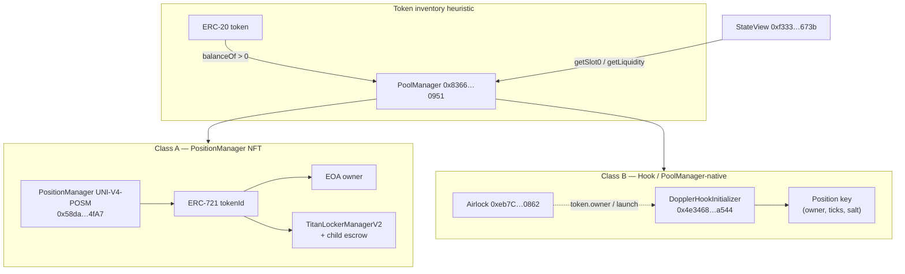
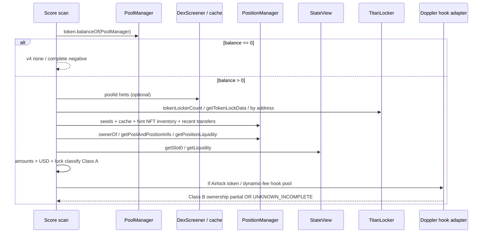

# HANSOME — Uniswap V4 LP Ownership & Lock Verification Research

| Field | Value |
|-------|--------|
| **Date** | 2026-07-31 |
| **Chain** | Robinhood Chain `4663` |
| **Mode** | Read-only research / architecture design |
| **Code / deploy** | **NONE** (no Production changes) |
| **Verdict** | **PASS_NOT_DEPLOYED** |

Artifacts:

- `reports/data/v4_addresses.json` — canonical addresses + resolved pool keys
- `reports/data/v4_liquidity_ownership_probe.json` — PositionManager / inventory probe
- `reports/data/v4_lp_deep_probe.json` — Titan sweep + Core7/Pons contrast
- Temporary probes: `reports/data/_tmp_v4_*.ts` (not Production paths)

Contrast / prior art:

- `reports/ROBINHOOD_UNISWAP_AND_LOCKER_AUDIT.md` (v2/v3/v4 deploy map)
- `reports/HANSOME_PHASE10A_V3_POSITION_DISCOVERY_COVERAGE_AUDIT.md` (V3 NFT enumeration class)
- `reports/HANSOME_PONS_LOCKER_ADAPTER.md` (Pons = **V3 NPM**, not V4)
- `reports/HANSOME_GME_0xc2362aff_LIQUIDITY_INVESTIGATION.md` (Doppler/Airlock launch class)

---

## 1. Executive summary

Robinhood Chain Uniswap V4 **does use Position NFTs** (`UNI-V4-POSM` on PositionManager). That path is how HANSOME Score already verifies Titan-locked / EOA-held LP for tokens like HANSOME.

However, **material V4 inventory is not always NFT-backed**. Airlock / Doppler launches (OKC, GME) place liquidity via **hook-owned PoolManager positions** with **zero** PositionManager ERC-721 balance. For those tokens, PosM `poolKeys(bytes25)` may be empty, Titan has no NFT to escrow, and Pons `getLaunchedToken` is `exists=false`. Claiming “all V4 LP locked” from PoolManager ERC-20 balance alone is **unsafe**.

**Recommended next phase name:** `PHASE11A_V4_DUAL_PATH_OWNERSHIP`  
(PosM NFT path hardening + Doppler/hook non-NFT ownership decoder — design-only until approved).

---

## 2. YES/NO answers (Q1–Q10)

| # | Question | Answer | Evidence |
|---|----------|--------|----------|
| 1 | Does RH V4 use Position NFTs? | **YES** | PosM `name()="Uniswap v4 Positions NFT"`, `symbol()="UNI-V4-POSM"`, `nextTokenId≈416911`, HANSOME `#47299/#357867/#142938` decode via `ownerOf` / `getPoolAndPositionInfo` / `getPositionLiquidity` |
| 2 | If NO, what uniquely identifies a position? | **N/A for NFT path**; **also** non-NFT positions exist | Non-NFT identity = PoolManager position key `(owner, tickLower, tickUpper, salt)` inside `poolId`. Doppler/hook L uses this path without minting ERC-721 |
| 3 | Can positions be enumerated? | **NO** (complete) / **PARTIAL** (practical) | `totalSupply()` reverts; no on-chain enumerator. Practical candidates: Titan lock IDs, seeds/cache, hint-owner NFT inventory, Blockscout PosM transfers, pool-scoped `ModifyLiquidity` logs |
| 4 | Can LP ownership be proven? | **YES for PosM NFTs**; **PARTIAL for hook L** | NFT: `ownerOf(tokenId)`. Hook: prove hook/Airlock owns PoolManager position (needs position-info reads / event reconstruction); **not** implemented as verified locker today |
| 5 | Can lock % be calculated? | **YES when position set + amounts known**; else **NO** | Must use token amounts from sqrtPrice+ticks (`position-value.ts`), never raw L or PoolManager inventory alone. Incomplete discovery → `UNKNOWN_INCOMPLETE` |
| 6 | How are current token amounts derived? | **CLMM math** | `StateView.getSlot0(poolId)` → `sqrtPriceX96` + ticks from packed `positionInfo` + `getPositionLiquidity` → `amountsForLiquidity` (v3-sdk SqrtPriceMath) |
| 7 | Can USD value be reconstructed? | **YES with price book** | Amounts × `{tokenPriceUsd, ethUsd, usdg≈1}` + pool TVL reconcile band (existing `position-value.ts`) |
| 8 | How does Pons implement V4 liquidity? | **It does not** | PonsLaunchLocker maps to **V3 NPM** only (`PRIMARY`/`TYGR` examples). `isV4Posm=false` for all probed tokens; V4 Doppler ≠ Pons |
| 9 | What APIs / contracts are required? | See §5 | PoolManager, PositionManager, StateView, Titan, (optional) Airlock/Doppler hooks, Blockscout NFT/transfers, DexScreener/Gecko for poolId hints |
| 10 | Limitations? | See §11 | Dual ownership model; non-enumerable PosM; Doppler lock semantics undefined; Titan sparse; no V4 Pons |

---

## 3. Architecture

### 3.1 Two V4 liquidity ownership classes on RH



| Class | How liquidity is created | Ownership proof | Lock proof today |
|-------|--------------------------|-----------------|------------------|
| **A — PosM NFT** | `PositionManager.modifyLiquidities` mints ERC-721 | `ownerOf(tokenId)` | Titan `getTokenLockData` + child holds NFT; EOA = unlocked |
| **B — Hook-native** | Hook `unlock` → `PoolManager.modifyLiquidity` | Pool position owner = hook (no NFT) | **Unsupported** — do not invent LOCKED from Airlock/Doppler |

### 3.2 Data flow (target design)



---

## 4. Required contracts (chainId 4663)

| Role | Address | Notes |
|------|---------|-------|
| **PoolManager** | `0x8366a39CC670B4001A1121B8F6A443A643e40951` | Singleton inventory; verified |
| **PositionManager** | `0x58daec3116aae6D93017bAAea7749052E8a04fA7` | `UNI-V4-POSM`; `nextTokenId≈4.17e5`; `totalSupply` reverts |
| **StateView** | `0xf3334192d15450cdd385c8b70e03f9a6bd9e673b` | `getSlot0`, `getLiquidity` |
| **Universal Router** | `0x53BF6B0684Ec7eF91e1387Da3D1a1769bC5A6F77` | Swaps / ops; not ownership source |
| **Permit2** | `0x000000000022D473030F116dDEE9F6B43aC78BA3` | Canonical |
| **TitanLockerManagerV2** | `0x26b0654A0756DCd036D4e7215324f3D2Be34D79e` | Timed V4 (and other asset) locks; `positionManagerKind(PosM)=(2,true)` |
| **Titan child (HANSOME #47299)** | `0x4a50761042e321F214b6B6c2920F9eA1C5533828` | Holds NFT; ERC-20 bal 0 |
| **PonsLaunchLocker** | `0x736D76699C26D0d966744cAe304C000d471f7F35` | **V3 only** |
| **V3 NPM** (contrast) | `0x73991a25c818bf1f1128deaab1492d45638de0d3` | Pons path |
| **Airlock** | `0xeb7C034704eF8Dcd2D32324c1545f62fB4aD0862` | Launchpad owner for Doppler clones |
| **DopplerHookInitializer** | `0x4e3468951D49f2EEa976eD0D6e75fFCb44a9a544` | OKC + GME V4 hooks; **PosM NFT bal = 0** |
| **RehypeDopplerHookInitializer** | `0x6f02324d20CC679d0E585290CAa6b16baCbC0F77` (+ other deployments) | Related launch stack |
| **WETH** | `0x0Bd7D308f8E1639FAb988df18A8011f41EAcAD73` | |
| **USDG** | `0x5fc5360D0400a0Fd4f2af552ADD042D716F1d168` | |

Machine-readable copy: `reports/data/v4_addresses.json`.

---

## 5. On-chain evidence — sampled tokens

### 5.1 Inventory gate (PoolManager `balanceOf`)

| Token | Address | PM share of supply | Launch class |
|-------|---------|-------------------|--------------|
| **OKC** (target) | `0xddEB…2bA3` | **~77.73%** | Airlock / Doppler |
| **HANSOME** | `0x2C38…0875` | ~12.46% | Organic + Titan NFT |
| **GME** | `0xc236…BA3` | ~5.92% | Airlock / Doppler |
| **CASHCAT** | `0x020b…18b4` | ~0.85% | Mixed (PM dust/material TBD) |
| **PONS** | `0x39dB…4571` | ~0.96% | Has V4 PosM activity (sample NFT `#400000` liq=0) |
| **TYGR** | `0x6998…e744` | ~0.46% | Pons **V3** primary + some V4 NFTs |
| **FOX** | `0x2103…9bf1` | ~0% (tiny PM bal) | Material book is **V3**; DexScreener also lists small V4 pairs |
| **PRIMARY (NBD)** | `0x57ff…e00f` | ~0.01% | Pons **V3** (`positionId=460447`) |

### 5.2 Resolved V4 pools

| Token | poolId | PoolKey | Ownership class |
|-------|--------|---------|-----------------|
| **HANSOME** | `0x1165db4c…1a0d` | ETH / HANSOME · fee **500** · spacing **10** · hooks **0x0** | **Class A** — PosM NFTs |
| **OKC** | `0xd3073ec4…35cf` | WETH / OKC · fee **8388608** (`DYNAMIC_FEE_FLAG`) · spacing **200** · hooks **DopplerHookInitializer** | **Class B** — hook-native; PosM `poolKeys` empty; hook NFT bal **0** |
| **GME** | `0x3623694d…11c2` | GME(RH) / GME · fee **8388608** · spacing **200** · same Doppler hook | **Class B** — hook NFT bal **0** |

OKC PoolKey was proven by brute-matching DexScreener `pairAddress` (= poolId) against `keccak256(abi.encode(PoolKey))`.

### 5.3 Titan locks (full sweep `1..tokenLockerCount`)

- `tokenLockerCount = 27` (26 readable; ids are **1-indexed**)
- V4 PosM NFT locks observed include: **#47299** (HANSOME, unlock ~2027-07-15), **#154479** (other token)
- Also locks V3 NPM NFTs and non-LP ERC-20 assets
- **No Titan lock** for OKC / GME / FOX / CASHCAT / PONS / TYGR among Core set
- Titan child holds HANSOME `#47299` only (Blockscout NFT inventory sample)

### 5.4 Pons vs V4

| Token | `getLaunchedToken.exists` | positionManager | V4? |
|-------|---------------------------|-----------------|-----|
| OKC / HANSOME / GME / FOX / CASHCAT / PONS / WALLET | false | — | — |
| PRIMARY | true | V3 NPM | **No** |
| TYGR | true | V3 NPM | **No** |

**Conclusion:** Pons is a **V3 NPM permanent escrow** adapter. It is not a V4 liquidity ownership path.

---

## 6. Position identifiers

### Class A — Position NFT

| Field | Source |
|-------|--------|
| `tokenId` | ERC-721 id on PositionManager |
| PoolKey | `getPoolAndPositionInfo(tokenId)` → `(currency0,1,fee,tickSpacing,hooks)` |
| `poolId` | `keccak256(abi.encode(PoolKey))` |
| Ticks | Packed `positionInfo` → `(info>>8)&0xffffff` / `(info>>32)&0xffffff` (as in `detect.ts`) |
| Liquidity | `getPositionLiquidity(tokenId)` |
| Owner | `ownerOf(tokenId)` |

### Class B — Hook / direct PoolManager

| Field | Source |
|-------|--------|
| `poolId` / PoolKey | Initialize logs, DexScreener pairAddress, or PosM `poolKeys` **if** any NFT ever minted |
| Position identity | `(owner=hook, tickLower, tickUpper, salt)` in PoolManager storage |
| Liquidity | StateView `getLiquidity` is **active L only** (not per-position); per-position requires `extsload` / position info helpers / event reconstruction |

---

## 7. Discovery algorithm (design)

```text
discoverV4Ownership(token):
  1. inventory = ERC20.balanceOf(PoolManager)
     if 0 → { searched, discoveryComplete, none }

  2. CLASS A candidates = ∪(
       knownSeeds[token],
       lpDiscoveryCache.positionIds,
       Titan locks where asset==PosM && pool involves token,
       hintAddress NFT inventories (Blockscout / balanceOf+tokenOfOwner if available),
       recent PosM Transfer tokenIds (bounded pages)
     )

  3. for each candidate tokenId:
       read ownerOf / getPoolAndPositionInfo / getPositionLiquidity
       drop if !involvesToken or burned
       classify:
         Titan child + unlockTime>now → LOCKED_VERIFIED_ONCHAIN
         known locker timed null expiry → LOCK_DETECTED_EXPIRY_UNKNOWN
         EOA → UNLOCKED_EOA_CONTROLLED
         unknown contract → UNSUPPORTED_LOCKER

  4. amounts/USD via StateView.getSlot0 + amountsForLiquidity
     lock% only if material positions valued + reconcile vs pool TVL

  5. CLASS B gate (honest incomplete unless adapter):
       if token.owner==Airlock OR resolved PoolKey.hooks ∈ DopplerRegistry:
         resolve poolId (DexScreener / Initialize / key brute with DYNAMIC_FEE_FLAG)
         if hook.balanceOf(PosM)==0 AND activeL>0:
           mark ownershipClass=HOOK_NATIVE
           lockAnalysisComplete=false  # until Doppler adapter defines lock semantics
           do NOT claim ALL_LOCKED from PM inventory

  6. aggregate:
       any Class B without adapter → UNKNOWN_INCOMPLETE
       Class A MIXED/ALL_* only over evaluated NFT positions + honesty labels
```

**Contrast with Phase 10A (V3):** V3 pool contracts emit Mint/Burn with enumerable pool-scoped history. V4 singleton has global `ModifyLiquidity` — pool-scoped log filters need `poolId` topic strategy + heavier indexing (closer to a V4 position index phase, analogous to V3 `v3-position-index`).

---

## 8. Caching strategy

| Cache | Contents | Rules |
|-------|----------|-------|
| Existing `lpDiscoveryCache` | `positionIds`, `poolIds`, `lockerCandidates`, `exhaustiveComplete` | Proven Class A IDs only; never persist lock classification; never promote flaky PM-history candidates |
| New (proposed) `v4PoolKeyCache` | `token → [{poolId, poolKey, source, ownershipClass}]` | DexScreener/Initialize/PosM `poolKeys`; TTL + revalidate via StateView L |
| New (proposed) `v4HookRegistry` | Doppler/Rehype hook addresses + kind | Manual allowlist first (like LOCKER_REGISTRY) |
| Titan | Full `1..count` is small (~27) today — cacheable; grow with `tokenLockerCount` | Prefer address-index + newest window (existing titan.ts) |

Do **not** cache “LOCKED” for Class B without an approved adapter.

---

## 9. Lock verification

### Supported today (Class A)

1. Titan: `getTokenLockData` → `asset == PositionManager`, `tokenId`, `unlockTime`, `contractAddress` (child)
2. Re-check `ownerOf(tokenId) == child`
3. Decode pool involvement + liquidity > 0
4. Timed expiry → `LOCKED_VERIFIED_ONCHAIN` while `now < unlockTime`

### Not supported (must stay Unknown)

| Pattern | Why |
|---------|-----|
| PoolManager holds 77% OKC | Inventory ≠ locked LP ownership |
| Airlock `token.owner()` | Launch control ≠ LP NFT escrow |
| Doppler hook holds active L | No HANSOME locker adapter; NFT bal 0; lock/migrate semantics not verified |
| Pons on V4 | Mapping never points at PosM for probed set |

---

## 10. Implementation phases (recommended)

| Phase | Name | Goal | Deploy? |
|-------|------|------|---------|
| **11A** | `PHASE11A_V4_DUAL_PATH_OWNERSHIP` | Document + detect ownership class A vs B in research harness; wire Class B → honest `HOOK_NATIVE` / incomplete (no LOCKED) | No (design → later impl approval) |
| **11B** | `PHASE11B_V4_POSM_INDEX` | Incremental PosM Transfer / ModifyLiquidity index (mirror Phase 10B V3 ideas) for Class A exhaustiveness | Separate approval |
| **11C** | `PHASE11C_DOPPLER_HOOK_ADAPTER` | Decode Doppler/Airlock position ownership + **only if** on-chain lock/migrate rules are proven → optional verified state | Separate approval; high risk |
| **11D** | `PHASE11D_V4_LOCK_PERCENT` | Extend amount/USD/% to multi-pool Class A complete sets; Class B excluded or separately labeled | After 11A/B |

**Immediate recommended next phase:** **PHASE11A_V4_DUAL_PATH_OWNERSHIP**.

Existing Production path remains valid for HANSOME-style Class A (partial discovery + Titan). Do not claim full V4 lock coverage.

---

## 11. Risk assessment

| Risk | Severity | Mitigation |
|------|----------|------------|
| Treating PM inventory as locked | **Critical** | Forbidden; Class B → Unknown/incomplete |
| False ALL_LOCKED from one Titan NFT | **High** | Existing honesty: MIXED / incomplete labels |
| Assuming all V4 L is NFT-enumerable | **High** | Dual-path model; Doppler samples prove counterexample |
| Doppler “economic lock” misread as Titan-style escrow | **High** | Require dedicated adapter + ABI proof of permanence/timing |
| PosM history pagination miss | **Medium** | Seeds + Titan + cache + eventual index (11B) |
| Dynamic fee flag pools | **Medium** | Include `0x800000` in PoolKey probes |
| Explorer rate limits | **Medium** | Prefer RPC for verification; explorer for candidates only |
| Pons confused with V4 | **Low** (if docs clear) | Keep Pons on V3 adapter path only |

---

## 12. Recommended implementation plan (when coding is approved)

1. **Read models:** add `ownershipClass: "posm_nft" | "hook_native" | "unknown"` on v4 version result (presentation + completeness only).
2. **Pool resolution:** DexScreener/Gecko `pairAddress` → StateView; PosM `poolKeys`; Doppler key template `{DYNAMIC_FEE_FLAG, spacing=200, hooks=DopplerHookInitializer}`.
3. **Class A:** keep `detectV4LpIntelligence` + Titan; optional bounded PosM index later.
4. **Class B:** new research adapter stub → always incomplete until 11C.
5. **Lock %:** only Class A valued positions; never PM share%.
6. **Tests / fixtures:** HANSOME MIXED regression; OKC/GME Class B incomplete fixtures; Pons V3 untouched.
7. **Public copy:** “V4 Position NFT + Titan” supported partially; “Doppler/Airlock V4 ownership” planned/incomplete.

---

## 13. Final verdict

**PASS_NOT_DEPLOYED**

Research complete. No Production code modified, no deployment. RH V4 **does** use Position NFTs for the standard PosM path, but **complete** LP ownership/lock verification also requires a **non-NFT hook path** (Doppler/Airlock) that is **not** covered by Titan/Pons today.

---

## 14. Parent return card

| Item | Value |
|------|--------|
| Verdict | **PASS_NOT_DEPLOYED** |
| Report | `reports/HANSOME_V4_LP_OWNERSHIP_LOCK_VERIFICATION_RESEARCH.md` |
| Position NFTs? | **YES** (also non-NFT hook liquidity exists) |
| Next phase | **PHASE11A_V4_DUAL_PATH_OWNERSHIP** |
| Key limitation | Doppler/Airlock V4 books are hook-native; cannot prove lock% via PosM/Titan |
